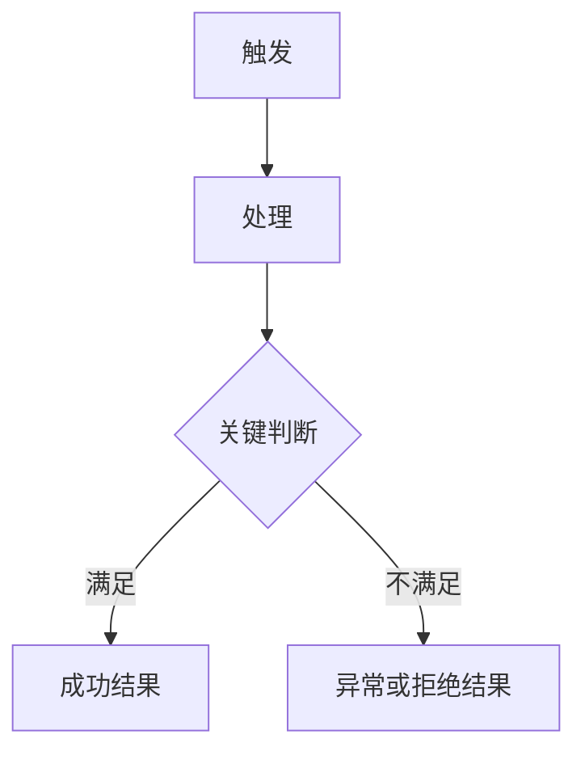
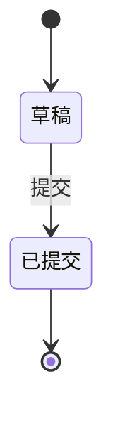
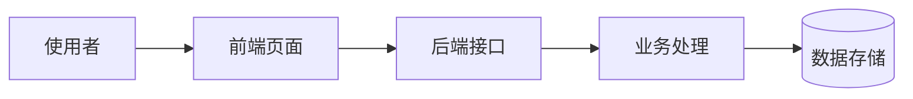
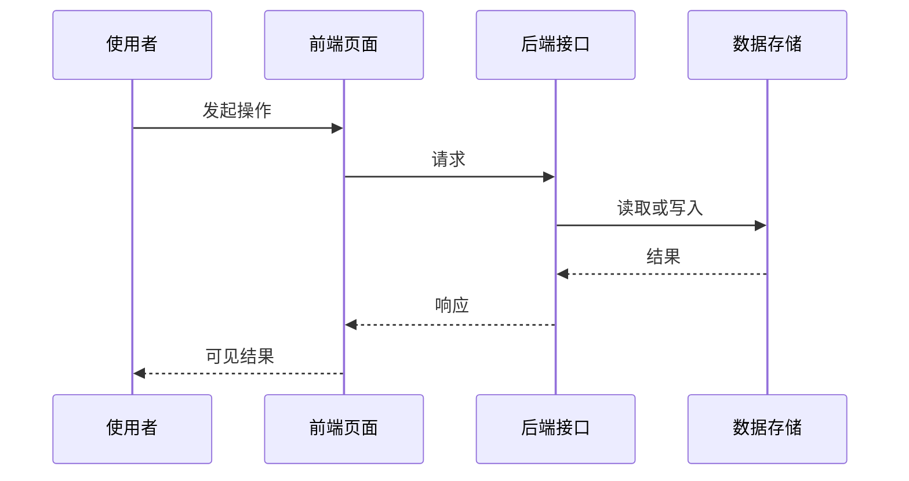
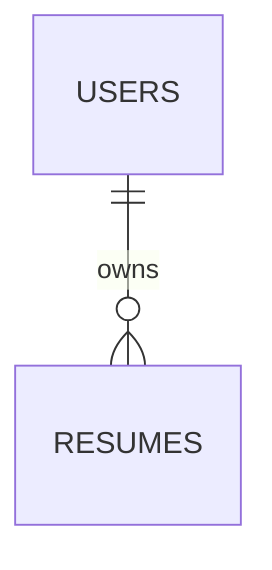

# <KEY> · <标题> 方案文档

| 项目 | 内容 |
| --- | --- |
| 需求编号 | <KEY> |
| 一句话需求 | <一句话说明本次要交付什么> |
| 来源 Issue | <完整链接或稳定引用；没有时写"无，本地维护"> |
| 后续路径 | 契约验收 / 直接施工（方案文档冻结时选定） |
| 创建时间 | <YYYY-MM-DD> |
| 最后更新 | <YYYY-MM-DD> |
| 当前状态 | 草稿 / 待用户确认 / 已冻结 |

## 第一部分 · 需求

### 1. 需求描述

#### 1.1 需求正文

<成段完整叙述本次要做的事，不用短语堆砌。至少讲清四件事：谁在什么场景下遇到了什么问题；本次要做出什么东西；做出来之后整件事怎么运转；哪些情况明确不在本次范围内。读完这一段就应该知道要做什么，不需要再看后面的章节。禁止"优化体验""完善逻辑"这类没有具体内容的表述。>

#### 1.2 背景与动机

- **问题来源**：<需求从哪来：用户反馈、业务目标、线上问题或上游要求>
- **为什么现在做**：<当前的紧迫性或前置条件已经具备的理由>
- **不做会怎样**：<维持现状带来的具体损失，不是泛泛的"影响体验">

#### 1.3 使用场景

| 场景 | 使用者 | 什么时候用 | 期望结果 |
| --- | --- | --- | --- |
|  |  |  |  |

#### 1.4 交付结果

<编号列出可以据此判断需求完成的业务信号，每条都要能被观察或验证。>

1. <交付结果一>

#### 1.5 本次不做

<明确排除的能力、兼容范围或后续事项，逐条列出并说明为什么排除。>

### 2. 现状与问题

- **现在怎么运作**：<基于真实代码和现有产品行为，用业务语言描述现状>
- **卡在哪里**：<现状为什么不能满足需求，会影响谁或什么流程>
- **判断依据**：<支撑上述描述的真实入口、模块、测试或需求来源>

区分已核实事实、合理推断和待确认信息，不把目标方案写成当前能力。

### 3. 模块分解

把整体需求拆成可以独立描述、独立验收的业务模块。按业务能力划分，不按代码目录或技术分层划分。

#### 3.1 模块清单

| 编号 | 模块 | 业务职责 | 依赖模块 | 交付顺序 | 可否独立验收 |
| --- | --- | --- | --- | --- | --- |
| M1 |  |  | 无 | 1 | 是 / 否 |

- 交付顺序按依赖拓扑排列，被依赖的模块排在前面；
- 存在循环依赖时说明拆分理由或合并为一个模块；
- 某个模块可以独立上线且自身规模较大时，在此说明是否建议单独立项。

#### 3.2 <M1 模块名称>

- **边界**：<本模块负责什么，明确不负责什么>
- **入口与触发**：<谁在什么场景下进入本模块>
- **完成信号**：<本模块单独交付时，用什么可观察结果判定完成>
- **对外提供**：<向其他模块或外部提供的能力、数据或事件>
- **依赖前提**：<必须先具备的模块、数据、配置或权限>

### 4. 业务流程

#### 4.1 主流程图



只画主链路和关键异常分支，节点使用业务语言。跨多个模块时在节点上标注模块编号。

主体只有一个、重点是判断分支和走向时用上面的流程图；参与者有多个、来回交互的先后顺序本身就是重点时改用时序图。二选一，不要同一条链路画两张。

#### 4.2 流程详解

1. **<节点名称>**（<模块编号>）
   - 触发者与动作：<谁在什么条件下做什么>
   - 系统行为与依赖：<系统承担的业务责任以及依赖对象>
   - 状态与数据：<状态如何变化、数据如何流转>
   - 可见结果：<用户或下游系统如何感知结果>

#### 4.3 异常分支

| 异常分支 | 触发条件 | 系统行为 | 用户或下游感知 | 状态或数据结果 |
| --- | --- | --- | --- | --- |
|  |  |  |  |  |

### 5. 状态机

不涉及状态流转时写"不涉及"并说明判断依据，不删除章节。

#### 5.1 <状态对象名称>

- **管的是什么**：<这组状态描述哪个业务对象的哪个阶段>
- **初始状态**：<创建时的状态及创建者>
- **终态**：<哪些状态不可再流出>



| 起始状态 | 事件或条件 | 目标状态 | 触发者 | 并发或重复触发处理 | 副作用 |
| --- | --- | --- | --- | --- | --- |
|  |  |  |  |  |  |

- **不允许的流转**：<明确禁止的组合，以及被拒绝时的系统行为和用户看到什么>
- **超时与滞留**：<状态停留过久时怎么处理；不涉及时写"不涉及">

## 第二部分 · 方案

### 6. 整体架构

#### 6.1 架构图



节点用业务或角色语言命名，技术名词放在括号内补充。

#### 6.2 分层与职责

| 层次 | 承担什么 | 不承担什么 | 涉及模块 |
| --- | --- | --- | --- |
|  |  |  |  |

#### 6.3 关键数据流



<用一段话补充图中看不出的部分：中途发生的校验与转换、哪些字段被刻意不返回、失败时在哪一步中断。参与者少且没有往返时可以只写这段话，删掉时序图。>

#### 6.4 技术选型与取舍

每个决策点都要写清放弃了什么和代价是什么。只写选定方案视为未完成，因为没有对比就无法参与判断。四列都用白话。

| 决策点 | 选定方案 | 放弃的方案 | 代价与理由 |
| --- | --- | --- | --- |
|  |  |  |  |

### 7. 数据模型

不涉及持久化数据变化时写"不涉及"并说明判断依据。涉及时必须给出可以直接落库的最终版定义。本阶段只定稿，不执行任何 DDL 或迁移。

#### 7.1 实体关系



#### 7.2 <表名>

- **用途**：<该表承载的业务对象和生命周期>
- **归属与权限**：<数据属于谁、谁可读写、如何隔离>
- **变更类型**：新增表 / 修改表 / 不变
- **数据量与增长**：<预估量级和增长方式，决定索引与分页策略>

| 字段 | 类型 | 可空 | 默认值 | 业务含义 | 变更 |
| --- | --- | --- | --- | --- | --- |
|  |  | NOT NULL |  |  | 新增 / 修改 / 删除 / 不变 |

- **主键**：<字段与生成策略>
- **唯一约束**：<约束名、字段组合和业务含义；无则写"无">
- **索引**：<索引名、字段顺序和支撑的具体查询；无则写"无">
- **外键与关联策略**：<关联表、约束名、删除与更新行为；无则写"无">
- **枚举取值**：<字段名及全部合法取值和含义，与第 5 节状态一一对应；无则写"无">

#### 7.3 定稿 DDL

```sql
-- 设计定稿，仅供评审与实现阶段引用，本阶段不执行
```

#### 7.4 旧数据与兼容

- **存量数据处理**：<回填、默认值、清洗或保持不变>
- **兼容窗口**：<新旧字段共存范围与读写顺序；不涉及时写"不涉及">
- **真值源核对**：<分别说明模型定义、仓库当前迁移版本、目标环境当前迁移版本三者的状态，不合并成一句；目标环境未核实时明确写"尚未核实">
- **回滚与不可逆点**：<回滚时已写入的新数据如何处理，以及哪一步执行之后就无法回滚>

### 8. 接口契约

不涉及时写"不涉及"。

| 接口 | 方法 | 变更 | 请求要点 | 响应要点 | 错误语义 | 权限 | 所属模块 |
| --- | --- | --- | --- | --- | --- | --- | --- |
|  |  | 新增 / 修改 / 删除 |  |  |  |  |  |

- **共享类型影响**：<前后端共用的类型如何变化；不涉及时写"不涉及">
- **消费方**：<谁在调用这些接口，需要同步改哪些地方>

### 9. 文件结构与实现方案

本节是实现者的直接施工依据，必须落到真实路径。写不出落点的内容说明方案还没想清楚，回到第 6 节。

#### 9.1 目录树

```text
<repository>/
└── <path>  # [新增/修改/删除] <一句话目的>
```

#### 9.2 文件职责

| 文件或模块 | 动作 | 修改后职责 | 所属模块 | 影响方 |
| --- | --- | --- | --- | --- |
|  | 新增 / 修改 / 删除 |  | M1 |  |

#### 9.3 <M1 模块名称> 实现方案

**实现步骤**

<按执行顺序编号，一步一句话。每步先说做什么，再用括号给出落点文件；不要把整条调用链挤成一段箭头串。>

1. <做什么>（`<真实文件路径>`）
2. <做什么>（`<真实文件路径>`）

**验证方式**

<单元 / 组件 / 集成 / 人工，分别落在哪个测试文件；这是后续验收契约和测试编写的接口，必填。>

<以下小节按需出现，没有内容就整节删掉，不要保留写着"无"的空节：>

**实现要点**

<只写真正需要提醒实现者的点：算法、并发、幂等、事务、性能、易踩的坑。没有就删掉本节。>

**复用能力**

<现有哪些能力直接拿来用，写明位置。没有可复用的就删掉本节。>

### 10. 外部服务与安全边界

不涉及外部服务、密钥或敏感数据处理时写"不涉及"并说明判断依据。

| 维度 | 结论 | 验证方式 |
| --- | --- | --- |
| 发送哪些数据、如何脱敏 |  |  |
| 密钥与配置边界 |  |  |
| 超时、重试、幂等与取消 |  |  |
| 失败时的降级与用户可见反馈 |  |  |
| 日志与监控中不得出现的内容 |  |  |

- **身份与资源归属**：<谁能访问什么，在哪一层校验；不涉及时写"不涉及">

## 第三部分 · 收口

### 11. 实施顺序

按依赖排列的可执行步骤，每步标注模块编号和涉及文件，使实现者可以逐步交付并随时验证。

| 步骤 | 内容 | 模块 | 涉及文件 | 完成判据 |
| --- | --- | --- | --- | --- |
| 1 |  | M1 |  |  |

### 12. 已确认决策

记录本阶段通过提问确认的所有选择，含业务规则和技术选型。只保留结论，不保留问答过程。

| 编号 | 决策事项 | 结论 | 影响章节 | 确认来源 |
| --- | --- | --- | --- | --- |
| D1 |  |  |  | 用户确认 / 飞书详情文档 / 来源 Issue |

### 13. 风险与依赖

| 风险或依赖 | 触发条件 | 影响 | 当前判断或应对方向 |
| --- | --- | --- | --- |
|  |  |  |  |
