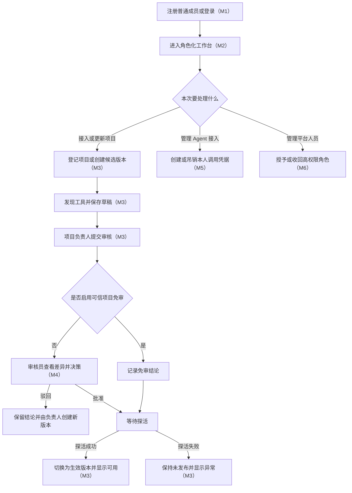
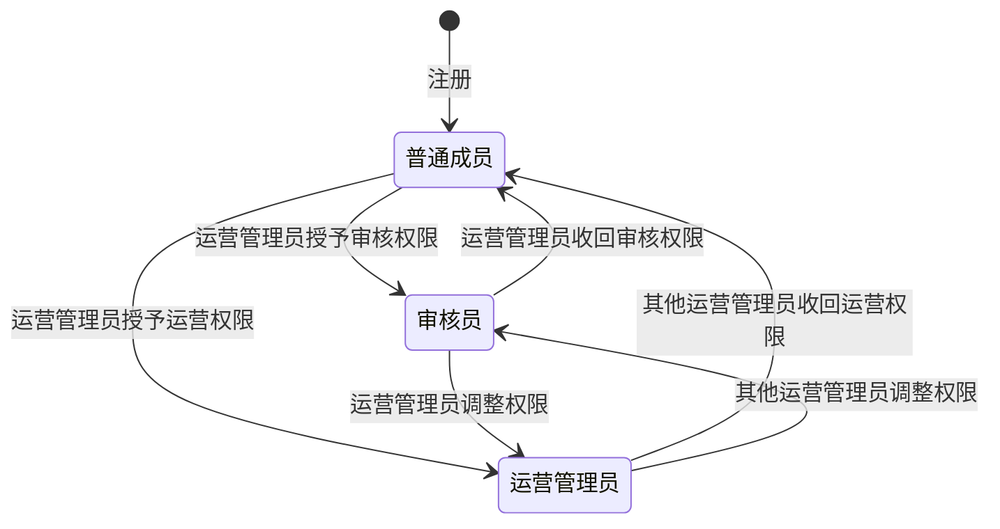
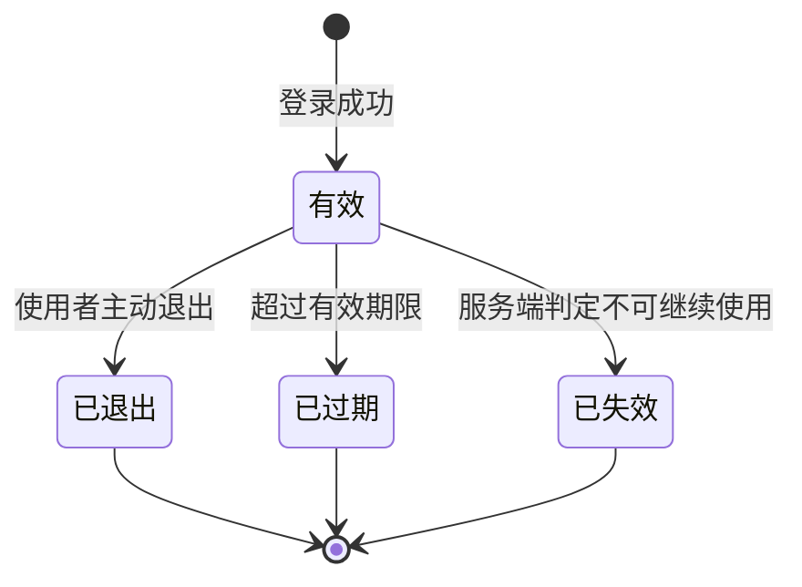
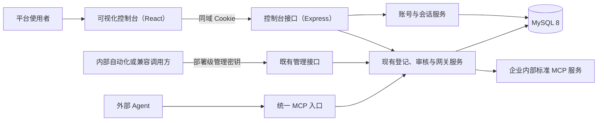
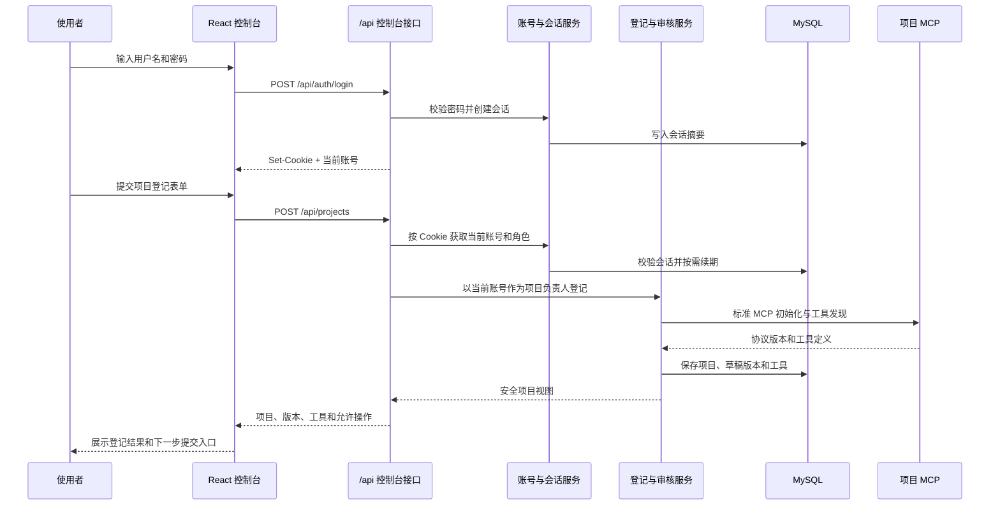
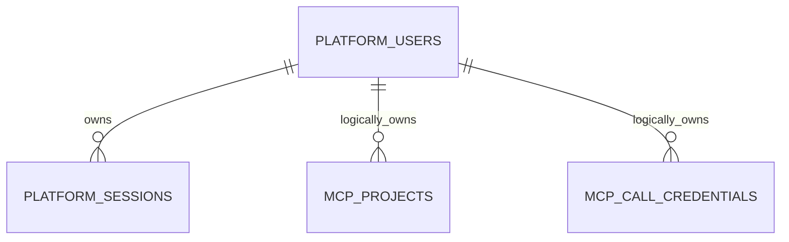

# MCPSTAT-1-CONSOLE · 可视化管理控制台方案文档

| 项目 | 内容 |
| --- | --- |
| 需求编号 | MCPSTAT-1-CONSOLE |
| 一句话需求 | 为 MCP 统一接入平台建设带登录注册、项目登记、版本审核、健康运维和调用凭据管理的可视化控制台 |
| 来源 Issue | 无独立 Issue；来源为已冻结的 MCPSTAT-1-L1 方案与 2026-08-06 用户新增要求 |
| 后续路径 | 契约验收 / 直接施工（方案文档冻结时选定） |
| 创建时间 | 2026-08-06 |
| 最后更新 | 2026-08-06 |
| 当前状态 | 需求部分已确认，技术方案编写中 |

## 第一部分 · 需求

### 1. 需求描述

#### 1.1 需求正文

MCP 统一接入平台已经具备服务登记、版本审核、探活、项目启停、统一工具清单和平台调用凭据等后台能力，但目前只能通过受保护的管理接口操作。项目负责人无法直观看到自己登记了哪些项目、候选版本为什么未发布、当前哪些工具可用；审核员缺少集中处理待审核版本的入口；运营管理员也无法通过统一界面管理人员角色、可信项目策略和项目下线。直接拼装请求不仅使用门槛高，还容易传错身份和遗漏必要步骤。

本次建设一套独立的可视化管理控制台。使用者先注册普通成员账号并登录，登录后根据账号角色看到不同的导航和操作。普通成员可以登记 MCP 项目、查看自己负责的项目、提交新版本、观察审核与健康状态，并管理自己的平台调用凭据；审核员可以集中查看待审核版本、对比候选版本与当前生效版本、批准或驳回非本人提交的版本；运营管理员可以分配审核员和运营管理员角色、控制可信项目免审、执行项目停用和永久下线。项目登记仍遵循“发现工具、形成草稿、提交审核、审核通过、探活成功后发布”的现有规则，界面只把这条链路清晰呈现出来，不绕过审核、探活或权限限制。

注册只会产生普通成员，使用者不能自行选择审核员或运营管理员。项目负责人是某个项目的归属关系，不是全局账号角色；审核员和运营管理员也可以登记自己的项目，但任何人都不能审核自己提交的版本。首个运营管理员由部署初始化，后续高权限角色均由运营管理员授予。

本期界面覆盖已经落地的接入层业务，不把采集层、分析层和闭环层尚未实现的能力包装成可用功能。调用统计、对话归因、问题聚类和 Skill 闭环只保留后续扩展位置，不展示虚假数据。本期也不提供任意协议适配、项目级或工具级授权配置，以及直接在浏览器中查看或复制项目 Token；项目 Token 只允许在登记或创建新版本时重新输入，提交后不再回显。

#### 1.2 背景与动机

- **问题来源**：接入层方案明确把可视化控制台排除在第一阶段之外；接入层现已完成并经过真实数据库与标准 MCP 接入验证，用户要求进入独立的控制台阶段。
- **为什么现在做**：登记、审核、发布和凭据管理已经形成完整后台链路，具备被页面承接的稳定业务基础；继续只使用接口会限制平台面向企业内部项目推广。
- **不做会怎样**：项目负责人需要手工组织身份信息和请求参数，无法在一个地方追踪版本从草稿到发布的进度；审核员容易遗漏待办；运营管理员难以确认角色、项目状态和健康状态是否一致，且部署级管理密钥存在被误放到个人脚本或浏览器中的风险。

#### 1.3 使用场景与界面范围

| 界面或场景 | 使用者 | 什么时候用 | 期望结果 |
| --- | --- | --- | --- |
| 登录页 | 已有账号的使用者 | 进入控制台时 | 使用登录标识和密码进入与自身角色匹配的工作区 |
| 注册页 | 新使用者 | 首次使用平台时 | 创建普通成员账号并进入登录流程，不能自行选择高权限角色 |
| 工作台总览 | 全部已登录使用者 | 登录后或日常巡检时 | 看到与本人相关的项目、待处理事项、异常健康项目和凭据提醒；无权限的数据不出现 |
| 项目列表 | 普通成员、审核员、运营管理员 | 查找和筛选项目时 | 普通成员看到自己负责的项目；审核员和运营管理员按职责看到可处理范围，并可按项目状态、健康状态和审核状态筛选 |
| 项目登记向导 | 全部已登录使用者 | 首次接入一个标准 MCP 项目时 | 填写项目信息、服务地址和项目 Token，平台发现工具并创建草稿；敏感信息提交后不回显 |
| 项目详情 | 项目负责人、审核员、运营管理员 | 查看项目现状或执行运维操作时 | 在同一处查看基本信息、当前生效版本、健康状态、工具清单、版本历史和允许执行的操作 |
| 新版本向导 | 项目负责人 | 服务地址、项目 Token 或工具定义变化时 | 创建不可变候选版本，预览发现结果和风险变化后决定保存草稿或提交审核 |
| 版本详情与差异 | 项目负责人、审核员、运营管理员 | 判断版本为什么待审、驳回或未发布时 | 查看候选版本、当前生效版本、工具新增删除变化、风险级别、提交和审核结论 |
| 审核队列 | 审核员 | 集中处理待审核版本时 | 按等待时间、项目和风险筛选待办，进入审核详情；本人提交的版本不可操作 |
| 审核详情 | 审核员 | 审核某个候选版本时 | 基于项目说明、工具差异、风险和历史信息批准或驳回，驳回必须说明原因 |
| 项目运维 | 项目负责人、运营管理员 | 项目需要暂停、恢复或永久下线时 | 在权限允许范围内执行操作，并看到操作前置条件、影响范围和最终状态 |
| 可信项目设置 | 运营管理员 | 确认项目后续版本可以免人工审核时 | 明确开启或关闭免审；默认关闭，界面提示免审不等于跳过探活 |
| 平台调用凭据 | 全部已登录使用者 | 外部 Agent 需要连接统一网关时 | 创建、查看摘要、到期时间和吊销自己的凭据；完整凭据只在创建成功时展示一次 |
| 用户与角色管理 | 运营管理员 | 新增审核员或调整运营权限时 | 搜索账号并调整高权限角色；不能通过注册直接获得高权限 |
| 个人账户与退出 | 全部已登录使用者 | 查看个人身份或结束使用时 | 查看账号与当前角色，安全退出当前会话 |
| 无权限与资源不存在 | 全部使用者 | 访问越权页面、失效链接或已不存在资源时 | 收到明确说明并返回可访问页面，不泄露资源详情 |

#### 1.4 交付结果

1. 新使用者可以注册普通成员账号，已有账号可以登录、保持会话并安全退出；未登录访问受保护页面时会被引导登录。
2. 不同角色只看到其职责范围内的导航、数据和操作；隐藏按钮不能替代服务端权限校验，越权请求必须被拒绝。
3. 项目负责人可以通过向导完成标准 MCP 项目登记，查看发现的工具并得到草稿版本；项目 Token 提交后不回显。
4. 项目负责人可以创建候选版本、查看与当前生效版本的差异、提交审核并跟踪审核与发布结果。
5. 审核员可以在审核队列查看待办、进入版本差异页并批准或驳回；不能审核本人提交的版本，驳回时必须填写原因。
6. 审核通过不会被界面描述成已经发布；只有探活成功并切换生效版本后，项目和工具才显示为已发布可用。
7. 项目负责人可以停用或恢复自己的项目，运营管理员可以执行相同操作并在满足现有状态规则时永久下线项目。
8. 运营管理员可以开启或关闭可信项目免审，并可以把普通成员调整为审核员或运营管理员；使用者不能通过注册或修改个人资料自行提升权限。
9. 使用者可以创建、查看和吊销自己的平台调用凭据；完整凭据只展示一次，列表和日志中只出现可识别摘要。
10. 工作台和列表能够展示已落地接入层的真实状态，并提供空数据、加载中、失败、无权限和资源不存在等完整反馈。
11. 采集层和后续层级未实现的数据不会出现在本期页面中，也不会用模拟统计冒充真实平台能力。

#### 1.5 本次不做

- 不建设调用统计、对话明细、问题归因、聚类分析和 Skill 闭环页面，因为对应层级尚未完成，提前建设会造成界面契约反复变化。
- 不提供标准 MCP 以外的接入向导，不支持本地进程、命令行包装或任意协议转换，保持与接入层范围一致。
- 不建设平台侧项目级或工具级授权配置；有效平台凭据仍可访问全部已发布、健康且未暂停的工具，项目内部数据权限继续由项目 MCP 判断。
- 不在浏览器中展示已保存的项目 Token、平台凭据摘要之外的秘密、部署级管理密钥或加密材料。
- 不允许在线编辑已经形成的服务版本；任何地址、凭据或工具定义变化都创建新版本，以免页面行为破坏不可变版本规则。
- 不提供项目物理删除和历史版本删除；永久下线保留历史记录和稳定项目标识。
- 本期不提供外部 Agent 的在线工具调试台；平台凭据的目标是供 Agent 接入统一网关，不把控制台扩展成通用 MCP 客户端。

### 2. 现状与问题

- **现在怎么运作**：平台已经可以登记标准 MCP 项目、发现工具、创建不可变版本、提交和审核版本、探活后发布、启停项目、设置可信项目免审，以及创建和吊销平台调用凭据。全部管理操作依赖部署级管理密钥和由可信调用方提供的身份信息，没有真实账号、密码、登录会话和页面查询入口。
- **卡在哪里**：现有管理能力以动作接口为主，缺少页面需要的项目列表、项目详情、版本差异、审核队列和角色管理能力；浏览器也不应持有部署级管理密钥或自行声明用户角色。现有数据只记录外部身份文本，尚不能承载登录、密码和角色分配。
- **判断依据**：已冻结并完成实现的接入层方案、当前六张业务表、管理接口与集成测试；关联的采集层飞书文档仍处于需求草稿且方案未开始，因此不属于本期可视化数据来源。

### 3. 模块分解

#### 3.1 模块清单

| 编号 | 模块 | 业务职责 | 依赖模块 | 交付顺序 | 可否独立验收 |
| --- | --- | --- | --- | --- | --- |
| M1 | 账号与会话 | 注册普通成员、登录、识别当前账号、退出和建立可信身份 | 无 | 1 | 是 |
| M2 | 控制台工作区 | 提供角色化导航、总览、统一反馈和可访问范围 | M1 | 2 | 是 |
| M3 | 项目接入与运维 | 可视化登记项目、创建版本、查看工具与版本、启停和可信项目设置 | M1、M2、现有接入层 | 3 | 是 |
| M4 | 版本审核 | 提供审核队列、版本差异和批准或驳回操作 | M1、M2、M3 | 4 | 是 |
| M5 | 调用凭据 | 创建、一次性展示、查询摘要和吊销本人凭据 | M1、M2、现有统一网关 | 5 | 是 |
| M6 | 用户与角色 | 由运营管理员查询账号并授予或收回高权限角色 | M1、M2 | 6 | 是 |

六个模块共同构成一个控制台，不建议再拆成独立需求编号。账号与会话可以先独立验收，后续模块按照依赖逐步接入；任一业务页都不能自行构造身份绕过账号模块。

#### 3.2 M1 账号与会话

- **边界**：负责普通成员注册、登录、当前身份识别和退出；不允许注册时选择高权限角色，不负责项目归属或审核权限判断。
- **入口与触发**：新使用者打开注册页，已有账号打开登录页，已登录使用者退出或会话失效。
- **完成信号**：有效账号可以进入控制台，错误凭据不能登录，退出或会话失效后不能继续访问受保护内容。
- **对外提供**：可信的当前账号、全局角色和登录状态。
- **依赖前提**：首个运营管理员已由部署过程初始化。

#### 3.3 M2 控制台工作区

- **边界**：负责角色化导航、工作台总览、页面访问控制以及加载、空数据、失败、无权限和资源不存在等统一反馈；不替各业务模块决定资源权限。
- **入口与触发**：使用者登录成功或在控制台内切换页面。
- **完成信号**：每个角色只看到可访问入口，工作台显示真实可追踪事项，异常状态有明确去向。
- **对外提供**：统一页面框架、当前位置、账号信息和反馈方式。
- **依赖前提**：账号与会话能够稳定给出当前身份，各业务模块提供真实查询结果。

#### 3.4 M3 项目接入与运维

- **边界**：负责项目列表、登记向导、项目详情、候选版本、版本差异、工具清单、项目启停和可信项目设置；不负责做出审核结论，也不直接调用业务工具。
- **入口与触发**：项目负责人登记或更新 MCP 服务、查看项目；运营管理员处理免审或项目状态。
- **完成信号**：项目从登记到提交审核、审核后探活发布的进度可见，所有操作遵守现有状态和归属规则。
- **对外提供**：项目、版本、工具、风险、健康和发布状态的可视化信息，以及允许执行的管理操作。
- **依赖前提**：账号身份可信，现有接入层登记、发现、探活和状态管理能力可用。

#### 3.5 M4 版本审核

- **边界**：负责待审核版本查询、版本差异展示和审核决策；不创建候选版本，不替代发布前探活。
- **入口与触发**：审核员进入审核队列并选择一条非本人提交的待办。
- **完成信号**：审核结果和意见可追踪，并发或重复决策不会覆盖先到结论；批准后页面继续区分等待探活和已经发布。
- **对外提供**：审核队列、差异视图和不可变审核结论。
- **依赖前提**：项目和候选版本已创建并提交，账号具有审核员角色。

#### 3.6 M5 调用凭据

- **边界**：负责本人平台调用凭据的创建、一次性展示、摘要列表和吊销；不管理项目 Token，不提供工具级授权。
- **入口与触发**：使用者需要让外部 Agent 连接统一网关，或需要停用某个已有凭据。
- **完成信号**：凭据可以安全创建和吊销，完整值不会在创建完成后再次取得，其他账号无法查看或操作。
- **对外提供**：可供外部 Agent 使用的平台凭据及其生命周期信息。
- **依赖前提**：账号与会话可确定凭据所有者，现有统一网关凭据校验能力可用。

#### 3.7 M6 用户与角色

- **边界**：负责账号查询以及审核员、运营管理员角色的授予和收回；不改变项目负责人归属，不允许使用者修改自己的高权限角色。
- **入口与触发**：运营管理员需要补充审核力量或调整运营权限。
- **完成信号**：角色调整立即影响后续页面和接口权限，注册流程始终只创建普通成员。
- **对外提供**：可管理的账号目录和可信角色结果。
- **依赖前提**：至少存在一个由部署初始化的运营管理员。

### 4. 业务流程

#### 4.1 主流程图



页面不会把“审核批准”“项目健康”和“已经发布”合并成一个状态。候选版本只有在获得发布资格并通过探活后才会切换生效；失败时保留原生效版本和候选版本记录。普通成员只处理自己负责的项目，审核员不能操作本人提交的审核项，运营管理员的角色与项目操作也必须经过相同的服务端校验。

#### 4.2 流程详解

1. **注册、登录与进入工作台**（M1、M2）
   - 触发者与动作：新使用者注册普通成员，或已有账号提交登录信息。
   - 系统行为与依赖：验证账号信息，建立登录会话并按当前角色生成可访问导航和待办摘要。
   - 状态与数据：新账号保存为普通成员；登录成功后产生会话，退出或失效后会话终止。
   - 可见结果：使用者进入工作台；登录失败时停留原页且不泄露账号是否存在。
2. **登记项目并发现工具**（M3）
   - 触发者与动作：已登录使用者填写稳定项目标识、展示信息、标准 MCP 服务地址和可选项目 Token。
   - 系统行为与依赖：连接目标服务，确认协议并读取工具定义，创建项目和第一个不可变草稿版本。
   - 状态与数据：项目处于待发布，版本处于草稿，发现的工具和风险结论随版本保存；项目 Token 安全保存且不回显。
   - 可见结果：使用者看到发现的工具、风险和下一步提交操作；连接失败时不会产生半完成项目。
3. **创建新版本并预览差异**（M3）
   - 触发者与动作：项目负责人提交新的服务地址或项目 Token。
   - 系统行为与依赖：重新发现工具，形成新候选版本，并与当前生效版本比较新增、删除和变化。
   - 状态与数据：旧版本保持不变；新版本先保存为草稿，高风险变化继续遵守工具暂停规则。
   - 可见结果：负责人可以在提交审核前查看发现结果和风险，不会误以为编辑了线上版本。
4. **提交与审核**（M3、M4）
   - 触发者与动作：项目负责人提交草稿；审核员从队列进入非本人提交的版本并作出决定。
   - 系统行为与依赖：普通项目进入待审核；可信免审项目直接取得发布资格；人工审核时批准或驳回只接受一次有效结论。
   - 状态与数据：审核结论不可覆盖；驳回保留原因，批准或免审进入等待探活阶段。
   - 可见结果：负责人和审核员看到一致的版本状态，驳回原因明确，批准页面提示尚未完成发布。
5. **探活与发布**（M3）
   - 触发者与动作：版本取得发布资格后由平台发起探活，项目负责人或运营管理员也可查看健康结果。
   - 系统行为与依赖：探活成功后原子切换生效版本；失败则不切换，旧版本继续按原状态服务。
   - 状态与数据：项目健康状态和最近检查时间更新，成功时项目进入正常服务并指向新版本。
   - 可见结果：页面明确显示已发布、等待探活或探活失败，不用审核状态代替发布状态。
6. **项目运维与可信策略**（M3）
   - 触发者与动作：负责人或运营管理员停用、恢复项目；运营管理员调整免审或执行永久下线。
   - 系统行为与依赖：按项目当前状态和操作者权限校验，恢复前重新确认健康，永久下线要求先停用。
   - 状态与数据：状态改变后立即影响统一工具清单；永久下线保留历史且不可恢复。
   - 可见结果：确认界面说明影响范围，成功后刷新为实际状态，非法流转显示原因。
7. **创建和吊销调用凭据**（M5）
   - 触发者与动作：使用者填写凭据名称和可选到期时间，或吊销本人凭据。
   - 系统行为与依赖：新建凭据并仅在成功结果中返回一次完整值；后续只保存和展示摘要，吊销后网关立即拒绝使用。
   - 状态与数据：凭据归属于当前账号，具有有效、已过期或已吊销的可判定状态。
   - 可见结果：使用者必须明确确认已复制完整值；离开后不能再次查看，只能创建新凭据。
8. **调整用户角色**（M6）
   - 触发者与动作：运营管理员搜索账号并授予或收回审核员、运营管理员角色。
   - 系统行为与依赖：验证操作者仍具运营权限，保存角色结果并让后续请求立即按新角色判断。
   - 状态与数据：账号仍是同一个，只有全局角色变化；项目归属不随角色调整。
   - 可见结果：目标账号下次访问或刷新时看到新权限；越权调整被拒绝。

#### 4.3 异常分支

| 异常分支 | 触发条件 | 系统行为 | 用户或下游感知 | 状态或数据结果 |
| --- | --- | --- | --- | --- |
| 注册信息重复或不合格 | 登录标识已被占用，或密码不满足规则 | 拒绝创建并返回可修正提示 | 停留注册页，不创建会话 | 不产生账号 |
| 登录失败 | 凭据错误 | 使用统一错误提示并限制连续尝试 | 不说明是账号还是密码错误 | 不产生会话，记录安全事件 |
| 会话失效 | 登录会话过期、退出或被服务端判为无效 | 中止当前请求并引导重新登录 | 未保存的敏感输入被清除 | 不改变业务对象 |
| 页面访问越权 | 角色不允许或资源不属于当前账号 | 服务端拒绝，页面显示无权限 | 不展示目标资源详情 | 不改变业务对象，记录拒绝事件 |
| MCP 服务连接失败 | 地址、协议或项目 Token 错误 | 终止登记或新版本创建，返回可定位但不含秘密的错误 | 向导保留非敏感输入供修正 | 不产生半完成版本 |
| 项目标识重复 | 新登记使用了已有稳定标识 | 拒绝登记并提示更换标识 | 项目不创建 | 现有项目不受影响 |
| 重复提交版本 | 草稿已经提交或形成终态 | 返回当前实际状态，不重复产生待办 | 页面刷新到最新版本状态 | 不重复写入审核流程 |
| 审核本人版本 | 审核员也是该版本提交者 | 拒绝决策并从可操作待办中排除 | 可以查看但不能批准或驳回 | 版本保持待审核 |
| 并发审核 | 两名审核员几乎同时提交结论 | 只接受第一个有效结论，后到者获得已有结果 | 页面提示已由他人处理 | 不覆盖审核记录 |
| 驳回未填写原因 | 审核员选择驳回但没有有效说明 | 不提交审核结果并提示补充 | 停留审核页 | 版本保持待审核 |
| 审核通过但探活失败 | 候选版本无法成功连接 | 不切换生效版本并展示失败健康状态 | 负责人看到“已批准但未发布” | 原生效版本不变 |
| 非法项目状态操作 | 例如正常服务状态直接永久下线 | 拒绝并说明需要先停用 | 界面刷新实际状态和可用操作 | 项目状态不变 |
| 创建凭据后未复制 | 使用者关闭一次性展示区域 | 不提供再次查看入口 | 明确提示只能创建新凭据 | 摘要仍保留，完整值不可恢复 |
| 重复吊销凭据 | 凭据已经吊销 | 返回当前吊销结果 | 页面保持已吊销 | 不重复产生状态变化 |
| 调整角色时权限已变化 | 操作者已被收回运营权限 | 拒绝角色调整并要求刷新身份 | 返回工作台或无权限页 | 目标账号角色不变 |
| 后端暂时不可用 | 页面查询或操作超时、服务错误 | 保留可安全重试的非敏感上下文，禁止重复提交未知结果的动作 | 显示重试入口和请求标识 | 以服务端实际结果为准，刷新后重新获取 |

### 5. 状态机

控制台不另造项目、版本、健康和凭据状态，直接展示接入层已有状态。本节只补充本次新增的账号角色与登录会话规则，并说明页面如何组合现有状态。

#### 5.1 账号角色

- **管的是什么**：账号在平台层面拥有普通使用、审核或运营管理哪一级权限；项目负责人由项目归属单独判断。
- **初始状态**：普通成员，由公开注册创建。
- **终态**：无；角色可由运营管理员按规则调整。



| 起始状态 | 事件或条件 | 目标状态 | 触发者 | 并发或重复触发处理 | 副作用 |
| --- | --- | --- | --- | --- | --- |
| 无 | 注册成功 | 普通成员 | 新使用者 | 登录标识唯一，重复注册被拒绝 | 获得登记项目和管理本人凭据的能力 |
| 普通成员 | 授予审核权限 | 审核员 | 运营管理员 | 重复授予返回当前角色 | 获得非本人版本审核入口 |
| 审核员 | 收回审核权限 | 普通成员 | 运营管理员 | 重复收回返回当前角色 | 后续审核请求立即被拒绝，已作结论保留 |
| 普通成员、审核员 | 授予运营权限 | 运营管理员 | 运营管理员 | 并发调整以先完成者为当前结果，后到者需基于最新角色重试 | 获得角色、免审和永久下线管理能力 |
| 运营管理员 | 调整为普通成员或审核员 | 普通成员、审核员 | 其他运营管理员 | 不允许账号自行降级绕过约束；必须保证部署仍有可用运营入口 | 后续运营请求立即被拒绝，历史操作保留 |

- **不允许的流转**：注册时不能进入审核员或运营管理员；账号不能修改自己的高权限角色；审核权限不能绕过“禁止审核本人版本”。非法请求返回无权限且不改变角色。
- **超时与滞留**：角色本身不超时。已建立会话在下一次权限校验时读取当前角色，不承诺旧页面按钮继续可用。

#### 5.2 登录会话

- **管的是什么**：某个浏览器是否仍被允许代表已登录账号访问控制台。
- **初始状态**：有效，由登录成功创建。
- **终态**：已退出、已过期或已失效，终态会话不能恢复。



| 起始状态 | 事件或条件 | 目标状态 | 触发者 | 并发或重复触发处理 | 副作用 |
| --- | --- | --- | --- | --- | --- |
| 无 | 登录信息验证成功 | 有效 | 使用者 | 每次成功登录创建独立会话 | 可以访问受保护页面 |
| 有效 | 主动退出 | 已退出 | 使用者 | 重复退出按成功处理 | 当前浏览器后续请求需重新登录 |
| 有效 | 超过有效期限 | 已过期 | 平台 | 首次发现时完成清理 | 当前请求被拒绝并引导登录 |
| 有效 | 会话凭据无效或安全策略要求终止 | 已失效 | 平台 | 重复失效不产生额外结果 | 当前请求被拒绝，安全事件可追踪 |

- **不允许的流转**：终态会话不能重新变为有效，必须重新登录创建新会话；页面不能自行延长服务端已失效的会话。
- **超时与滞留**：有效会话必须有明确期限；具体时长和是否允许延长在技术方案中定稿，但过期后不能继续访问。

#### 5.3 页面展示的现有业务状态

- **服务版本**：草稿、待审核、已批准、已驳回。批准只表示获得发布资格，不代表已经生效。
- **接入项目**：待发布、正常服务、已停用、已下线。永久下线不可恢复。
- **健康结论**：未知、健康、不健康，并展示最近一次检查时间；健康结论不代替项目状态。
- **工具运行状态**：正常、已暂停；已暂停时必须展示原因。
- **调用凭据**：有效、已过期、已吊销。其中“已过期”由到期时间推导，不另存一套状态。

上述状态流转完全沿用已冻结接入层规则。控制台只决定如何组合展示和哪些操作在当前状态下可见，最终允许与否仍以服务端实际状态为准。

## 第二部分 · 方案

### 6. 整体架构

#### 6.1 架构图



控制台与后端同仓库、同域发布。浏览器只持有不可读的会话 Cookie，不持有部署级管理密钥，也不能通过请求参数声明自己的账号或角色。既有 `/admin` 接口继续服务内部自动化，新增 `/api` 接口专供控制台使用；两类入口复用同一套登记、审核、健康和凭据服务，因此不会产生两套业务状态机。生产环境由 Express 提供前端静态文件和单页应用回退，开发环境由 Vite 提供热更新并把 `/api`、`/admin`、`/mcp` 和 `/healthz` 代理到后端。

#### 6.2 分层与职责

| 层次 | 承担什么 | 不承担什么 | 涉及模块 |
| --- | --- | --- | --- |
| 页面与交互 | 路由、角色化导航、表单、差异视图、一次性凭据展示和视觉反馈 | 不保存身份真值，不自行判断最终权限 | M1–M6 |
| 控制台接口 | 会话认证、资源权限、查询视图、参数校验和错误契约 | 不接收浏览器自报角色，不复制领域状态机 | M1–M6 |
| 账号与会话 | 密码摘要、账号角色、会话签发、滑动续期和注销 | 不管理项目归属，不参与 MCP 调用鉴权 | M1、M6 |
| 现有业务服务 | 项目登记、版本发现、审核、探活、发布、启停和平台调用凭据 | 不负责页面布局与登录会话 | M3–M5 |
| 持久化 | 保存账号、会话和现有 MCP 业务数据 | 不依赖前端状态保证完整性 | M1、M3–M6 |
| 兼容入口 | 保留部署级管理接口和统一 MCP 入口 | 不向浏览器暴露部署级管理能力 | 现有 L1 |

#### 6.3 关键数据流



密码只在登录请求中进入服务端并立即参与摘要校验，不写日志；会话令牌只在随机生成时短暂出现，数据库只保存其摘要。项目 Token 只从登记或新版本表单传入，业务服务加密后保存，任何控制台响应都不返回密文或原值。会话无效、资源越权、下游 MCP 发现失败都会在写入业务对象前中断；版本提交、审核、发布和项目状态仍由现有服务执行事务与状态校验。

#### 6.4 技术选型与取舍

| 决策点 | 选定方案 | 放弃的方案 | 代价与理由 |
| --- | --- | --- | --- |
| 前端框架 | React 19、TypeScript、Vite，放在仓库 `web` 目录 | Next.js 或独立前端仓库 | 控制台不需要服务端渲染；同仓库构建最少，代价是前后端仍需两个 TypeScript 配置 |
| 发布方式 | Express 同域托管前端产物，开发时 Vite 反向代理 | 独立域名和独立发布 | 避免跨域和浏览器令牌存储；代价是前端发布与后端发布绑定 |
| 登录态 | 服务端随机会话，HttpOnly Cookie，7 天滑动续期 | 浏览器保存长期访问令牌或固定短会话 | 减少脚本窃取令牌风险并符合用户选择；代价是每次请求需要读取会话，需定期清理过期记录 |
| 密码摘要 | Argon2id，每个密码独立盐值 | 明文、可逆加密、快速哈希 | 抗离线破解能力更好；代价是登录时有可控计算开销，需要原生依赖 |
| 页面数据 | TanStack Query 管理服务端数据，局部表单状态留在组件 | 全局状态库保存所有响应 | 查询缓存、刷新和失败重试语义更清楚；代价是需要为变更操作显式失效相关查询 |
| 表单 | React Hook Form 与 Zod，共享字段规则但以后端校验为准 | 手写受控表单 | 复杂向导错误定位稳定；代价是增加两个前端依赖 |
| 样式与动效 | Tailwind CSS、Geist 字体、GSAP；认证入口使用编辑式大画幅，业务页使用克制的分区动效 | 无设计系统的零散样式，或把营销页滚动效果复制到所有表格 | 落实 `gpt-taste` 的字体、网格、对比度和真实动效要求；业务页减少固定滚动，避免影响审核效率和可访问性 |
| 页面图标 | Phosphor Icons | Emoji 或混用多套图标 | 视觉一致且满足技能禁用 Emoji 的约束；代价是增加图标依赖 |
| 分页 | 基于稳定游标和固定上限 | 全量返回或页码偏移 | 数据增长后仍稳定；代价是不能直接跳到任意页，本期业务无需该能力 |
| 旧管理接口 | 保留 `/admin`，新增 `/api` 控制台入口 | 直接把 `/admin` 暴露给浏览器 | 不破坏已有自动化且不泄露管理密钥；代价是维护两组 HTTP 入口，但领域服务只有一套 |

### 7. 数据模型

本次只新增账号和会话两张表。项目、版本、工具、审核、运行状态和调用凭据继续使用现有六张表，不为页面展示复制数据，也不新增持久化的统计、探活计数或派生状态。

#### 7.1 实体关系



账号与会话使用数据库外键。项目与调用凭据继续沿用现有字符串所有者字段，为兼容既有管理接口不增加物理外键；控制台创建的新资源写入账号 UUID，旧管理接口写入的外部身份仍可继续使用。

#### 7.2 `platform_users`

- **用途**：保存可登录控制台的账号、密码摘要和全局角色。
- **归属与权限**：账号本人可读取自己的安全视图并修改显示名称；只有运营管理员可以查询账号目录和调整高权限角色；任何接口都不返回密码摘要。
- **变更类型**：新增表。
- **数据量与增长**：企业内部账号预计为百至万级，按用户名精确登录，运营侧按角色与创建时间游标查询。

| 字段 | 类型 | 可空 | 默认值 | 业务含义 | 写入方 / 读取方 |
| --- | --- | --- | --- | --- | --- |
| `id` | `CHAR(36)` | NOT NULL | 无 | 账号 UUID，作为会话和新资源所有者标识 | 注册或初始化脚本 / 全部控制台服务 |
| `username` | `VARCHAR(64)` 二进制排序 | NOT NULL | 无 | 全局唯一、不可修改的登录用户名 | 注册或初始化脚本 / 登录、用户查询 |
| `display_name` | `VARCHAR(120)` | NOT NULL | 无 | 页面展示名称，可由本人修改 | 注册、个人资料 / 页面与审核记录展示 |
| `password_hash` | `VARCHAR(255)` | NOT NULL | 无 | Argon2id 完整摘要串 | 注册、密码校验 / 仅账号服务 |
| `role` | `VARCHAR(16)` | NOT NULL | `member` | 全局角色 | 注册默认值、运营管理员 / 权限中间件与导航 |
| `created_at` | `DATETIME(6)` | NOT NULL | 当前 UTC 时间 | 创建时间 | 数据库 / 用户列表 |
| `updated_at` | `DATETIME(6)` | NOT NULL | 当前 UTC 时间 | 最近资料或角色更新时间 | 数据库 / 会话身份刷新 |

- **主键**：`pk_platform_users (id)`，应用生成 UUID。
- **唯一约束**：`uk_platform_users_username (username)`，用户名按大小写敏感精确唯一。
- **索引**：`idx_platform_users_role_created (role, created_at, id)`，支撑运营管理员按角色和稳定游标查询。
- **外键与关联策略**：无入站外键定义在本表；账号不提供物理删除，避免破坏历史归属。
- **枚举取值**：`role` 为 `member`（普通成员）、`reviewer`（审核员）、`operator`（运营管理员）。

#### 7.3 `platform_sessions`

- **用途**：保存浏览器登录会话的不可逆令牌摘要、活动时间、滑动过期时间和注销结果。
- **归属与权限**：会话属于单个账号；只由账号服务读写，前端只能得到到期时间，不能查询令牌摘要或其他设备的会话。
- **变更类型**：新增表。
- **数据量与增长**：随登录次数增长；过期或注销记录定期硬删除，不承担长期审计职责。

| 字段 | 类型 | 可空 | 默认值 | 业务含义 | 写入方 / 读取方 |
| --- | --- | --- | --- | --- | --- |
| `id` | `CHAR(36)` | NOT NULL | 无 | 会话 UUID | 登录 / 账号服务 |
| `user_id` | `CHAR(36)` | NOT NULL | 无 | 所属账号 | 登录 / 会话认证 |
| `token_digest` | `BINARY(32)` | NOT NULL | 无 | 随机会话令牌的 SHA-256 摘要 | 登录 / 会话认证 |
| `expires_at` | `DATETIME(6)` | NOT NULL | 无 | 当前滑动过期时间 | 登录与续期 / 会话认证、前端提示 |
| `last_seen_at` | `DATETIME(6)` | NOT NULL | 无 | 最近一次被服务端接受的访问时间 | 登录与续期 / 清理与安全排查 |
| `created_at` | `DATETIME(6)` | NOT NULL | 当前 UTC 时间 | 会话创建时间 | 数据库 / 会话服务 |
| `revoked_at` | `DATETIME(6)` | NULL | `NULL` | 当前会话主动退出时间 | 退出 / 会话认证 |

- **主键**：`pk_platform_sessions (id)`，应用生成 UUID。
- **唯一约束**：`uk_platform_sessions_token_digest (token_digest)`，防止令牌摘要重复。
- **索引**：`idx_platform_sessions_user_created (user_id, created_at, id)` 支撑账号会话关联；`idx_platform_sessions_expiry (expires_at)` 支撑过期清理。
- **外键与关联策略**：`fk_platform_sessions_user` 指向账号，更新和删除均限制；账号不物理删除。
- **枚举取值**：无。有效状态由 `revoked_at IS NULL AND expires_at > 当前时间` 推导，不重复保存状态字段。

#### 7.4 定稿 DDL

```sql
-- 设计定稿，仅供评审与实现阶段引用，本阶段不执行
CREATE TABLE platform_users (
  id CHAR(36) NOT NULL COMMENT '平台账号 UUID',
  username VARCHAR(64) CHARACTER SET utf8mb4 COLLATE utf8mb4_0900_bin NOT NULL COMMENT '全局唯一且不可修改的登录用户名',
  display_name VARCHAR(120) NOT NULL COMMENT '账号展示名称',
  password_hash VARCHAR(255) NOT NULL COMMENT 'Argon2id 密码摘要',
  role VARCHAR(16) NOT NULL DEFAULT 'member' COMMENT 'member/reviewer/operator',
  created_at DATETIME(6) NOT NULL DEFAULT CURRENT_TIMESTAMP(6) COMMENT 'UTC 创建时间',
  updated_at DATETIME(6) NOT NULL DEFAULT CURRENT_TIMESTAMP(6) ON UPDATE CURRENT_TIMESTAMP(6) COMMENT 'UTC 更新时间',
  CONSTRAINT pk_platform_users PRIMARY KEY (id),
  CONSTRAINT uk_platform_users_username UNIQUE (username),
  KEY idx_platform_users_role_created (role, created_at, id),
  CONSTRAINT ck_platform_users_role CHECK (role IN ('member', 'reviewer', 'operator'))
) ENGINE=InnoDB DEFAULT CHARSET=utf8mb4 COLLATE=utf8mb4_0900_ai_ci COMMENT='LinkCli 控制台账号';

CREATE TABLE platform_sessions (
  id CHAR(36) NOT NULL COMMENT '登录会话 UUID',
  user_id CHAR(36) NOT NULL COMMENT '所属平台账号',
  token_digest BINARY(32) NOT NULL COMMENT '会话令牌 SHA-256 摘要',
  expires_at DATETIME(6) NOT NULL COMMENT 'UTC 滑动过期时间',
  last_seen_at DATETIME(6) NOT NULL COMMENT 'UTC 最近有效访问时间',
  created_at DATETIME(6) NOT NULL DEFAULT CURRENT_TIMESTAMP(6) COMMENT 'UTC 创建时间',
  revoked_at DATETIME(6) NULL COMMENT 'UTC 主动注销时间',
  CONSTRAINT pk_platform_sessions PRIMARY KEY (id),
  CONSTRAINT uk_platform_sessions_token_digest UNIQUE (token_digest),
  KEY idx_platform_sessions_user_created (user_id, created_at, id),
  KEY idx_platform_sessions_expiry (expires_at),
  CONSTRAINT ck_platform_sessions_expiry CHECK (expires_at > created_at),
  CONSTRAINT fk_platform_sessions_user FOREIGN KEY (user_id) REFERENCES platform_users (id) ON UPDATE RESTRICT ON DELETE RESTRICT
) ENGINE=InnoDB DEFAULT CHARSET=utf8mb4 COLLATE=utf8mb4_0900_ai_ci COMMENT='LinkCli 控制台登录会话';
```

#### 7.5 旧数据与兼容

- **存量数据处理**：现有六张 MCP 表不改字段、不回填。旧管理接口写入的所有者字符串继续有效，但不会自动绑定到新注册账号；控制台新建资源使用账号 UUID。现有内部自动化继续通过 `/admin` 管理其资源。
- **兼容窗口**：`/admin` 与 `/api` 长期并存；控制台不会读取或保存部署级管理密钥。若未来需要把旧项目转给控制台账号，应另行设计显式转移流程，不能按用户名猜测归属。
- **真值源核对**：领域类型和仓库实现当前只有六张 MCP 表；仓库绿地真值源为 `src/db/schema.sql`，尚无版本化迁移链；本轮实现时把两张新表同时加入绿地 schema。开发 MySQL 的现有六表状态曾在 L1 当次验证通过，但本轮尚未核实是否已经存在新表；其他目标环境当前版本尚未核实。
- **回滚与不可逆点**：上线时先创建两张新表，再发布读取它们的后端，最后发布前端。回滚应用不会影响现有六表；新注册账号和会话会暂时成为无人读取的数据。只有执行删除新表才会不可逆丢失账号，因此普通应用回滚不得删表。

### 8. 接口契约

#### 8.1 通用约定

- 控制台接口统一位于 `/api`，请求和响应使用 JSON，时间均为 UTC ISO 8601 字符串。
- 成功响应统一为 `{ "data": ... }`；列表额外返回 `{ "meta": { "nextCursor": string | null } }`。
- 错误统一为 `{ "error": { "code": string, "message": string, "details"?: object, "requestId": string } }`。
- 所有受保护接口从 `linkcli_session` Cookie 解析账号；浏览器不得发送用户编号或角色请求头。
- 写操作要求同源 `Origin`，Cookie 使用 `HttpOnly`、`Secure`（生产）、`SameSite=Lax` 和根路径；登录成功后重新生成会话，避免会话固定攻击。
- `limit` 默认 20，最小 1、最大 100；`cursor` 为服务端不透明字符串，前端不解析。
- 所有安全视图都排除密码摘要、会话摘要、项目凭据密文、项目 Token、平台凭据摘要和完整值；平台凭据只在创建成功响应中返回一次。

**共享安全类型**

```ts
type UserRole = "member" | "reviewer" | "operator";
type UserView = {
  id: string;
  username: string;
  displayName: string;
  role: UserRole;
  createdAt: string;
  updatedAt: string;
};

type SessionView = { expiresAt: string };
type AllowedAction =
  | "create_version" | "submit_version" | "review_version"
  | "disable_project" | "enable_project" | "retire_project"
  | "set_trusted_review_bypass";
```

#### 8.2 账号与会话接口（M1）

| 接口 | 方法 | 请求参数 | 成功响应 | 主要错误 | 权限 |
| --- | --- | --- | --- | --- | --- |
| `/api/auth/register` | POST | `username: string(3..64)`，只允许字母、数字、点、下划线和连字符；`displayName: string(1..120)`；`password: string(12..128)` | `201 { data: { user: UserView } }`，不创建会话 | `INVALID_INPUT`、`USERNAME_TAKEN`、`RATE_LIMITED` | 匿名 |
| `/api/auth/login` | POST | `username: string`，`password: string` | `200 { data: { user: UserView, session: SessionView } }` 并设置 Cookie | `AUTHENTICATION_FAILED`、`RATE_LIMITED` | 匿名 |
| `/api/auth/session` | GET | 无 | `200 { data: { user: UserView, session: SessionView } }`，接近过期阈值时续期 | `AUTHENTICATION_REQUIRED` | 已登录 |
| `/api/auth/logout` | POST | 无 | `204` 并清除 Cookie | 重复退出仍返回 `204` | 已登录或已有 Cookie |
| `/api/me` | PATCH | `displayName: string(1..120)` | `200 { data: { user: UserView } }` | `INVALID_INPUT` | 已登录 |

登录失败统一返回“用户名或密码错误”，不泄露用户名是否存在。连续失败限制按客户端地址和规范化用户名共同计算；第一期为单实例内存限流，多实例共享限流列入风险。

#### 8.3 工作台接口（M2）

`GET /api/dashboard` 无请求体，返回当前账号可见范围内的摘要：

```ts
type DashboardResponse = {
  data: {
    projects: { total: number; active: number; unhealthy: number; pending: number };
    reviews: { pending: number; stale: number } | null;
    credentials: { active: number; expiringWithinSevenDays: number };
    attention: Array<{
      type: "unhealthy_project" | "pending_review" | "expiring_credential";
      id: string;
      title: string;
      description: string;
      href: string;
      occurredAt: string;
    }>;
  };
};
```

普通成员的项目统计只包含本人项目，审核员的审核统计包含可审核且非本人提交的版本，运营管理员可以看到全平台项目健康摘要但不自动获得审核操作。

#### 8.4 项目查询与操作接口（M3）

| 接口 | 方法 | 请求参数 | 成功响应 | 主要错误 | 权限 |
| --- | --- | --- | --- | --- | --- |
| `/api/projects` | GET | 查询：`query?`、`status?`、`healthStatus?`、`reviewStatus?`、`cursor?`、`limit?` | 项目摘要列表和下一游标 | `INVALID_INPUT` | 成员仅本人；审核员、运营管理员可查看全平台 |
| `/api/projects` | POST | `projectKey: string(2..48)`、`displayName: string(1..120)`、`description: string(1..1000)`、`endpoint: absolute http/https URL`、`projectToken?: string(1..4096)` | `201`，项目、草稿版本、工具列表和允许操作 | `INVALID_INPUT`、`CONFLICT`、`MCP_DISCOVERY_FAILED` | 已登录，当前账号成为负责人 |
| `/api/projects/:projectKey` | GET | 路径：`projectKey` | 项目详情、当前版本、最新版本、工具运行状态、版本摘要和允许操作 | `NOT_FOUND`、`AUTHORIZATION_FAILED` | 负责人、审核员、运营管理员 |
| `/api/projects/:projectKey/versions` | GET | 查询：`cursor?`、`limit?` | 版本摘要列表和下一游标 | `NOT_FOUND`、`AUTHORIZATION_FAILED` | 负责人、审核员、运营管理员 |
| `/api/projects/:projectKey/versions` | POST | `endpoint: absolute http/https URL`、`projectToken?: string(1..4096)` | `201`，新草稿版本、工具、差异和暂停工具；相同定义返回既有版本并标明 `created: false` | `INVALID_STATE`、`AUTHORIZATION_FAILED`、`MCP_DISCOVERY_FAILED` | 仅负责人 |
| `/api/projects/:projectKey/status` | PATCH | `action: "disable" | "enable" | "retire"` | 更新后的项目和允许操作 | `INVALID_STATE`、`AUTHORIZATION_FAILED`、`SERVICE_UNAVAILABLE` | 负责人可停用/恢复；运营管理员还可永久下线 |
| `/api/projects/:projectKey/trusted-review-bypass` | PATCH | `enabled: boolean` | 更新后的项目 | `AUTHORIZATION_FAILED`、`NOT_FOUND` | 仅运营管理员 |

**项目摘要与详情类型**

```ts
type ProjectSummary = {
  id: string;
  projectKey: string;
  displayName: string;
  description: string;
  owner: { id: string; displayName: string } | { id: string; displayName: null };
  status: "pending" | "active" | "disabled" | "retired";
  healthStatus: "unknown" | "healthy" | "unhealthy";
  activeVersionNo: number | null;
  latestReviewStatus: "draft" | "pending_review" | "approved" | "rejected";
  toolCount: number;
  lastHealthCheckedAt: string | null;
  updatedAt: string;
};

type ProjectDetail = ProjectSummary & {
  trustedReviewBypassEnabled: boolean;
  activeVersion: VersionSummary | null;
  latestVersion: VersionSummary;
  tools: ToolView[];
  versions: VersionSummary[];
  allowedActions: AllowedAction[];
};
```

#### 8.5 版本、差异与审核接口（M3、M4）

| 接口 | 方法 | 请求参数 | 成功响应 | 主要错误 | 权限 |
| --- | --- | --- | --- | --- | --- |
| `/api/versions/:versionId` | GET | 路径：`versionId` | 版本详情、工具、与该版本之前最近一个已批准版本的差异、审核记录和允许操作；首版以空工具集为基线 | `NOT_FOUND`、`AUTHORIZATION_FAILED` | 负责人、审核员、运营管理员 |
| `/api/versions/:versionId/submit` | POST | 无 | 更新后的版本、是否触发免审、是否已经发布 | `INVALID_STATE`、`AUTHORIZATION_FAILED` | 仅项目负责人 |
| `/api/reviews` | GET | 查询：`query?`、`riskLevel?`、`waiting? = all | stale`、`cursor?`、`limit?` | 非本人提交的待审核版本列表和下一游标 | `AUTHORIZATION_FAILED` | 仅审核员 |
| `/api/versions/:versionId/review` | POST | `decision: "approved" | "rejected"`；驳回时 `comment: string(1..2000)` 必填，批准时可选 | 版本、项目、审核记录、`published: boolean` | `INVALID_INPUT`、`CONFLICT`、`AUTHORIZATION_FAILED`、`SERVICE_UNAVAILABLE` | 仅审核员且不能自审 |

```ts
type VersionSummary = {
  id: string;
  projectId: string;
  versionNo: number;
  endpoint: string;
  protocolVersion: string;
  reviewStatus: "draft" | "pending_review" | "approved" | "rejected";
  riskLevel: "low" | "medium" | "high" | "incompatible";
  submittedBy: { id: string; displayName: string | null };
  submittedAt: string | null;
  createdAt: string;
};

type ToolView = {
  id: string;
  originalName: string;
  publicName: string;
  description: string;
  inputSchema: Record<string, unknown>;
  outputSchema: Record<string, unknown> | null;
  riskLevel: "low" | "medium" | "high" | "incompatible";
  runtimeStatus: "active" | "suspended";
  suspendedReason: string | null;
};

type ToolDiff = {
  name: string;
  change: "added" | "removed" | "description_changed" | "input_changed" | "output_changed" | "unchanged";
  before: ToolView | null;
  after: ToolView | null;
};

type VersionDetail = VersionSummary & {
  project: ProjectSummary;
  tools: ToolView[];
  diffBaseVersionNo: number | null;
  diff: ToolDiff[];
  review: null | {
    decision: "approved" | "rejected" | "bypassed";
    comment: string | null;
    reviewer: { id: string; displayName: string | null };
    decidedAt: string;
  };
  allowedActions: AllowedAction[];
};
```

差异由后端依据目标版本之前最近一个已批准版本计算，首版与空工具集比较。这样版本批准并成为当前生效版本后，审核时看到的历史差异仍保持稳定；前端只负责呈现，不得根据颜色或文本自行推导风险结论。完整项目 Token、加密字段和定义摘要不进入上述类型。

#### 8.6 调用凭据接口（M5）

| 接口 | 方法 | 请求参数 | 成功响应 | 主要错误 | 权限 |
| --- | --- | --- | --- | --- | --- |
| `/api/credentials` | GET | 查询：`cursor?`、`limit?` | 本人凭据列表和下一游标 | `AUTHENTICATION_REQUIRED` | 已登录，仅本人 |
| `/api/credentials` | POST | `credentialName: string(1..120)`、`expiresAt?: ISO datetime | null`，必须晚于当前时间 | `201 { data: { credential: CredentialView, token: string } }`；`token` 只返回一次 | `INVALID_INPUT` | 已登录，仅本人 |
| `/api/credentials/:credentialId` | DELETE | 路径：`credentialId` | `200 { data: { credential: CredentialView } }` | `NOT_FOUND`、`AUTHORIZATION_FAILED` | 已登录，仅本人 |

```ts
type CredentialView = {
  id: string;
  credentialName: string;
  tokenPrefix: string;
  expiresAt: string | null;
  createdAt: string;
  revokedAt: string | null;
  status: "active" | "expired" | "revoked";
};
```

#### 8.7 用户与角色接口（M6）

| 接口 | 方法 | 请求参数 | 成功响应 | 主要错误 | 权限 |
| --- | --- | --- | --- | --- | --- |
| `/api/users` | GET | 查询：`query?`、`role?`、`cursor?`、`limit?` | `UserView` 列表和下一游标 | `AUTHORIZATION_FAILED` | 仅运营管理员 |
| `/api/users/:userId/role` | PATCH | `role: "member" | "reviewer" | "operator"` | 更新后的 `UserView` | `INVALID_STATE`、`AUTHORIZATION_FAILED`、`NOT_FOUND` | 仅运营管理员；不能修改自己，不能移除最后一个运营管理员 |

#### 8.8 页面路由与接口映射

| 页面路由 | 页面 | 主要读取接口 | 主要写入接口 | 访问角色 |
| --- | --- | --- | --- | --- |
| `/login` | 登录 | 无 | `/api/auth/login` | 匿名 |
| `/register` | 注册 | 无 | `/api/auth/register` | 匿名 |
| `/` | 工作台 | `/api/auth/session`、`/api/dashboard` | 无 | 全部已登录账号 |
| `/projects` | 项目列表 | `/api/projects` | 无 | 全部已登录账号 |
| `/projects/new` | 项目登记向导 | 无 | `/api/projects` | 全部已登录账号 |
| `/projects/:projectKey` | 项目详情 | 项目详情、版本列表 | 状态、免审、提交 | 负责人、审核员、运营管理员 |
| `/projects/:projectKey/versions/new` | 新版本向导 | 项目详情 | 创建版本 | 仅负责人 |
| `/versions/:versionId` | 版本差异与审核详情 | 版本详情 | 提交或审核 | 负责人、审核员按权限 |
| `/reviews` | 审核队列 | `/api/reviews` | 无 | 仅审核员 |
| `/credentials` | 调用凭据 | `/api/credentials` | 创建、吊销凭据 | 全部已登录账号 |
| `/users` | 用户与角色 | `/api/users` | 调整角色 | 仅运营管理员 |
| `/account` | 个人账户 | `/api/auth/session` | `/api/me`、退出 | 全部已登录账号 |

- **共享类型影响**：后端导出纯 JSON 视图类型，前端在 `web/src/api/types.ts` 保留对应契约并通过接口测试校验关键字段；不把后端领域对象直接序列化到浏览器。
- **消费方**：React 页面只调用 `/api`；既有 `/admin` 集成测试和统一 MCP 调用方不改请求契约。

### 9. 文件结构与实现方案

#### 9.1 目录树

```text
LinkCli/
├── package.json                                  # [修改] 增加前端、联调、构建和检查脚本
├── src/
│   ├── app.ts                                    # [修改] 挂载 /api 和生产静态资源
│   ├── main.ts                                   # [修改] 注入账号仓库、会话服务和控制台查询服务
│   ├── config.ts                                 # [修改] 增加会话 Cookie、前端产物和初始化配置
│   ├── domain.ts                                 # [修改] 增加账号、角色和会话领域类型
│   ├── auth/
│   │   ├── password.ts                           # [新增] Argon2id 摘要与校验
│   │   ├── repository.ts                         # [新增] 账号和会话仓库接口、内存与 MySQL 实现
│   │   ├── service.ts                            # [新增] 注册、登录、滑动续期、退出和角色调整
│   │   └── middleware.ts                         # [新增] Cookie 解析、同源校验和角色保护
│   ├── console/
│   │   ├── http.ts                               # [新增] /api 路由和请求校验
│   │   ├── query-service.ts                      # [新增] 工作台、项目、审核和用户查询视图
│   │   ├── views.ts                              # [新增] 安全响应、差异和允许操作转换
│   │   └── pagination.ts                         # [新增] 不透明游标编码与校验
│   └── db/schema.sql                             # [修改] 加入账号和会话定稿 DDL
├── scripts/
│   └── admin/bootstrap-operator.mjs              # [新增] 从终端安全读取密码并初始化首个运营管理员
├── web/
│   ├── index.html                                # [新增] Vite 页面入口
│   ├── vite.config.ts                            # [新增] 构建路径和开发代理
│   ├── tsconfig.json                             # [新增] 浏览器 TypeScript 配置
│   └── src/
│       ├── main.tsx                              # [新增] React、查询缓存和路由启动
│       ├── router.tsx                            # [新增] 页面路由、登录守卫和角色守卫
│       ├── styles.css                            # [新增] Tailwind、Geist、主题和减少动态效果规则
│       ├── api/client.ts                         # [新增] 同域请求、错误和会话失效处理
│       ├── api/types.ts                          # [新增] 第 8 节共享契约
│       ├── components/AppShell.tsx               # [新增] 顶部导航、侧栏、用户菜单和响应式框架
│       ├── components/ui/                        # [新增] 按钮、表单、状态、对话框、表格和空状态
│       ├── features/auth/                        # [新增] 登录、注册和个人账户
│       ├── features/dashboard/                   # [新增] 工作台摘要和关注事项
│       ├── features/projects/                    # [新增] 项目列表、登记、新版本和项目详情
│       ├── features/reviews/                     # [新增] 审核队列、版本差异和审核表单
│       ├── features/credentials/                 # [新增] 凭据列表和一次性展示
│       └── features/users/                       # [新增] 用户查询和角色调整
└── tests/
    ├── auth-http.integration.test.ts             # [新增] 注册、登录、续期、退出和权限测试
    ├── console-http.integration.test.ts          # [新增] 页面接口、归属、审核和凭据完整流程
    ├── console-mysql.integration.test.ts         # [新增] 两张新表与真实 MySQL 持久化测试
    └── web/                                      # [新增] 组件、路由和关键交互测试
```

#### 9.2 文件职责

| 文件或模块 | 动作 | 修改后职责 | 所属模块 | 影响方 |
| --- | --- | --- | --- | --- |
| `src/auth/*` | 新增 | 提供不可绕过的账号、密码和会话边界 | M1、M6 | `/api`、初始化脚本、测试 |
| `src/console/http.ts` | 新增 | 实现第 8 节控制台接口并调用现有领域服务 | M1–M6 | React 控制台 |
| `src/console/query-service.ts` | 新增 | 组合页面所需查询，执行可见范围过滤与游标分页 | M2–M6 | 控制台接口、数据库仓库 |
| `src/console/views.ts` | 新增 | 删除秘密字段、计算差异和允许操作 | M2–M5 | 全部业务页面 |
| `src/db/schema.sql`、账号仓库 | 修改/新增 | 保存账号和会话并支持页面查询 | M1、M6 | 启动、真实 MySQL 测试 |
| `src/app.ts`、`src/main.ts` | 修改 | 挂载控制台接口与静态资源，完成依赖装配 | M1–M6 | 现有服务、部署 |
| `web/src/api/*` | 新增 | 封装同域契约、错误和类型 | M1–M6 | 所有前端功能 |
| `web/src/components/*` | 新增 | 提供符合 `gpt-taste` 的统一视觉和可访问组件 | M2 | 所有页面 |
| `web/src/features/*` | 新增 | 按业务模块实现页面与交互 | M1–M6 | 使用者、控制台接口 |
| `scripts/admin/bootstrap-operator.mjs` | 新增 | 初始化或验证首个运营管理员，不在命令参数输出密码 | M6 | 部署人员 |
| `tests/*`、`tests/web/*` | 新增 | 固化会话、权限、接口和页面行为 | M1–M6 | 持续集成、发布验收 |

#### 9.3 M1 账号与会话实现方案

**实现步骤**

1. 增加账号、角色和会话领域类型，并建立独立仓库接口（`src/domain.ts`、`src/auth/repository.ts`）。
2. 实现 Argon2id 密码处理、随机会话令牌摘要和 7 天滑动续期（`src/auth/password.ts`、`src/auth/service.ts`）。
3. 实现 Cookie 解析、同源写请求校验和登录保护（`src/auth/middleware.ts`）。
4. 实现注册、登录、当前会话、退出和个人资料接口（`src/console/http.ts`）。
5. 实现首个运营管理员初始化脚本，密码从交互式标准输入读取（`scripts/admin/bootstrap-operator.mjs`）。
6. 实现登录、注册和个人账户页面（`web/src/features/auth/*`）。

**验证方式**

在 `tests/auth-http.integration.test.ts` 覆盖重复用户名、弱密码、统一登录错误、Cookie 属性、滑动续期、退出、越权和角色即时生效；在 `tests/web/auth.test.tsx` 覆盖表单校验、重定向和会话失效清理。

**实现要点**

会话令牌使用高熵随机字节，数据库只存 SHA-256 摘要；只有剩余有效期少于 6 天时才把过期时间续到当前时间后 7 天，避免每个请求都写库。密码、Cookie、摘要和项目 Token 不进入日志、错误详情或测试快照。

#### 9.4 M2 控制台工作区实现方案

**实现步骤**

1. 创建 React 入口、查询缓存、路由和基础主题（`web/src/main.tsx`、`web/src/router.tsx`、`web/src/styles.css`）。
2. 实现顶栏、侧栏、角色导航、移动端布局和统一错误边界（`web/src/components/AppShell.tsx`、`web/src/components/ui/*`）。
3. 实现当前会话和工作台摘要查询（`src/console/query-service.ts`、`src/console/http.ts`）。
4. 实现总览数据、关注事项、空状态和重试交互（`web/src/features/dashboard/*`）。

**验证方式**

在 `tests/console-http.integration.test.ts` 验证角色化总览范围；在 `tests/web/router.test.tsx` 和 `tests/web/dashboard.test.tsx` 验证页面守卫、导航、空状态、失败重试和移动端基本结构。

**实现要点**

编码前按 `gpt-taste` 输出确定性设计计划。认证入口使用宽幅编辑式构图、无空洞密排网格和 GSAP 文本揭示；业务工作区保留顶部导航，以轻量进入动效和可点击反馈为主，并完整支持 `prefers-reduced-motion`。所有按钮在深浅背景下都满足清晰对比，不使用 Emoji 或廉价章节标签。

#### 9.5 M3 项目接入与运维实现方案

**实现步骤**

1. 为仓库补充分页查询和页面详情所需组合读取（`src/db/repository.ts`、`src/console/query-service.ts`）。
2. 生成不包含秘密的项目、版本、工具与允许操作视图（`src/console/views.ts`）。
3. 实现项目列表、登记、详情、新版本、状态和免审接口（`src/console/http.ts`）。
4. 实现项目列表、筛选、登记向导和项目详情页（`web/src/features/projects/*`）。
5. 实现项目 Token 输入后立即清理、危险操作确认和服务端实际状态刷新（`web/src/features/projects/*`）。

**验证方式**

在 `tests/console-http.integration.test.ts` 覆盖成员只见本人项目、登记失败无半成品、版本不变性、免审权限和状态非法流转；在 `tests/web/projects.test.tsx` 覆盖向导、Token 不回显、状态组合和危险确认。

#### 9.6 M4 版本审核实现方案

**实现步骤**

1. 实现候选版本与当前生效版本的工具级差异转换（`src/console/views.ts`）。
2. 实现审核队列、版本详情和审核决策接口（`src/console/query-service.ts`、`src/console/http.ts`）。
3. 实现审核队列、差异视图、批准和必填驳回原因交互（`web/src/features/reviews/*`）。
4. 决策成功后同时刷新版本、项目、审核队列和工作台查询（`web/src/features/reviews/*`）。

**验证方式**

在 `tests/console-http.integration.test.ts` 覆盖禁止自审、并发先到结论、驳回原因、批准但探活失败和发布成功；在 `tests/web/reviews.test.tsx` 覆盖差异展示、权限按钮和并发冲突反馈。

#### 9.7 M5 调用凭据实现方案

**实现步骤**

1. 把现有凭据服务转换为本人范围的控制台接口和派生状态（`src/console/http.ts`、`src/console/views.ts`）。
2. 实现凭据列表、创建对话框、一次性完整值展示和吊销确认（`web/src/features/credentials/*`）。
3. 离开一次性展示后从 React 状态中删除完整值并禁止通过查询缓存恢复（`web/src/features/credentials/*`）。

**验证方式**

在 `tests/console-http.integration.test.ts` 验证完整值仅创建时返回、摘要不泄露和跨账号拒绝；在 `tests/web/credentials.test.tsx` 验证复制确认、关闭后不可恢复和吊销状态。

#### 9.8 M6 用户与角色实现方案

**实现步骤**

1. 实现账号搜索、角色分页和最后一个运营管理员保护（`src/auth/repository.ts`、`src/auth/service.ts`）。
2. 实现用户列表与角色调整接口（`src/console/http.ts`）。
3. 实现用户查询、角色说明和调整确认界面（`web/src/features/users/*`）。
4. 角色修改成功后让目标账号下一次请求读取新角色，并刷新操作者用户列表（`src/auth/middleware.ts`、`web/src/features/users/*`）。

**验证方式**

在 `tests/auth-http.integration.test.ts` 覆盖普通成员越权、不能修改自己、最后一个运营管理员保护和角色即时生效；在 `tests/web/users.test.tsx` 覆盖角色筛选、确认和冲突反馈。

### 10. 外部服务与安全边界

| 维度 | 结论 | 验证方式 |
| --- | --- | --- |
| 发送哪些数据、如何脱敏 | 浏览器只向同域发送表单数据；项目地址和项目 Token 仅在登记或新版本时进入后端；项目 Token 不返回；密码只用于摘要校验 | 接口测试断言响应与日志不含密码、Token、密文和摘要 |
| 密钥与配置边界 | 部署级管理密钥和项目加密密钥只在服务端环境；会话 Cookie 不可被脚本读取；平台完整凭据仅创建时显示一次 | 配置测试、Cookie 属性测试、响应快照检查 |
| 超时、重试、幂等与取消 | 查询失败可人工或受控重试；登记、审核、状态和凭据写操作不自动重试；重复提交依赖服务端幂等或冲突结果 | 集成测试模拟网络失败、重复决策和未知结果刷新 |
| 失败时的降级与用户可见反馈 | 后端不可用时保留非敏感表单内容，清除密码和 Token；权限变化返回无权限；会话失效返回登录页 | 页面测试覆盖错误边界和敏感字段清理 |
| 日志与监控中不得出现的内容 | 密码、Cookie、会话令牌及摘要、项目 Token、项目凭据密文、平台完整凭据和请求正文 | 日志捕获测试与代码审查 |

- **身份与资源归属**：会话中间件确定账号，控制台接口按账号角色和资源所有者双重校验；页面隐藏操作只是体验优化。项目内部业务数据权限仍由项目 MCP 根据平台保存的项目 Token 判断，控制台不接管。
- **视觉素材边界**：不从运行时第三方图库加载图片，避免企业控制台泄露访问元数据；`gpt-taste` 要求的质感通过本地字体、CSS 网格、渐变、噪点和矢量纹理实现。
- **跨站请求保护**：所有写请求校验 `Origin` 与服务端公开源一致；Cookie 为 `SameSite=Lax`，生产环境强制 `Secure`。前端不允许通过查询参数传递会话。
- **密码策略**：长度 12–128，服务端使用 Argon2id；错误提示不暴露账号存在性。第一期进程内限流适合单实例，多实例发布前需接共享限流设施或入口网关限流。

## 第三部分 · 收口

### 11. 实施顺序

| 步骤 | 内容 | 模块 | 涉及文件 | 完成判据 |
| --- | --- | --- | --- | --- |
| 1 | 将两张新表加入绿地 schema，并实现账号与会话仓库 | M1、M6 | `src/db/schema.sql`、`src/auth/repository.ts` | 内存与真实 MySQL 仓库契约测试通过 |
| 2 | 实现密码、会话、Cookie、同源校验和初始化运营管理员 | M1 | `src/auth/*`、`scripts/admin/bootstrap-operator.mjs` | 注册、登录、7 天滑动续期、退出和初始化测试通过 |
| 3 | 实现控制台安全视图、查询、分页和 `/api` 契约 | M2–M6 | `src/console/*`、`src/app.ts`、`src/main.ts` | 第 8 节接口集成测试全部通过且响应无秘密 |
| 4 | 建立 React、Vite、Tailwind、GSAP 和统一组件 | M2 | `web/*`、`package.json` | 前端类型检查、组件测试和生产构建通过 |
| 5 | 实现登录、注册、工作台和账号页面 | M1、M2 | `web/src/features/auth/*`、`dashboard/*` | 匿名、登录、失效会话和角色导航流程可运行 |
| 6 | 实现项目、版本、差异、审核和运维页面 | M3、M4 | `web/src/features/projects/*`、`reviews/*` | 从登记到审核、探活发布的页面流程通过 |
| 7 | 实现调用凭据和用户角色页面 | M5、M6 | `web/src/features/credentials/*`、`users/*` | 一次性凭据与角色即时生效流程通过 |
| 8 | 接入同域静态托管并完成真实联调 | M1–M6 | `src/app.ts`、`web/vite.config.ts`、运行配置 | 浏览器同域访问、真实 MySQL、真实标准 MCP 接入和生产构建验证通过 |
| 9 | 更新长期运行文档 | M1–M6 | `README.md`、`docs/architecture.md` | 安装、初始化运营管理员、开发、构建和部署说明与实际命令一致 |

### 12. 已确认决策

| 编号 | 决策事项 | 结论 | 影响章节 | 确认来源 |
| --- | --- | --- | --- | --- |
| D1 | 注册、项目归属与高权限角色规则 | 注册只创建普通成员；项目负责人由项目归属判断；审核员和运营管理员只能由运营管理员授予；禁止审核本人版本；首个运营管理员由部署初始化 | 1、3、4、5 | 用户于 2026-08-06 确认采纳推荐方案 |
| D2 | 前端部署架构 | React 前端与 LinkCli 同仓库建设并由现有服务同域托管；浏览器通过同域会话访问管理接口，不持有部署级管理密钥 | 6、8、9、10、11 | 用户于 2026-08-06 确认“同仓库、同域托管” |
| D3 | 登录标识 | 使用全局唯一且不可修改的用户名和密码登录，显示名称独立维护；本期不引入邮箱、验证码、邮件验证或自助找回密码 | 1、4、6、7、8、10 | 用户于 2026-08-06 确认“用户名 + 密码” |
| D4 | 登录会话时长 | 使用 7 天滑动会话；活跃访问按阈值续期，连续 7 天未使用则过期，允许多设备登录，退出只终止当前会话 | 5、6、7、8、9、10 | 用户于 2026-08-06 选择“7 天”方案 |
| D5 | 视觉实现规则 | 使用已安装的 `gpt-taste` 作为视觉与动效基线，并针对企业管理后台保留可访问性、操作效率和减少动态效果支持 | 6、9、10 | 用户明确要求使用该 Skill 实现前端 |

### 13. 风险与依赖

| 风险或依赖 | 触发条件 | 影响 | 当前判断或应对方向 |
| --- | --- | --- | --- |
| 现有数据库没有迁移链 | 在已有库直接运行只面向空库的初始化脚本 | 新表无法自动加入或重复建表失败 | 本轮真实联调前先只执行经评审的新增表 DDL；绿地 schema 同步更新，不删除既有表 |
| 旧外部身份无法自动绑定账号 | 旧项目负责人标识不是新账号 UUID | 新注册成员看不到旧自动化创建的项目 | 保持兼容，不按用户名猜测；后续确有需求再单独设计项目转移 |
| 7 天滑动会话长期存活 | 用户持续活跃且设备遗失 | 会话暴露窗口变长 | HttpOnly、Secure、同源校验、主动退出和服务端注销；后续可增加会话设备管理 |
| 单实例登录限流 | 部署多个后端副本 | 每个副本独立计数，整体限制变弱 | 第一阶段单实例可接受；扩容前接入口网关或共享存储限流 |
| 原生密码依赖构建 | 目标环境缺少预编译包或构建工具 | 安装或容器构建失败 | 锁定 Node 版本，在 CI 和目标环境执行安装与登录测试；失败时评估纯实现而非降低摘要强度 |
| 前端范围较大 | 页面和接口并行实现时契约漂移 | 重复返工或权限不一致 | 先冻结第 8 节契约并完成后端接口测试，再实现页面 |
| 动效影响操作效率 | 在数据表格和危险操作中使用重滚动效果 | 审核效率和可访问性下降 | `gpt-taste` 的强动效集中在认证入口与空状态，业务页使用轻量反馈并支持减少动态效果 |
| 目标环境状态未知 | 开始真实联调前未核实 MySQL 与部署配置 | 无法声明目标环境已验证 | 实施阶段当次读取真实环境并记录证据，未执行的验证明确标注 |
