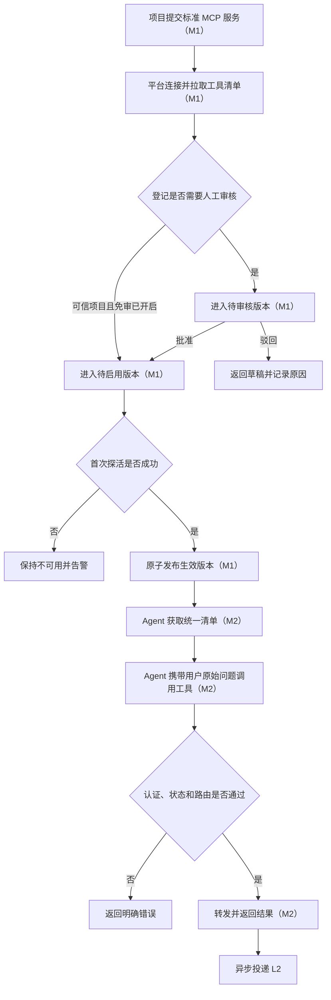
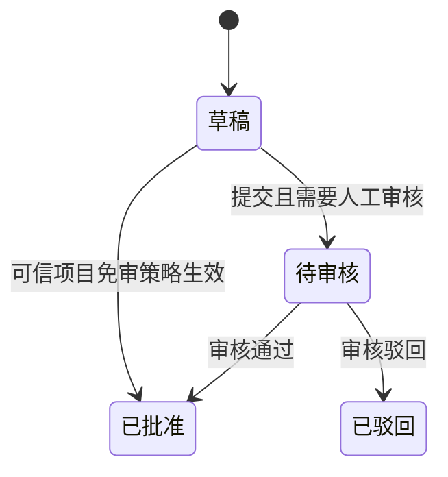
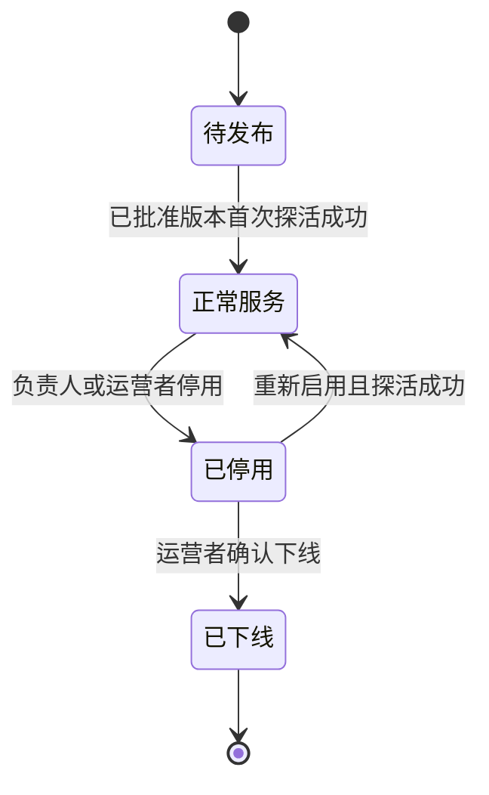
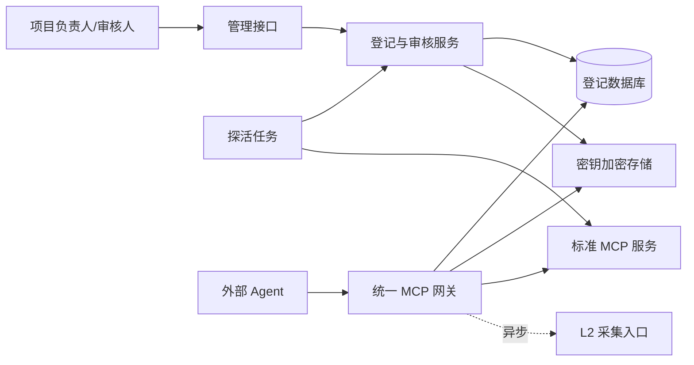
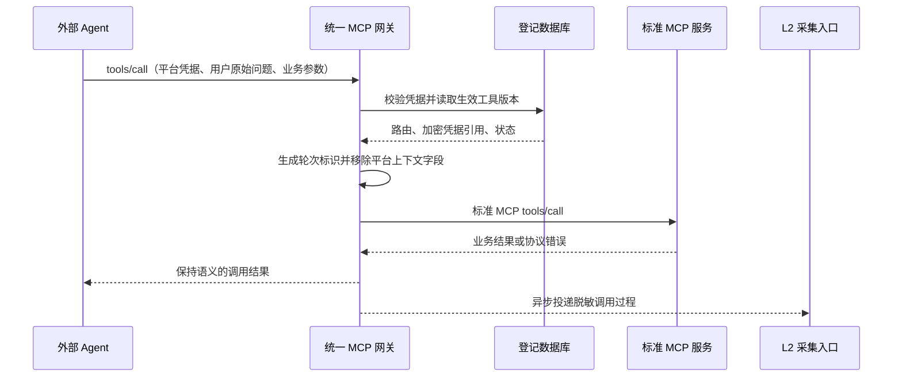
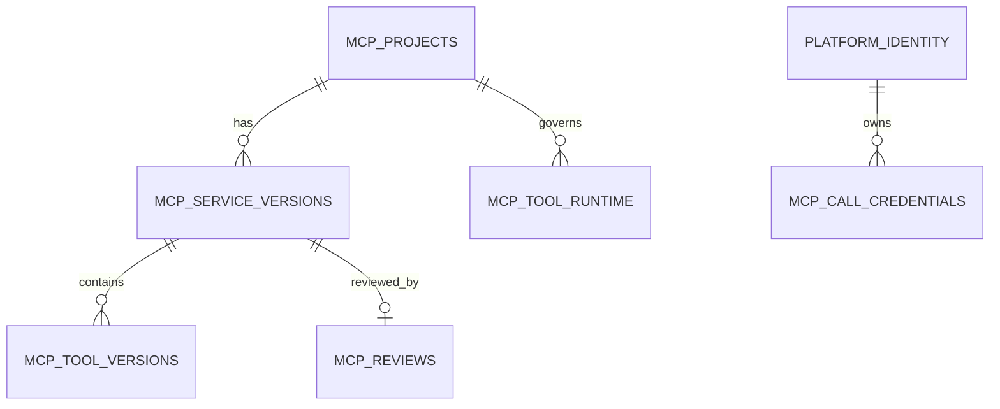

# MCPSTAT-1-L1 · 服务登记与统一网关方案文档

| 项目 | 内容 |
| --- | --- |
| 需求编号 | MCPSTAT-1-L1 |
| 一句话需求 | 建立只接入标准 MCP 服务的登记、审核与统一网关，让外部 Agent 通过一个入口安全调用全部已批准能力 |
| 来源 Issue | 无独立 Issue；来源为飞书 MCPSTAT-1 总览及 L1 接入层详情文档 |
| 后续路径 | 契约验收（方案 → 验收契约 → 实现） |
| 创建时间 | 2026-08-04 |
| 最后更新 | 2026-08-14 |
| 当前状态 | 已冻结 |

## 第一部分 · 需求

### 1. 需求描述

#### 1.1 需求正文

内部项目已经以标准 MCP 服务提供不同业务能力，但每个项目若分别面向外部 Agent 发布，就要重复处理接入地址、身份校验、工具命名、健康检查和变更通知，而且平台无法统一知道有哪些能力可用、谁批准了这些能力、当前版本是否安全。L1 接入层需要把这些共同工作收口为服务登记与统一网关两个模块：项目负责人通过管理接口提交标准 MCP 服务，平台拉取工具清单并进入审核；审核通过且探活成功后，工具才进入统一清单。外部 Agent 使用平台凭据连接一个标准 MCP 地址，即可获取和调用全部已发布、健康且未暂停的工具，网关负责名称改写、路由、超时、熔断和原始调用过程投递。

首次登记默认人工审核。平台可以配置可信项目免审，但该能力默认关闭；影响工具输入、输出、业务语义、权限或副作用的变更必须生成待审核版本，不能覆盖线上版本。不兼容或高风险变更在审核期间暂停对应工具以及依赖它的 Skill，审核通过后原子切换新版本。为了让采集层完成对话归因，网关在保持标准 MCP 协议的前提下为工具定义增加“用户原始问题”参数，并由网关基于认证主体、连接会话和调用次序生成轮次标识；不再要求调用方传入自定义对话编号。

本次只接入标准 MCP 服务，不建设命令行进程适配器，不支持任意脚本包装，也不建设可视化管理控制台；登记、审核和运维先通过受保护的管理接口完成。本层只识别调用者、管理服务与工具版本并转发请求，不判断工具调用在业务上是否合规，不承担统计分析或 Skill 生成。

#### 1.2 背景与动机

- **问题来源**：MCPSTAT-1 四层方案需要在入口处统一发现、调用和观测所有工具，同时修正旧方案中依赖自定义对话编号的归因冲突。
- **为什么现在做**：采集、分析和闭环三层都依赖完整且口径一致的调用过程，入口层不统一时下游无法可靠成立。
- **不做会怎样**：各项目重复建设入口和鉴权；工具名称、错误和版本策略分裂；高风险变更可能未经审核直接影响调用方；调用记录无法稳定归属于一次用户问题。

#### 1.3 使用场景

| 场景 | 使用者 | 什么时候用 | 期望结果 |
| --- | --- | --- | --- |
| 首次登记服务 | 项目负责人 | 项目准备向外部 Agent 开放工具时 | 平台拉取工具并创建待审核登记，不直接上线 |
| 审核登记 | 平台运营者 | 收到首次登记或高影响变更时 | 能查看差异、批准或驳回，并留下审核记录 |
| 更新工具定义 | 项目负责人 | 服务地址或工具定义发生变化时 | 生成独立候选版本，线上版本在批准前不被静默覆盖 |
| 获取统一工具清单 | 外部 Agent | 建立连接或刷新工具列表时 | 获得全部已发布、健康且未暂停的标准 MCP 工具清单 |
| 调用工具 | 外部 Agent | 回答用户问题需要内部能力时 | 通过一个入口调用目标服务并得到与直连一致的业务结果 |
| 服务异常恢复 | 平台运维者 | 下游连续失败或恢复时 | 自动熔断和恢复，调用方得到明确错误，状态可追踪 |

#### 1.4 交付结果

1. 标准 MCP 服务能够通过管理接口登记，并由平台自动读取工具清单。
2. 首次登记默认进入人工审核；可信项目免审开关存在但默认关闭。
3. 工具变更形成候选版本；高风险或不兼容变更在审核期间暂停相关工具和 Skill，批准后原子切换。
4. 外部 Agent 使用一个标准 MCP 地址即可获取和调用全部可用工具，跨项目重名不会冲突。
5. 平台凭据缺失、过期或已吊销时请求在转发前被拒绝；第一阶段不做项目级或工具级授权，项目凭据不会暴露给外部 Agent。
6. 每次调用包含用户原始问题，并由网关生成稳定轮次标识后异步投递 L2；投递失败不影响业务响应。
7. 下游不可用时网关按阈值熔断，第一阶段不自动重试任何工具调用，恢复后再重新开放。
8. 登记、审核、版本切换、调用和健康状态均有不包含密钥及敏感正文的审计信息。

#### 1.5 本次不做

- 不接入命令行或本地进程服务，因为当前范围只确认标准 MCP 接入。
- 不建设任意协议转 MCP 的适配层，避免第一期同时承担协议转换和网关稳定性风险。
- 不建设可视化控制台；先以管理接口完成闭环，界面另行立项。
- 不负责调用合规判断、分析统计和 Skill 生成，这些分别属于 L2、L3、L4。
- 不向下游项目透传终端用户身份，也不统一接管各项目内部的数据权限模型。
- 不建设平台侧项目级或工具级授权；所有有效平台凭据均可访问全部已发布、健康且未暂停的工具，项目 MCP 使用平台配置的项目 Token 自行完成业务权限判断。

### 2. 现状与问题

- **现在怎么运作**：当前 LinkCli 仓库只有从 LinkCV 同步来的通用工作流文件，没有业务代码、运行入口、数据模型或测试；飞书 L1 草稿仍包含命令行服务和自定义对话编号等已被新决策排除的描述。
- **卡在哪里**：尚无可执行的登记、审核、统一清单、路由和健康管理能力；旧文档会让实现者把已排除范围和冲突的归因方案带入实现。
- **判断依据**：本地仓库文件清单、远端仓库无分支、飞书 L1 文档 revision 2，以及本轮用户确认的范围和审核规则。

### 3. 模块分解

#### 3.1 模块清单

| 编号 | 模块 | 业务职责 | 依赖模块 | 交付顺序 | 可否独立验收 |
| --- | --- | --- | --- | --- | --- |
| M1 | 服务登记与审核 | 管理项目、连接信息、工具版本、审核和健康状态 | 无 | 1 | 是 |
| M2 | 统一网关 | 认证调用方、合并工具清单、路由转发、熔断并投递调用过程 | M1 | 2 | 是 |

M1 可以先独立完成管理接口和审核闭环；M2 必须读取 M1 已批准的版本。两个模块共享版本与可用状态，不建议再拆成独立需求编号。

#### 3.2 M1 服务登记与审核

- **边界**：负责标准 MCP 服务登记、工具发现、人工审核、可信项目策略、候选版本、启停和探活；不转发外部调用。
- **入口与触发**：项目负责人提交或更新服务；审核人处理申请；探活任务周期运行；工具定义漂移触发候选版本。
- **完成信号**：登记对象具有可追踪状态和审核记录，只有已批准且健康的版本可被网关读取。
- **对外提供**：当前生效的项目、连接、工具定义、版本和可用状态快照。
- **依赖前提**：平台管理身份、项目凭据加密能力和至少一种标准 MCP 远程传输方式。

#### 3.3 M2 统一网关

- **边界**：负责标准 MCP 对外入口、平台凭据校验、工具清单改写、路由、超时、熔断和 L2 异步投递；不审核服务、不持久化完整调用正文、不做业务合规判断。
- **入口与触发**：Agent 获取工具清单或调用工具；健康状态和生效版本变化触发清单刷新。
- **完成信号**：一个入口能稳定调用全部可用工具，失败姿态明确，调用过程按约定交给 L2。
- **对外提供**：统一工具清单、标准工具调用结果、平台用户标识和轮次标识。
- **依赖前提**：M1 已存在至少一个已批准并健康的工具版本，平台凭据服务可用。

### 4. 业务流程

#### 4.1 主流程图



审核通过并不等于立即对外，首次探活成功才允许发布。调用过程中，网关剥离平台增加的上下文字段后再转发给下游，避免改变原工具入参；L2 投递失败只记录指标和有限暂存，不改变已经产生的业务结果。

#### 4.2 流程详解

1. **提交登记**（M1）：负责人提交项目标识、标准 MCP 地址和凭据；平台连接服务并保存拉取到的工具快照。
2. **审核与发布**（M1）：默认人工审核；通过后探活，成功才原子切换生效版本，驳回保留原因。
3. **工具变更**（M1）：发现定义差异时创建候选版本；高影响变更立即暂停目标工具和相关 Skill，低影响变更保持旧版在线直至批准。
4. **清单合并**（M2）：只读取已批准且可用的版本，给工具名加项目前缀并加入用户原始问题参数说明。
5. **调用转发**（M2）：校验平台凭据、状态和工具版本，生成轮次标识，移除平台上下文字段后调用下游。
6. **过程投递**（M2）：响应返回后异步向 L2 投递脱敏、截断的过程元数据。

#### 4.3 异常分支

| 异常分支 | 触发条件 | 系统行为 | 用户或下游感知 | 状态或数据结果 |
| --- | --- | --- | --- | --- |
| 服务无法连接 | 地址、协议或凭据错误 | 登记失败或候选版本保持草稿 | 负责人看到可定位错误 | 不发布版本 |
| 审核驳回 | 定义、权限或风险不合格 | 保留旧版，候选版退回草稿 | 负责人看到驳回原因 | 审核记录保留 |
| 高风险定义漂移 | 输入、输出、权限、语义或副作用变化 | 暂停工具及相关 Skill并创建候选版 | Agent 刷新清单后看不到该工具 | 旧版不再接收新调用 |
| 无效平台凭据 | 缺失、过期或吊销 | 转发前拒绝 | Agent 收到认证错误 | 不产生下游调用 |
| 下游连续失败 | 超时或错误达到阈值 | 打开熔断，拒绝新调用并继续探活 | Agent 收到服务暂不可用 | 可用状态变更 |
| L2 投递失败 | 队列或采集接口不可用 | 有界暂存或丢弃并告警 | Agent 无感知 | 计入投递失败指标 |

### 5. 状态机

#### 5.1 服务版本审核

- **管的是什么**：一次登记或变更的定义是否已经获得发布资格，只描述审核结论，不混入发布和探活状态。
- **初始状态**：草稿，由项目负责人创建或由定义漂移自动创建。
- **终态**：已批准、已驳回；终态版本不可再修改，任何调整都创建新版本。



| 起始状态 | 事件或条件 | 目标状态 | 触发者 | 并发或重复触发处理 | 副作用 |
| --- | --- | --- | --- | --- | --- |
| 草稿 | 提交且需人工审核 | 待审核 | 项目负责人 | 重复提交幂等 | 固化版本定义和审核快照 |
| 草稿 | 可信项目且免审开关开启 | 已批准 | 系统 | 读取提交时策略快照 | 记录免审结论并发起首次探活 |
| 待审核 | 审核通过 | 已批准 | 审核人 | 并发审核以先到者为准 | 记录审核结论并发起首次探活 |
| 待审核 | 审核驳回 | 已驳回 | 审核人 | 并发审核以先到者为准 | 记录驳回原因 |

- **不允许的流转**：草稿不能跳过审核规则直接批准；已批准和已驳回不能回到草稿。被拒绝时返回当前实际状态。
- **超时与滞留**：版本进入待审核或免审批准时记录实际提交时间；待审核超过七天只告警，不自动批准或驳回，草稿创建时间不参与该时长计算。

#### 5.2 接入项目与健康状态

- **管的是什么**：项目是否处于待发布、正常服务、人工停用或永久下线阶段，以及当前生效服务最近一次探活结论。
- **初始状态**：待发布；健康状态未知。
- **终态**：已下线。



| 起始状态 | 事件或条件 | 目标状态 | 触发者 | 并发或重复触发处理 | 副作用 |
| --- | --- | --- | --- | --- | --- |
| 待发布 | 已批准版本探活成功 | 正常服务 | 系统 | 同一项目串行发布 | 原子切换生效版本并进入统一清单 |
| 正常服务 | 停用 | 已停用 | 负责人或运营者 | 重复停用幂等 | 移出统一清单，在途调用继续完成 |
| 已停用 | 重新启用且探活成功 | 正常服务 | 负责人或运营者 | 重复启用幂等 | 恢复统一清单 |
| 已停用 | 下线 | 已下线 | 运营者 | 重复下线幂等 | 保留历史，项目标识不得复用 |

健康状态独立保存为未知、健康、不健康三种结论。首次探活前为未知；探活成功变为健康；连续失败达到运行时阈值后变为不健康；连续成功达到恢复阈值后恢复健康。连续成功和失败次数只用于当前探活判断，不作为长期业务数据保存。

- **不允许的流转**：待发布不能直接下线，正常服务不能直接下线，必须先停用；已下线不能恢复。
- **超时与滞留**：首次探活持续失败时保持待发布并告警；健康结论超过规定时间未刷新时按未知处理。

#### 5.3 工具运行状态

- **管的是什么**：已发布项目中的某个稳定工具当前是否允许接收新调用。
- **初始状态**：正常。
- **终态**：无；暂停工具在风险解除后可以恢复。

| 起始状态 | 事件或条件 | 目标状态 | 触发者 | 并发或重复触发处理 | 副作用 |
| --- | --- | --- | --- | --- | --- |
| 正常 | 发现高风险或不兼容定义变化 | 已暂停 | 系统 | 重复暂停只更新原因 | 从统一清单移除并通知相关 Skill |
| 已暂停 | 新版本审核通过并发布，风险解除 | 正常 | 系统 | 重复恢复幂等 | 重新进入统一清单并通知相关 Skill |

- **不允许的流转**：没有明确暂停原因时不能进入已暂停；候选版本未批准前不能恢复。
- **超时与滞留**：暂停超过七天仍未提交合格版本时向项目负责人告警。

## 第二部分 · 方案

### 6. 整体架构

#### 6.1 架构图



#### 6.2 分层与职责

| 层次 | 承担什么 | 不承担什么 | 涉及模块 |
| --- | --- | --- | --- |
| 管理接口 | 登记、提交、审核、启停和凭据管理 | 不提供工具调用 | M1 |
| 登记与审核 | 工具发现、版本差异、审核规则和生效快照 | 不处理外部调用 | M1 |
| 统一网关 | MCP 会话、清单改写、认证、路由、熔断和投递 | 不决定审核结论与业务合规 | M2 |
| 基础设施 | MySQL、加密密钥、任务调度和有界投递 | 不承载领域规则 | M1、M2 |

#### 6.3 关键数据流



网关不会把平台调用凭据、终端用户身份或内部路由字段传给下游；项目凭据只在调用前按引用解密到内存，并仅作为下游 MCP 的认证信息发送，不混入业务参数，使用后尽快释放。用户原始问题只用于归因和脱敏投递，不传给原业务工具。下游调用失败时先返回标准化错误，再更新熔断计数，L2 不参与同步返回链路。

#### 6.4 技术选型与取舍

| 决策点 | 选定方案 | 放弃的方案 | 代价与理由 |
| --- | --- | --- | --- |
| 实现语言 | TypeScript + Node.js，使用官方 MCP SDK | Python 或多语言拆分 | 与 MCP 类型契约贴合、单仓启动快；代价是团队需统一 Node 运维规范 |
| 接入范围 | 只支持标准 MCP Streamable HTTP；SSE 仅在明确兼容需求后增加 | stdio、任意 HTTP 适配器 | 范围最小且可部署；代价是旧服务需先自行升级 |
| 管理入口 | 受保护的 REST 管理接口 | 第一版同时建设 Web 控制台 | 先完成核心闭环；代价是运营初期需要 API 工具 |
| 版本发布 | 不可变候选版本 + 原子切换当前版本 | 原地覆盖工具定义 | 可审核、可回滚；代价是增加版本表和清理策略 |
| 清单读取 | 数据库生效快照 + 进程内短缓存，版本事件主动失效 | 每次直连所有项目拉取或引入 Redis | 降低请求延迟且不新增基础设施；代价是多实例存在秒级收敛窗口 |
| 调用投递 | 有界异步队列，失败不阻塞 | 同步调用 L2 或无限重试 | 保护业务调用；代价是极端故障下允许少量观测丢失 |
| 对话归因输入 | 工具定义增加用户原始问题，网关生成轮次标识 | 调用方传自定义对话编号 | 保持标准 MCP 且避免编号语义冲突；代价是客户端模型必须正确填写原始问题 |

### 7. 数据模型

#### 7.1 实体关系



#### 7.2 表与字段

采用五张核心业务表：`mcp_projects` 保存稳定项目身份、发布指针和当前健康结论；`mcp_service_versions` 只保存不可变的服务版本与审核状态；`mcp_tool_versions` 保存每版工具定义；`mcp_reviews` 保存最终审核结论；`mcp_call_credentials` 保存调用凭据摘要。为了落实“只暂停发生高风险变化的工具”，额外增加一张最小运行辅助表 `mcp_tool_runtime`，它不保存工具定义，只保存项目内稳定工具名称的当前暂停状态。

`mcp_tool_versions` 额外保存 `module_key`：登记或提交新版本时由项目负责人显式指定该工具所属的业务模块标识（例如“用户”“订单”），系统不从工具名猜测、也不用 Project 代替。这个字段本层自身不消费，只作为稳定事实供 L3 聚类使用；同一 `original_name` 在新版本中改变 `module_key` 视为正常的业务模块调整，不触发风险分类。

字段遵循最小必要原则：审核状态只保存 `draft`、`pending_review`、`approved`、`rejected`；版本是否正在生效由项目的 `active_version_id` 推导，是否退役由其不再被生效指针引用推导，不重复落库。`submitted_at` 保存版本实际进入待审核或免审批准的时间，是计算七天审核滞留且无法由草稿创建时间可靠替代的业务事实。探活只持久化 `health_status` 和 `last_health_checked_at`，连续成功、失败次数由探活任务在运行时维护。凭据是否有效由 `revoked_at` 和 `expires_at` 推导，不再保存容易漂移的状态字段；最近使用时间从 L2 调用记录统计。

项目状态取值为 `pending`、`active`、`disabled`、`retired`；健康状态取值为 `unknown`、`healthy`、`unhealthy`；工具运行状态取值为 `active`、`suspended`。主键继续使用应用生成的 UUID 字符串，时间统一按 UTC、微秒精度保存。标识字段使用大小写敏感排序规则，避免项目或工具名称被数据库错误合并。

#### 7.3 定稿 DDL

```sql
-- 绿地设计定稿，仅供评审；当前未执行、未创建迁移
CREATE TABLE mcp_projects (
  id CHAR(36) NOT NULL COMMENT '项目主键 UUID',
  project_key VARCHAR(48) CHARACTER SET utf8mb4 COLLATE utf8mb4_0900_bin NOT NULL COMMENT '稳定项目标识及工具名前缀',
  display_name VARCHAR(120) NOT NULL COMMENT '项目展示名称',
  description VARCHAR(1000) NOT NULL COMMENT '项目能力说明',
  owner_id VARCHAR(64) NOT NULL COMMENT '项目负责人平台身份',
  status VARCHAR(16) NOT NULL DEFAULT 'pending' COMMENT 'pending/active/disabled/retired',
  trusted_review_bypass_enabled BOOLEAN NOT NULL DEFAULT FALSE COMMENT '可信项目免审开关，默认关闭',
  active_version_id CHAR(36) NULL COMMENT '当前生效服务版本',
  health_status VARCHAR(16) NOT NULL DEFAULT 'unknown' COMMENT 'unknown/healthy/unhealthy',
  last_health_checked_at DATETIME(6) NULL COMMENT 'UTC 最近探活完成时间',
  created_at DATETIME(6) NOT NULL DEFAULT CURRENT_TIMESTAMP(6) COMMENT 'UTC 创建时间',
  updated_at DATETIME(6) NOT NULL DEFAULT CURRENT_TIMESTAMP(6) ON UPDATE CURRENT_TIMESTAMP(6) COMMENT 'UTC 更新时间',
  PRIMARY KEY (id),
  UNIQUE KEY uk_mcp_projects_project_key (project_key),
  KEY idx_mcp_projects_status_health (status, health_status),
  CONSTRAINT ck_mcp_projects_status CHECK (status IN ('pending', 'active', 'disabled', 'retired')),
  CONSTRAINT ck_mcp_projects_health CHECK (health_status IN ('unknown', 'healthy', 'unhealthy'))
) ENGINE=InnoDB DEFAULT CHARSET=utf8mb4 COLLATE=utf8mb4_0900_ai_ci COMMENT='MCP 接入项目';

CREATE TABLE mcp_service_versions (
  id CHAR(36) NOT NULL COMMENT '服务版本主键 UUID',
  project_id CHAR(36) NOT NULL COMMENT '所属项目',
  version_no BIGINT UNSIGNED NOT NULL COMMENT '项目内递增版本号',
  endpoint VARCHAR(2048) NOT NULL COMMENT '标准 MCP 服务地址',
  protocol_version VARCHAR(32) NOT NULL COMMENT 'MCP 协议版本',
  credential_ciphertext TEXT NULL COMMENT '项目调用凭据密文',
  credential_key_id VARCHAR(64) NULL COMMENT '加密密钥版本标识',
  review_status VARCHAR(24) NOT NULL DEFAULT 'draft' COMMENT 'draft/pending_review/approved/rejected',
  risk_level VARCHAR(16) NOT NULL DEFAULT 'low' COMMENT 'low/medium/high/incompatible',
  definition_hash BINARY(32) NOT NULL COMMENT '连接与工具定义 SHA-256',
  submitted_by VARCHAR(64) NOT NULL COMMENT '提交者平台身份',
  submitted_at DATETIME(6) NULL COMMENT 'UTC 提交审核或免审批准时间，草稿为空',
  created_at DATETIME(6) NOT NULL DEFAULT CURRENT_TIMESTAMP(6) COMMENT 'UTC 创建时间',
  PRIMARY KEY (id),
  UNIQUE KEY uk_mcp_service_versions_id_project (id, project_id),
  UNIQUE KEY uk_mcp_service_versions_project_version (project_id, version_no),
  KEY idx_mcp_service_versions_project_hash (project_id, definition_hash),
  KEY idx_mcp_service_versions_review_submitted (review_status, submitted_at),
  CONSTRAINT ck_mcp_service_versions_review CHECK (review_status IN ('draft', 'pending_review', 'approved', 'rejected')),
  CONSTRAINT ck_mcp_service_versions_risk CHECK (risk_level IN ('low', 'medium', 'high', 'incompatible')),
  CONSTRAINT fk_mcp_service_versions_project FOREIGN KEY (project_id) REFERENCES mcp_projects (id) ON UPDATE RESTRICT ON DELETE RESTRICT
) ENGINE=InnoDB DEFAULT CHARSET=utf8mb4 COLLATE=utf8mb4_0900_ai_ci COMMENT='MCP 服务不可变版本';

ALTER TABLE mcp_projects
  ADD CONSTRAINT fk_mcp_projects_active_version FOREIGN KEY (active_version_id, id) REFERENCES mcp_service_versions (id, project_id) ON UPDATE RESTRICT ON DELETE RESTRICT;

CREATE TABLE mcp_tool_versions (
  id CHAR(36) NOT NULL COMMENT '工具版本主键 UUID',
  service_version_id CHAR(36) NOT NULL COMMENT '所属服务版本',
  original_name VARCHAR(128) CHARACTER SET utf8mb4 COLLATE utf8mb4_0900_bin NOT NULL COMMENT '服务原始工具名',
  module_key VARCHAR(64) CHARACTER SET utf8mb4 COLLATE utf8mb4_0900_bin NULL COMMENT '登记时由项目负责人指定的业务模块标识，供 L3 聚类使用，不由系统猜测',
  description TEXT NOT NULL COMMENT '工具说明',
  input_schema JSON NOT NULL COMMENT '原始输入定义',
  output_schema JSON NULL COMMENT '原始输出定义',
  risk_level VARCHAR(16) NOT NULL DEFAULT 'low' COMMENT 'low/medium/high/incompatible',
  PRIMARY KEY (id),
  UNIQUE KEY uk_mcp_tool_versions_service_name (service_version_id, original_name),
  KEY idx_mcp_tool_versions_module (service_version_id, module_key),
  CONSTRAINT ck_mcp_tool_versions_risk CHECK (risk_level IN ('low', 'medium', 'high', 'incompatible')),
  CONSTRAINT fk_mcp_tool_versions_service FOREIGN KEY (service_version_id) REFERENCES mcp_service_versions (id) ON UPDATE RESTRICT ON DELETE RESTRICT
) ENGINE=InnoDB DEFAULT CHARSET=utf8mb4 COLLATE=utf8mb4_0900_ai_ci COMMENT='每个服务版本的 MCP 工具定义';

CREATE TABLE mcp_tool_runtime (
  project_id CHAR(36) NOT NULL COMMENT '所属项目',
  original_name VARCHAR(128) CHARACTER SET utf8mb4 COLLATE utf8mb4_0900_bin NOT NULL COMMENT '项目内稳定工具名称',
  status VARCHAR(16) NOT NULL DEFAULT 'active' COMMENT 'active/suspended',
  suspended_reason VARCHAR(1000) NULL COMMENT '暂停原因，正常状态为空',
  updated_at DATETIME(6) NOT NULL DEFAULT CURRENT_TIMESTAMP(6) ON UPDATE CURRENT_TIMESTAMP(6) COMMENT 'UTC 更新时间',
  PRIMARY KEY (project_id, original_name),
  CONSTRAINT ck_mcp_tool_runtime_status CHECK (status IN ('active', 'suspended')),
  CONSTRAINT ck_mcp_tool_runtime_reason CHECK (status <> 'suspended' OR (suspended_reason IS NOT NULL AND CHAR_LENGTH(TRIM(suspended_reason)) > 0)),
  CONSTRAINT fk_mcp_tool_runtime_project FOREIGN KEY (project_id) REFERENCES mcp_projects (id) ON UPDATE RESTRICT ON DELETE RESTRICT
) ENGINE=InnoDB DEFAULT CHARSET=utf8mb4 COLLATE=utf8mb4_0900_ai_ci COMMENT='MCP 工具当前运行状态';

CREATE TABLE mcp_reviews (
  service_version_id CHAR(36) NOT NULL COMMENT '被审核服务版本',
  decision VARCHAR(16) NOT NULL COMMENT 'approved/rejected/bypassed',
  comment VARCHAR(2000) NULL COMMENT '审核意见，驳回时必填',
  reviewer_id VARCHAR(64) NOT NULL COMMENT '审核人平台身份',
  decided_at DATETIME(6) NOT NULL DEFAULT CURRENT_TIMESTAMP(6) COMMENT 'UTC 决策时间',
  PRIMARY KEY (service_version_id),
  KEY idx_mcp_reviews_reviewer_time (reviewer_id, decided_at),
  CONSTRAINT ck_mcp_reviews_decision CHECK (decision IN ('approved', 'rejected', 'bypassed')),
  CONSTRAINT ck_mcp_reviews_rejected_comment CHECK (decision <> 'rejected' OR (comment IS NOT NULL AND CHAR_LENGTH(TRIM(comment)) > 0)),
  CONSTRAINT fk_mcp_reviews_service FOREIGN KEY (service_version_id) REFERENCES mcp_service_versions (id) ON UPDATE RESTRICT ON DELETE RESTRICT
) ENGINE=InnoDB DEFAULT CHARSET=utf8mb4 COLLATE=utf8mb4_0900_ai_ci COMMENT='MCP 服务版本审核记录';

CREATE TABLE mcp_call_credentials (
  id CHAR(36) NOT NULL COMMENT '调用凭据主键 UUID',
  owner_id VARCHAR(64) NOT NULL COMMENT '凭据所属平台用户',
  credential_name VARCHAR(120) NOT NULL COMMENT '用户可识别的凭据名称',
  token_prefix VARCHAR(16) NOT NULL COMMENT '令牌展示与定位前缀',
  token_digest BINARY(32) NOT NULL COMMENT '令牌 SHA-256 摘要',
  expires_at DATETIME(6) NULL COMMENT 'UTC 过期时间',
  created_at DATETIME(6) NOT NULL DEFAULT CURRENT_TIMESTAMP(6) COMMENT 'UTC 创建时间',
  revoked_at DATETIME(6) NULL COMMENT 'UTC 吊销时间',
  PRIMARY KEY (id),
  UNIQUE KEY uk_mcp_call_credentials_digest (token_digest),
  KEY idx_mcp_call_credentials_owner_created (owner_id, created_at),
  CONSTRAINT ck_mcp_call_credentials_expiry CHECK (expires_at IS NULL OR expires_at > created_at)
) ENGINE=InnoDB DEFAULT CHARSET=utf8mb4 COLLATE=utf8mb4_0900_ai_ci COMMENT='统一网关调用凭据';
```

#### 7.4 旧数据与兼容

- **存量数据处理**：绿地仓库，无存量数据迁移。
- **兼容窗口**：服务版本切换保留旧版历史；在途调用继续绑定发起时版本，新调用只读取原子切换后的版本。工具对外名称由项目标识和原始工具名实时生成，不需要旧字段兼容。
- **真值源核对**：当前无模型定义；仓库无迁移版本；目标环境尚未建立且尚未核实。
- **回滚与不可逆点**：回滚只需把项目的生效版本指针切回上一已批准版本并刷新清单；健康结论随后由探活任务刷新。历史版本、工具定义和审核记录均禁止自动物理删除；销毁仍被密文引用的密钥后无法完整回滚，因此密钥清理前必须先确认没有版本引用。

### 8. 接口契约

| 接口 | 方法 | 变更 | 请求要点 | 响应要点 | 错误语义 | 权限 | 所属模块 |
| --- | --- | --- | --- | --- | --- | --- | --- |
| `/admin/projects` | POST | 新增 | 项目档案、标准 MCP 地址、项目凭据 | 草稿版本及发现的工具差异 | 地址不可达、协议不支持、名称冲突 | 项目负责人 | M1 |
| `/admin/projects/{key}/versions` | POST | 新增 | 新地址或重新发现工具；可为每个发现的工具附带 `module_key` | 候选版本、风险等级、差异摘要 | 重复定义、状态冲突 | 项目负责人 | M1 |
| `/admin/versions/{id}/tools/{toolId}/module` | PATCH | 新增 | `module_key`（可为空表示清除） | 更新后的工具定义 | 版本非草稿状态不可修改 | 项目负责人 | M1 |
| `/admin/versions/{id}/submit` | POST | 新增 | 版本号 | 待审核或待启用状态 | 定义不完整、状态冲突 | 项目负责人 | M1 |
| `/admin/versions/{id}/review` | POST | 新增 | 批准或驳回、意见 | 审核结果和后续状态 | 重复审核、权限不足 | 审核人 | M1 |
| `/admin/projects/{key}/status` | PATCH | 新增 | 启用、停用或下线动作 | 当前状态 | 非法流转 | 负责人或运营者 | M1 |
| `/admin/credentials` | POST/GET/DELETE | 新增 | 名称、有效期或凭据编号 | 令牌仅创建时返回一次 | 超限、已吊销 | 平台用户 | M2 |
| `/mcp` | MCP | 新增 | 标准初始化、清单和调用；调用含用户原始问题 | 标准 MCP 响应 | 认证、工具不存在、服务不可用 | 有效平台凭据 | M2 |

- **共享类型影响**：新增项目、服务版本、工具版本、审核、凭据和 L2 调用信封类型；管理接口与网关共用只读生效快照类型。
- **消费方**：项目接入脚本调用管理接口；外部 Agent 只调用 `/mcp`；L2 消费异步调用信封；L4 消费工具暂停和版本生效事件。

### 9. 文件结构与实现方案

当前仓库是绿地仓库，以下均为目标落点，不代表现有实现。

#### 9.1 目录树

```text
LinkCli/
├── package.json                                      # [新增] 工作区命令和依赖
├── tsconfig.json                                     # [新增] TypeScript 基线
├── src/
│   ├── main.ts                                       # [新增] 进程入口
│   ├── config.ts                                     # [新增] 配置校验
│   ├── admin/http.ts                                 # [新增] 管理接口
│   ├── registry/project-service.ts                   # [新增] 登记与版本编排
│   ├── registry/discovery.ts                         # [新增] 标准 MCP 工具发现
│   ├── registry/review-service.ts                    # [新增] 审核与发布
│   ├── registry/risk-classifier.ts                   # [新增] 工具差异与风险分类
│   ├── registry/health-monitor.ts                    # [新增] 探活和恢复
│   ├── gateway/server.ts                             # [新增] 统一 MCP 服务端
│   ├── gateway/catalog.ts                            # [新增] 清单合并与参数改写
│   ├── gateway/router.ts                             # [新增] 调用路由和凭据装配
│   ├── gateway/auth.ts                               # [新增] 平台调用凭据校验
│   ├── gateway/circuit-breaker.ts                    # [新增] 熔断状态
│   ├── collection/envelope.ts                        # [新增] L2 调用信封
│   ├── collection/dispatcher.ts                      # [新增] 有界异步投递
│   ├── db/schema.sql                                 # [新增] SQL-first 基线
│   └── db/repository.ts                              # [新增] 事务与查询
└── tests/
    ├── registry.integration.test.ts                  # [新增] 登记审核集成测试
    ├── gateway.integration.test.ts                   # [新增] MCP 网关集成测试
    ├── version-switch.concurrency.test.ts            # [新增] 原子切换并发测试
    └── fixtures/fake-mcp-server.ts                    # [新增] 标准 MCP 测试服务
```

#### 9.2 文件职责

| 文件或模块 | 动作 | 修改后职责 | 所属模块 | 影响方 |
| --- | --- | --- | --- | --- |
| `src/registry/*` | 新增 | 服务发现、差异、审核、版本和健康状态 | M1 | 管理接口、网关、L4 |
| `src/gateway/*` | 新增 | 标准 MCP 入口、清单、认证、路由和熔断 | M2 | 外部 Agent、接入项目 |
| `src/collection/*` | 新增 | 生成轮次标识并向 L2 有界投递 | M2 | L2 |
| `src/db/*` | 新增 | 物理模型和事务边界 | M1、M2 | 全部服务模块 |
| `tests/*` | 新增 | 验证状态、协议、失败和并发契约 | M1、M2 | 质量门禁 |

#### 9.3 M1 服务登记与审核实现方案

**实现步骤**

1. 建立配置校验、数据库连接和 SQL-first 基线（`src/config.ts`、`src/db/schema.sql`、`src/db/repository.ts`）。
2. 实现标准 MCP 初始化与工具发现，并对定义做规范化哈希（`src/registry/discovery.ts`）。
3. 实现不可变候选版本和项目内递增版本号，接受并保存项目负责人为每个工具指定的 `module_key`（`src/registry/project-service.ts`）。
4. 实现结构差异和风险分类，高风险变更产生暂停事件（`src/registry/risk-classifier.ts`）。
5. 实现人工审核、可信项目免审策略和事务内原子发布（`src/registry/review-service.ts`）。
6. 实现探活、熔断状态写入和恢复阈值（`src/registry/health-monitor.ts`）。
7. 暴露受保护的登记、提交、审核和启停接口（`src/admin/http.ts`）。

**验证方式**

在 `tests/registry.integration.test.ts` 覆盖首次人工审核、免审默认关闭、驳回、低风险保留旧版、高风险暂停和恢复；在 `tests/version-switch.concurrency.test.ts` 验证并发审核与原子切换只有一个版本生效。

#### 9.4 M2 统一网关实现方案

**实现步骤**

1. 实现调用令牌签发、摘要保存、校验和吊销（`src/gateway/auth.ts`）。
2. 实现已生效清单读取、项目前缀和用户原始问题参数注入（`src/gateway/catalog.ts`）。
3. 实现路由查找、项目凭据短时解密和标准 MCP 转发（`src/gateway/router.ts`）。
4. 实现连续失败熔断和连续成功恢复（`src/gateway/circuit-breaker.ts`）。
5. 实现统一 MCP 会话与错误映射（`src/gateway/server.ts`）。
6. 实现轮次标识、脱敏截断和有界异步投递（`src/collection/envelope.ts`、`src/collection/dispatcher.ts`）。
7. 组装进程入口并在启动时拒绝缺失关键密钥的配置（`src/main.ts`）。

**验证方式**

在 `tests/gateway.integration.test.ts` 使用 `tests/fixtures/fake-mcp-server.ts` 覆盖工具清单、前缀、原始问题、轮次标识、认证拒绝、读写调用、超时、熔断、L2 失败不阻塞以及项目凭据不外泄。

### 10. 外部服务与安全边界

| 维度 | 结论 | 验证方式 |
| --- | --- | --- |
| 发送哪些数据、如何脱敏 | 下游只收到原业务参数；L2 收到截断、脱敏后的问题、参数摘要、结果摘要和时序元数据 | 集成测试断言敏感字段被替换且长度受限 |
| 密钥与配置边界 | 平台令牌只存摘要；项目凭据加密存储；主密钥仅来自运行环境 | 启动配置测试、数据库快照检查、日志扫描 |
| 超时、重试、幂等与取消 | 每次调用有硬超时；第一阶段不自动重试任何工具调用；断开时尽力取消；审核和状态动作幂等 | 超时、重复提交和并发测试 |
| 失败时的降级与用户可见反馈 | 认证、工具不存在、下游不可用、超时分开表达；L2 失败不阻塞 | MCP 错误契约测试 |
| 日志与监控中不得出现的内容 | 原始令牌、项目凭据、完整用户问题、完整工具参数和结果 | 结构化日志字段白名单测试 |

- **身份与资源归属**：项目负责人只能修改自己负责的项目；审核人不能审核自己提交的版本；运营者可以停用和下线；所有有效平台凭据均可看到全部已发布、健康且未暂停的工具。项目内部业务权限由项目 MCP 根据平台配置的项目 Token 自行判断，所有平台侧校验在可信服务端执行。

## 第三部分 · 收口

### 11. 实施顺序

| 步骤 | 内容 | 模块 | 涉及文件 | 完成判据 |
| --- | --- | --- | --- | --- |
| 1 | 建立 Node/TypeScript、配置和数据库基线 | M1 | `package.json`、`tsconfig.json`、`src/config.ts`、`src/db/*` | 配置校验和空库建表测试通过 |
| 2 | 完成服务发现、版本、风险和审核 | M1 | `src/registry/*`、`src/admin/http.ts` | 登记审核集成测试通过 |
| 3 | 完成探活和原子发布 | M1 | `src/registry/health-monitor.ts`、`src/registry/review-service.ts` | 状态及并发测试通过 |
| 4 | 完成凭据、清单和标准 MCP 网关 | M2 | `src/gateway/*` | 真实标准 MCP 测试服务可被统一调用 |
| 5 | 完成轮次标识和 L2 异步投递 | M2 | `src/collection/*` | 投递成功与失败隔离测试通过 |
| 6 | 完成契约验收、日志安全检查和故障测试 | M1、M2 | `tests/*` | 已冻结验收场景全部通过 |

### 12. 已确认决策

| 编号 | 决策事项 | 结论 | 影响章节 | 确认来源 |
| --- | --- | --- | --- | --- |
| D1 | 首次登记审核 | 默认人工审核；可信项目可免审但默认关闭；高影响变更重新审核 | 1、4、5、9 | 用户确认 |
| D2 | 工具定义变更 | 创建待审核候选版本，不原地覆盖；高风险或不兼容变更暂停工具及相关 Skill，批准后原子切换 | 1、4、5、6、9 | 用户确认 |
| D3 | 接入范围 | 当前只考虑标准 MCP 接入，不做命令行适配器 | 1、3、6、8、9 | 用户确认 |
| D4 | 对话归因 | 使用用户原始问题作为归因输入，轮次标识由网关生成，不要求调用方传自定义对话编号 | 1、4、6、8、9 | 用户针对冲突要求修正 |
| D5 | 技术实现基线 | TypeScript、Node.js、官方 MCP SDK、MySQL 和 REST 管理接口 | 6—11 | 用户确认按当前方案进入契约验收阶段 |
| D6 | 数据字段原则 | 只保存具有明确业务意义且不可可靠推导的数据；探活连续计数、派生工具名、凭据派生状态和最近使用时间不进入核心表 | 5、7、9 | 用户确认按精简方案重写 |
| D7 | 调用权限边界 | 第一阶段不做平台侧项目级或工具级授权；所有有效平台凭据可调用全部已发布、健康且未暂停的工具；项目 MCP 根据项目 Token 自行完成业务权限判断 | 1、4、5、8、10 | 用户确认 |
| D8 | 调用重试策略 | 第一阶段不自动重试任何工具调用，不保存工具读写分类 | 1、7、9、10 | 用户确认按精简字段方案继续推进 |
| D9 | 审核滞留计时 | 服务版本增加可空提交时间；进入待审核或免审批准时写入，草稿为空，七天告警只按该时间计算 | 5、7、9 | 实现审查发现创建时间不可替代后，用户确认增加字段并同步文档 |
| D10 | 工具模块标识 | `mcp_tool_versions` 增加可空 `module_key`，登记或提交新版本时由项目负责人显式指定，系统不从工具名猜测、不用 Project 代替；本层不消费该字段，只作为稳定事实供 L3 聚类读取 | 7、8、9 | 用户确认，为 MCPSTAT-1-L3 的候选范围划分提供数据来源 |

### 13. 风险与依赖

| 风险或依赖 | 触发条件 | 影响 | 当前判断或应对方向 |
| --- | --- | --- | --- |
| 标准 MCP 不原生携带用户问题 | 客户端模型未填写新增参数 | L2 无法可靠归因 | 参数设为必填并返回可修正错误；验收主流客户端行为 |
| 多实例清单短暂不一致 | 生效版本切换后事件延迟 | 少量请求仍命中旧缓存 | 缓存短时有效并携带版本号，关键发布主动失效 |
| 高风险分类误判 | 自动差异无法理解业务语义 | 应暂停的工具继续在线 | 输入、输出、权限和副作用变化一律提升审核；允许人工强制高风险 |
| 项目凭据密钥丢失 | 运行环境密钥误删 | 无法调用下游且历史密文不可恢复 | 密钥版本化、备份和轮换演练，上线前校验引用 |
| L2 长时间不可用 | 有界队列持续满 | 部分调用过程丢失 | 明确丢弃策略、告警和丢失指标，不反压业务调用 |
