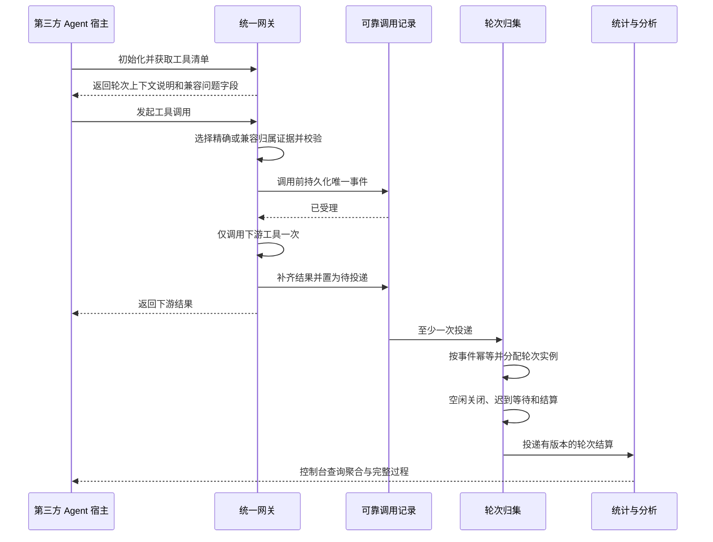
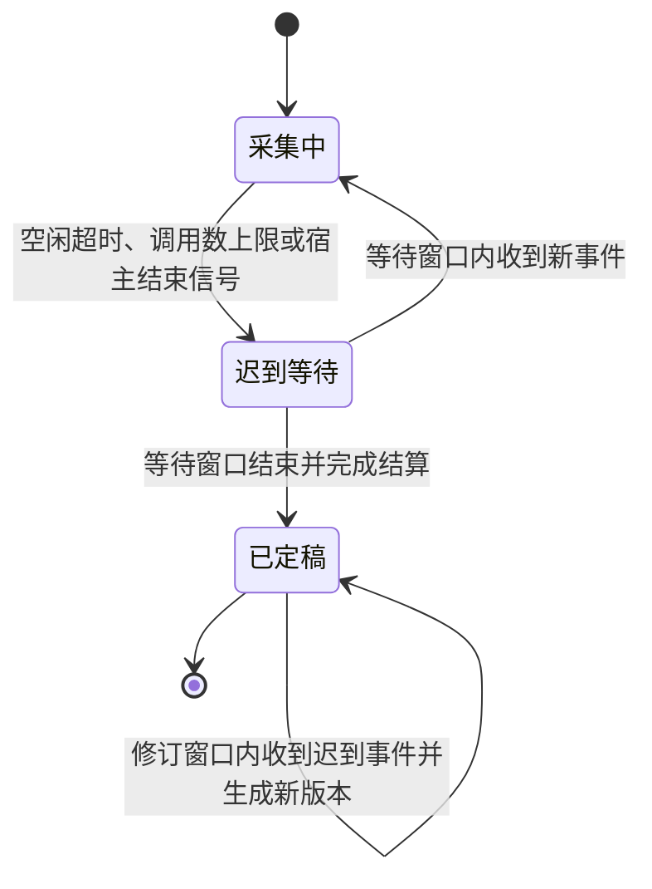
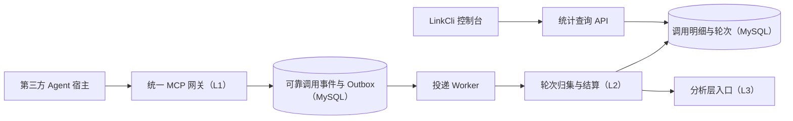
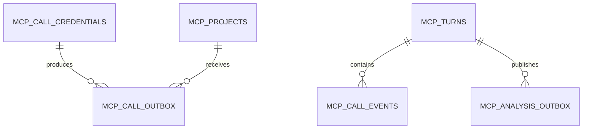

# MCPSTAT-1-L2 · 对话级 MCP 调用采集与统计方案文档

| 项目 | 内容 |
| --- | --- |
| 需求编号 | MCPSTAT-1-L2 |
| 一句话需求 | 在第三方 Agent 场景下可靠记录每次工具调用，并按一轮用户对话还原工具调用集合、先后关系和可下钻统计 |
| 来源 Issue | https://wcnnpvbxd7li.feishu.cn/docx/Xaq0dxMk1oi1s6xIXNpc81a5nSh |
| 后续路径 | 契约验收 |
| 创建时间 | 2026-08-07 |
| 最后更新 | 2026-08-07 |
| 当前状态 | 已冻结 |

## 第一部分 · 需求

### 1. 需求描述

#### 1.1 需求正文

LinkCli 已经把企业内部工具收口到统一入口，但平台当前看到的仍是一条条互相独立的调用。运营者无法准确回答一次用户提问调用了哪些工具、调用顺序是什么、哪一步失败、后续是否换参数恢复，也无法从项目或工具统计下钻到完整过程。

本阶段建设对话级采集与统计能力。统计基本单位定义为“一轮对话”，即从一次用户输入开始，到 Agent 完成本次回答为止；一个聊天窗口可以包含多轮对话，一轮对话可以包含一次、连续多次或并行多次工具调用。平台为能够配合的第三方 Agent 提供精确轮次上下文；对无法改造的第三方 Agent，继续通过用户原始问题和可用的连接上下文推断归属。两种结果必须分别标记，不能把推断结果伪装成精确结果。

每次调用在访问下游工具前先留下持久记录，调用完成后补齐结果，并通过可靠投递进入轮次归集。相同事件重复投递不会产生重复明细，服务重启或采集模块短时不可用不会丢失已经受理的调用。轮次结束后，平台按真实开始时间还原调用顺序和并行关系，计算可版本化的调用链签名与客观行为信号，并支持按项目、工具、调用方、时间、归属方式和数据质量查询及下钻。

本阶段不判断用户问题最终是否被正确解决，不把工具执行成功等同于 Agent 回答正确，不对推断轮次承诺百分之百准确，也不要求所有第三方 Agent 必须完成宿主改造。用户原始问题允许明文存入业务数据库，但不得进入日志、错误响应或测试样例；问题正文和调用明细保留九十天，不含正文的轮次结算与聚合统计长期保留。

#### 1.2 背景与动机

- **问题来源**：统一网关已能观测所有调用，但当前事件只携带单次调用信息，尚不能稳定还原一轮对话。
- **为什么现在做**：后续问题聚类、调用套路分析和 Skill 生成都依赖可信的对话级样本；接入层已经具备统一入口和调用前后拦截点。
- **不做会怎样**：统计只能停留在工具调用量，无法判断一组调用是否共同服务于同一问题；错误拼接的调用链会污染后续分析，内存队列故障还会造成无法识别的数据缺口。

#### 1.3 使用场景

| 场景 | 使用者 | 什么时候用 | 期望结果 |
| --- | --- | --- | --- |
| 精确记录一轮调用 | 已适配的第三方 Agent | 宿主能在收到用户消息时生成轮次上下文 | 同一轮全部调用准确归入一条记录，重复问题和并发窗口也不会混淆 |
| 兼容记录一轮调用 | 未适配的第三方 Agent | Agent 只能按工具说明填写用户原始问题 | 平台尽可能推断轮次，同时明确展示推断方式和可信等级 |
| 查看调用统计 | 项目负责人、审核人、运营者 | 观察项目、工具和调用方的使用情况 | 查询调用量、错误率、耗时和对话级链路分布 |
| 下钻单轮过程 | 项目负责人、审核人、运营者 | 发现异常统计或分析某类调用套路 | 查看问题、工具顺序、并行关系、每步耗时、结果和归属证据 |
| 采集故障恢复 | 平台运维者 | 采集服务短时不可用、服务重启或发生重复投递 | 已受理调用最终送达，重复事件不重复入库，失败可重放和告警 |
| 到期清理 | 平台定时任务 | 明细超过九十天 | 删除正文和单次明细，保留不含正文的长期结算与聚合结果 |

#### 1.4 交付结果

1. 已适配宿主提供的轮次上下文能够精确区分同一聊天窗口内的不同轮次、相同问题的重复提问和不同窗口的并发提问。
2. 未适配宿主仍可通过用户原始问题进入兼容采集；平台明确展示归属方式和可信等级，不宣称推断结果绝对准确。
3. 每次已受理调用在访问下游前留下持久记录；服务重启或采集模块短时不可用后可以继续投递。
4. 同一事件重复投递只产生一条调用明细，不会重复增加轮次计数。
5. 一轮对话可查到全部工具调用、确定的先后顺序、显式的并行分组、每步耗时、执行结果和稳定错误分类。
6. 轮次生命周期、结算状态、数据质量和结束原因分别记录，迟到事件可在窗口内补入并触发版本化重算。
7. 可以按项目、工具、调用方、时间范围、归属方式、质量和执行结果聚合，并从聚合结果下钻到轮次与单次调用。
8. 只有归属质量为可信或推断且记录完整的轮次进入分析层；存疑、缺失和部分记录仍保留用于统计和采集健康观测，不写入分析层 Outbox。
9. 用户原始问题和调用明细在九十天后删除，不含正文的轮次结算和聚合统计继续可查。

#### 1.5 本次不做

- 不要求平台从完全不配合的第三方 Agent 中恢复绝对准确的用户消息边界，因为协议本身没有提供这项事实。
- 不让大模型生成或维护不透明的轮次编号；精确轮次上下文只能由 Agent 宿主自动生成和注入。
- 不把连接标识直接当作一轮对话；一个连接可以包含多轮对话，连接信息只用于兼容模式隔离。
- 不判断用户问题是否最终解决，也不评价 Agent 最终回答质量；本层只记录可观测的工具执行事实。
- 不自动重试任何业务工具调用；可靠重试只作用于采集事件投递。
- 不在本阶段建设离线数仓或外部消息队列；先使用现有 MySQL 完成可靠事件、轮次和查询闭环。

### 2. 现状与问题

- **现在怎么运作**：统一网关要求调用携带用户原始问题，调用结束后生成一条摘要并放入进程内有界队列；事件标识按调用方、会话和进程内序号生成。
- **卡在哪里**：当前事件标识实际代表一次调用而不是一轮对话；连接缺失时多个客户端会退化到同一范围；序号在重启和多副本间不稳定；队列满或投递失败时事件永久丢失；原始问题是唯一归属证据，无法准确处理同一问题重复提问和措辞漂移。
- **判断依据**：`src/gateway/server.ts`、`src/gateway/router.ts`、`src/collection/envelope.ts`、`src/collection/dispatcher.ts`、现有网关集成测试和来源飞书文档 revision 4。

### 3. 模块分解

#### 3.1 模块清单

| 编号 | 模块 | 业务职责 | 依赖模块 | 交付顺序 | 可否独立验收 |
| --- | --- | --- | --- | --- | --- |
| M3 | 轮次上下文与调用受理 | 获取精确或兼容归属证据，确定性校验问题文本，并在调用前后持久记录调用事实 | L1 统一网关 | 1 | 是 |
| M4 | 可靠投递与轮次归集 | 幂等接收调用事件，分配轮次实例、处理迟到事件并结算调用链 | M3 | 2 | 是 |
| M5 | 统计查询与保留期 | 提供聚合、下钻、质量指标和九十天清理 | M4、现有控制台身份 | 3 | 是 |

三个模块共享同一套事件和轮次契约，属于一个需求编号；M3 可先独立证明调用不丢，M4 再证明归组正确，M5 最后提供运营闭环。

#### 3.2 M3 轮次上下文与调用受理

- **边界**：负责接收宿主轮次上下文、注入兼容问题字段、执行确定性校验、生成问题指纹和调用事件，并在访问下游前持久化；不决定最终轮次实例，不分析问题语义。
- **入口与触发**：第三方 Agent 初始化、获取工具清单或发起工具调用。
- **完成信号**：每次被允许访问下游的调用都有唯一事件记录；精确上下文和兼容上下文均进入统一事件契约。
- **对外提供**：调用事件、归属证据、校验信号和可靠投递状态。
- **依赖前提**：L1 已完成调用方认证、工具路由和下游单次调用。

#### 3.3 M4 可靠投递与轮次归集

- **边界**：负责领取持久事件、幂等入库、按证据分配轮次实例、维护轮次生命周期、处理迟到事件和结算；不判断最终回答是否正确。
- **入口与触发**：待投递事件可领取、轮次空闲或调用数达到上限、结算重试任务运行。
- **完成信号**：重复事件不重复入库；同一精确轮次的调用始终归在一起；兼容轮次带有明确质量等级；结算结果可版本化重算。
- **对外提供**：单次调用明细、轮次结算、分析层投递事件。
- **依赖前提**：M3 提供稳定事件标识和完整归属证据。

#### 3.4 M5 统计查询与保留期

- **边界**：负责聚合查询、轮次与调用下钻、权限过滤、采集健康指标和到期清理；不修改调用归属结论。
- **入口与触发**：控制台用户查询，定时清理任务运行。
- **完成信号**：聚合与明细口径一致；用户只能看到有权访问的项目；到期正文和明细被删除且长期统计不受影响。
- **对外提供**：统计接口、轮次详情接口和保留期指标。
- **依赖前提**：M4 已产生轮次和调用明细，现有控制台身份与项目可见性规则可复用。

### 4. 业务流程

#### 4.1 主流程



调用访问下游前必须先留下持久记录；这意味着可靠记录不可用时调用不会继续。下游已经执行后，平台不会因为采集结果补写失败而自动重试业务工具，避免有副作用的工具重复执行。精确轮次上下文优先，兼容问题文本只用于没有精确上下文的调用。

#### 4.2 流程详解

1. **发布归属规则**（M3）
   - 触发者与动作：第三方 Agent 初始化并读取工具清单。
   - 系统行为与依赖：返回宿主轮次上下文扩展说明；在业务工具定义中注入兼容问题字段，并在登记阶段阻止保留字段冲突。
   - 状态与数据：不创建轮次，只返回契约。
   - 可见结果：已适配宿主自动注入轮次上下文；未适配 Agent 由模型填写用户原始问题。
2. **确定性校验与调用受理**（M3）
   - 触发者与动作：Agent 发起工具调用。
   - 系统行为与依赖：优先读取宿主上下文，否则读取问题原文；只对缺失、类型错误、空白、超长和非法字符进行硬拦截，其他启发式规则只产生质量信号。
   - 状态与数据：生成全局唯一事件，在下游调用前记录开始事实和接收顺序。
   - 可见结果：持久记录成功后调用继续；失败时下游不执行并返回采集不可用。
3. **完成调用并可靠排队**（M3）
   - 触发者与动作：下游调用成功、返回业务错误或抛出协议错误。
   - 系统行为与依赖：补齐结果、耗时和结束时间，置为待投递；不重试业务调用。
   - 状态与数据：调用从已开始变为已完成；完成补写失败时保留部分记录并告警。
   - 可见结果：正常情况下调用方收到与直连一致的结果。
4. **幂等入库与轮次分配**（M4）
   - 触发者与动作：可靠投递任务领取事件。
   - 系统行为与依赖：精确上下文按调用方、聊天和轮次标识直接归组；兼容上下文按调用凭据、可用连接范围、问题指纹和空闲窗口分配轮次实例。
   - 状态与数据：重复事件被忽略；新轮次创建，已有轮次追加并刷新最后活跃时间。
   - 可见结果：单次调用可以查到所属轮次、归属方式和可信等级。
5. **关闭、迟到与结算**（M4）
   - 触发者与动作：轮次空闲五分钟、累计一百次调用或收到可信宿主结束信号。
   - 系统行为与依赖：先进入一分钟迟到等待；窗口内收到事件则继续采集，窗口结束后结算；二十四小时内的迟到事件触发修订和重算。
   - 状态与数据：生成有版本的调用链签名、工具执行结论和行为信号。
   - 可见结果：质量达标的结算可靠投递给分析层；其他结算仍可在统计中查看。
6. **查询与清理**（M5）
   - 触发者与动作：控制台用户查询或每日清理任务运行。
   - 系统行为与依赖：按现有项目可见性过滤结果；聚合查询可下钻；到期删除问题正文和调用明细。
   - 状态与数据：长期轮次仅保留不含正文的结算摘要和聚合维度。
   - 可见结果：统计与明细一致，保留期执行情况可观测。

#### 4.3 异常分支

| 异常分支 | 触发条件 | 系统行为 | 调用方或使用者感知 | 状态或数据结果 |
| --- | --- | --- | --- | --- |
| 问题字段缺失或格式非法 | 无精确上下文且问题为空、类型错误、超长或含非法字符 | 不调用下游，返回可补救错误 | Agent 修正后重试 | 记录不合规指标，不产生业务调用；不创建无法归属的单次调用 |
| 问题疑似概括或无实体交集 | 启发式规则命中 | 继续调用并记录质量信号 | 无感知 | 轮次质量可能降为存疑 |
| 调用前持久化失败 | MySQL 不可用或事务失败 | 不调用下游 | 收到采集不可用错误 | 不产生无法追踪的业务调用 |
| 调用后补写失败 | 下游已执行但结果无法持久化 | 不重试业务调用，保留开始记录并告警 | 仍返回实际下游结果 | 调用标记为部分记录、结果未知 |
| 重复投递 | 超时重试或 worker 重启 | 按事件唯一标识幂等确认 | 无感知 | 明细与计数不重复 |
| 轮次事件乱序 | 不同事件重试次数不同 | 按调用开始顺序和持久接收序号排序 | 无感知 | 不使用 L2 到达顺序 |
| 并行调用 | 多个工具执行时间重叠 | 保存开始和结束时间，展示并行关系 | 无感知 | 不伪造严格串行顺序 |
| 同一问题重复提问 | 同一聊天短时间重复完全相同文本 | 精确模式按不同宿主轮次区分；兼容模式可能合并并降低质量 | 精确模式无感知 | 兼容结果明确标记推断边界 |
| 同轮措辞漂移 | 同一轮多次调用携带不同问题文本 | 精确模式仍按宿主轮次归组；兼容模式拆分并标记相似 | 无感知 | 推断记录不冒充精确记录 |
| 投递持续失败 | 超过重试上限 | 转入死信并持续告警，支持人工重放 | 运营者看到告警 | 原始事件仍保留 |
| 结算失败 | 签名或写入异常 | 保留明细并退避重试 | 无感知 | 结算状态失败，不投递分析层 |
| 明细超过九十天 | 到达保留期 | 删除原始问题和调用明细 | 历史详情显示已清理 | 长期摘要与聚合保留 |

### 5. 状态机

#### 5.1 轮次生命周期

- **管的是什么**：一轮对话是否仍接收调用、等待迟到事件或已经完成结算。
- **初始状态**：采集中，由首个可归属调用创建。
- **终态**：已定稿；后续迟到事件通过修订结算处理，不把生命周期倒退。



| 起始状态 | 事件或条件 | 目标状态 | 触发者 | 并发或重复触发处理 | 副作用 |
| --- | --- | --- | --- | --- | --- |
| 无 | 首个调用被归属 | 采集中 | 轮次归集任务 | 精确键靠唯一约束；兼容键在事务中锁定候选记录 | 保存归属证据、开始时间和首个调用 |
| 采集中 | 空闲五分钟、调用数达到一百或可信结束信号 | 迟到等待 | 定时任务或宿主 | 条件更新，重复触发幂等 | 记录结束原因和一分钟等待截止时间 |
| 迟到等待 | 截止前收到同轮事件 | 采集中 | 轮次归集任务 | 锁定轮次后追加 | 清除等待截止时间并刷新活跃时间 |
| 迟到等待 | 等待截止且结算成功 | 已定稿 | 结算任务 | 按轮次版本幂等 | 生成结算并投递分析层 |
| 已定稿 | 二十四小时内收到可确定归属的迟到事件 | 已定稿 | 轮次归集任务 | 事件唯一，版本递增 | 更新明细、重算并发送新版本 |

- **不允许的流转**：已定稿轮次不能直接回到采集中；超过修订窗口的兼容事件不静默改写历史轮次；缺少归属证据的调用不能强行并入可信轮次。
- **超时与滞留**：采集中按空闲阈值关闭；迟到等待一分钟；结算失败单独记录并退避重试，不改变生命周期。

#### 5.2 结算与质量状态

结算状态取“待结算、已成功、失败”；质量状态取“可信、推断、存疑、缺失、部分”。两组状态独立：结算成功只说明计算完成，不代表数据可信；部分记录也可以完成结算，但不得进入默认分析样本。

## 第二部分 · 方案

### 6. 整体架构

#### 6.1 架构图



L2 先作为 LinkCli 仓库内的模块化单体实现，与 L1 共用 MySQL，但通过持久事件契约隔离职责。Worker 默认在同一进程调用采集服务，不再依赖当前易丢失的内存 HTTP 队列；保留 Sink 接口，为将来拆分独立采集服务提供替换点。

#### 6.2 分层与职责

| 层次 | 承担什么 | 不承担什么 | 涉及模块 |
| --- | --- | --- | --- |
| MCP 边界 | 初始化说明、扩展元数据解析、兼容字段注入和确定性校验 | 不分配最终轮次，不做启发式硬拦截 | M3 |
| 调用受理 | 调用前记录、调用后补写、事件顺序和可靠排队 | 不重试业务工具，不计算统计 | M3 |
| 可靠投递 | 领取、租约、退避、死信和幂等交付 | 不改变事件事实 | M4 |
| 轮次归集 | 精确归组、兼容推断、并发锁、迟到和生命周期 | 不判断用户问题是否解决 | M4 |
| 结算与分析出口 | 版本化调用链签名、执行信号和分析层 Outbox | 不做语义聚类和评分 | M4 |
| 查询与保留期 | 权限过滤、聚合、下钻、质量指标和到期清理 | 不修改历史归属 | M5 |

#### 6.3 关键数据流

精确模式从 `tools/call.params._meta` 读取宿主生成的聊天标识、轮次标识和轮次序号；兼容模式读取工具参数中的用户原始问题。问题正文原样保存，同时只做 Unicode NFC、首尾空白移除和连续空白折叠以生成 HMAC-SHA-256 指纹，不做分词、同义替换、停用词删除或语义合并。调用参数与结果沿用现有敏感键脱敏和有界摘要规则，用户问题不写日志。

调用顺序不能使用事件到达 L2 的顺序。网关在调用前写入事件时取得持久递增接收序号，并保存开始、结束时间；轮次详情按开始时间、接收序号和事件标识稳定排序。结算时根据调用时间区间重叠生成稳定的并行分组；时间重叠的调用共享并行组，不强行解释为串行。

#### 6.4 技术选型与取舍

| 决策点 | 选定方案 | 放弃的方案 | 代价与理由 |
| --- | --- | --- | --- |
| 轮次真值 | 宿主生成轮次上下文优先，问题文本兼容推断 | 只用问题文本；让模型维护轮次编号 | 精确模式需要宿主适配；换来重复问题、措辞漂移和并发窗口的可靠区分 |
| 扩展承载 | 精确上下文放在 MCP `_meta`，兼容问题保留工具参数 | 把全部上下文塞进业务参数 | `_meta` 需要客户端支持，但不会污染下游工具输入定义 |
| 连接信息 | 只作为兼容隔离提示 | 直接把 MCP 连接当轮次 | 一个连接包含多轮且协议未来可能变化，不能作为真值 |
| 文本校验 | 确定性错误硬拦截，启发式规则只标记 | 实体无交集或模板命中即拒绝 | 少量低质量记录会进入统计，但避免误伤 ID、枚举和派生参数调用 |
| 可靠性 | MySQL 调用记录加 Transactional Outbox，至少一次投递 | 进程内有界队列；立即引入 Kafka | 增加表、Worker 和清理任务；复用现有 MySQL，当前规模不新增基础设施 |
| 调用前故障 | 记录无法持久化时不执行下游 | 始终放行业务调用 | 降低网关可用性，但满足“已执行调用一定有发生记录”的可靠性目标 |
| 调用后故障 | 保留开始记录、结果标记未知、不重试业务工具 | 返回错误诱导 Agent 重试 | 极端故障下结果摘要可能不完整，但避免有副作用工具重复执行 |
| 结算状态 | 生命周期、结算、质量和结束原因分列 | 一个状态字段混合全部含义 | 字段更多，但迟到修订、失败重试和质量降级不再互相冲突 |
| 查询实现 | 首期直接查询明细与轮次表，索引支撑常用过滤 | 首期建设预聚合数仓 | 大数据量下需后续滚动聚合；当前先保证口径和下钻一致 |
| 正文存储 | 用户问题明文入库，日志与错误响应禁止出现 | AES 加密正文 | 运维读取面更大，但符合已确认选择；通过权限和九十天保留期控制风险 |

### 7. 数据模型

#### 7.1 实体关系



#### 7.2 表与字段

**`mcp_call_outbox`。** L1 拥有的可靠调用事实和投递队列。调用前创建，调用后补齐；全局递增主键同时作为稳定接收序号。主要字段包括事件标识、调用凭据、宿主上下文、连接提示、问题正文与指纹、工具版本、参数与结果摘要、调用状态、投递租约和重试信息。已投递记录保留七天，死信最多保留九十天。

**`mcp_turns`。** 一轮对话的长期记录。精确模式保存宿主轮次键，兼容模式保存候选分组键和独立轮次实例；正文九十天后置空，结算摘要长期保留。生命周期、结算状态、质量状态和结束原因分别落库。

**`mcp_call_events`。** L2 幂等接收的单次调用明细，以事件标识为主键并关联轮次。保存真实开始和结束时间、接收顺序、参数结果摘要和执行结果，九十天后整行删除。

**`mcp_analysis_outbox`。** L2 向 L3 可靠发布轮次结算、修订和撤回事件。同一轮次、版本和事件类型唯一，避免分析层重复计数。

#### 7.3 定稿 DDL

```sql
-- 设计定稿，仅供评审与实现阶段引用，本阶段不执行

CREATE TABLE mcp_call_outbox (
  id BIGINT UNSIGNED NOT NULL AUTO_INCREMENT COMMENT '调用接收顺序及物理主键',
  event_id CHAR(36) NOT NULL COMMENT '单次工具调用 UUID',
  schema_version SMALLINT UNSIGNED NOT NULL DEFAULT 1 COMMENT '事件契约版本',
  credential_id CHAR(36) NOT NULL COMMENT '调用凭据',
  platform_owner_id VARCHAR(64) NOT NULL COMMENT '调用凭据所属平台用户快照',
  client_conversation_id VARCHAR(128) NULL COMMENT '宿主生成的聊天标识',
  client_turn_id VARCHAR(128) NULL COMMENT '宿主生成的一轮对话标识',
  client_turn_sequence BIGINT UNSIGNED NULL COMMENT '宿主提供的聊天内轮次序号',
  transport_session_id VARCHAR(128) NULL COMMENT '可选传输会话提示，不作为轮次真值',
  session_source VARCHAR(16) NOT NULL DEFAULT 'missing' COMMENT 'mcp/custom/missing',
  attribution_hint VARCHAR(24) NOT NULL COMMENT 'client_turn/session_question/credential_question/missing',
  user_question TEXT NULL COMMENT '用户原始问题明文，缺失归属时可空',
  question_fingerprint BINARY(32) NULL COMMENT '规范化问题 HMAC-SHA-256',
  normalization_version SMALLINT UNSIGNED NOT NULL DEFAULT 1 COMMENT '问题规范化算法版本',
  project_id CHAR(36) NOT NULL COMMENT '被调用项目',
  service_version_id CHAR(36) NOT NULL COMMENT '实际调用服务版本',
  tool_version_id CHAR(36) NOT NULL COMMENT '实际调用工具版本',
  project_key VARCHAR(48) CHARACTER SET utf8mb4 COLLATE utf8mb4_0900_bin NOT NULL COMMENT '项目标识快照',
  tool_name VARCHAR(128) CHARACTER SET utf8mb4 COLLATE utf8mb4_0900_bin NOT NULL COMMENT '原始工具名快照',
  arguments_summary JSON NOT NULL COMMENT '脱敏截断后的调用参数摘要',
  result_summary JSON NULL COMMENT '脱敏截断后的调用结果摘要',
  call_status VARCHAR(16) NOT NULL DEFAULT 'started' COMMENT 'started/completed/partial',
  outcome VARCHAR(16) NOT NULL DEFAULT 'unknown' COMMENT 'success/error/unknown',
  call_error_code VARCHAR(64) NULL COMMENT '稳定业务调用错误分类，不保存敏感正文',
  validation_signals JSON NOT NULL COMMENT '问题质量与归属观测信号',
  started_at DATETIME(6) NOT NULL COMMENT 'UTC 调用开始时间',
  completed_at DATETIME(6) NULL COMMENT 'UTC 调用结束时间',
  duration_ms BIGINT UNSIGNED NULL COMMENT '调用耗时毫秒',
  delivery_status VARCHAR(16) NOT NULL DEFAULT 'waiting' COMMENT 'waiting/ready/processing/delivered/dead_letter',
  delivery_attempts INT UNSIGNED NOT NULL DEFAULT 0 COMMENT '采集投递次数',
  next_attempt_at DATETIME(6) NULL COMMENT 'UTC 下次投递时间',
  lease_owner VARCHAR(128) NULL COMMENT '当前 Worker 租约标识',
  lease_until DATETIME(6) NULL COMMENT 'UTC 租约截止时间',
  delivered_at DATETIME(6) NULL COMMENT 'UTC 成功投递时间',
  last_error_code VARCHAR(64) NULL COMMENT '最后一次投递错误分类，不保存敏感正文',
  created_at DATETIME(6) NOT NULL DEFAULT CURRENT_TIMESTAMP(6) COMMENT 'UTC 创建时间',
  updated_at DATETIME(6) NOT NULL DEFAULT CURRENT_TIMESTAMP(6) ON UPDATE CURRENT_TIMESTAMP(6) COMMENT 'UTC 更新时间',
  CONSTRAINT pk_mcp_call_outbox PRIMARY KEY (id),
  CONSTRAINT uk_mcp_call_outbox_event UNIQUE (event_id),
  KEY idx_mcp_call_outbox_delivery (delivery_status, next_attempt_at, id),
  KEY idx_mcp_call_outbox_retention (delivery_status, updated_at, id),
  KEY idx_mcp_call_outbox_started (call_status, started_at, id),
  KEY idx_mcp_call_outbox_credential_time (credential_id, started_at, id),
  CONSTRAINT ck_mcp_call_outbox_session_source CHECK (session_source IN ('mcp','custom','missing')),
  CONSTRAINT ck_mcp_call_outbox_attribution CHECK (attribution_hint IN ('client_turn','session_question','credential_question','missing')),
  CONSTRAINT ck_mcp_call_outbox_call_status CHECK (call_status IN ('started','completed','partial')),
  CONSTRAINT ck_mcp_call_outbox_outcome CHECK (outcome IN ('success','error','unknown')),
  CONSTRAINT ck_mcp_call_outbox_delivery CHECK (delivery_status IN ('waiting','ready','processing','delivered','dead_letter')),
  CONSTRAINT fk_mcp_call_outbox_credential FOREIGN KEY (credential_id) REFERENCES mcp_call_credentials (id) ON UPDATE RESTRICT ON DELETE RESTRICT,
  CONSTRAINT fk_mcp_call_outbox_project FOREIGN KEY (project_id) REFERENCES mcp_projects (id) ON UPDATE RESTRICT ON DELETE RESTRICT,
  CONSTRAINT fk_mcp_call_outbox_service_version FOREIGN KEY (service_version_id) REFERENCES mcp_service_versions (id) ON UPDATE RESTRICT ON DELETE RESTRICT,
  CONSTRAINT fk_mcp_call_outbox_tool_version FOREIGN KEY (tool_version_id) REFERENCES mcp_tool_versions (id) ON UPDATE RESTRICT ON DELETE RESTRICT
) ENGINE=InnoDB DEFAULT CHARSET=utf8mb4 COLLATE=utf8mb4_0900_ai_ci COMMENT='L1 可靠调用事件与投递队列';

CREATE TABLE mcp_turns (
  id CHAR(36) NOT NULL COMMENT '轮次实例 UUID',
  credential_id CHAR(36) NOT NULL COMMENT '调用凭据',
  platform_owner_id VARCHAR(64) NOT NULL COMMENT '调用方平台用户快照',
  client_conversation_id VARCHAR(128) NULL COMMENT '宿主聊天标识',
  client_turn_id VARCHAR(128) NULL COMMENT '宿主轮次标识',
  client_turn_sequence BIGINT UNSIGNED NULL COMMENT '宿主提供的聊天内轮次序号',
  exact_turn_key BINARY(32) NULL COMMENT '精确模式唯一 HMAC 键',
  transport_session_id VARCHAR(128) NULL COMMENT '兼容模式连接范围',
  candidate_key BINARY(32) NOT NULL COMMENT '精确或兼容归组候选 HMAC 键',
  attribution_method VARCHAR(24) NOT NULL COMMENT 'client_turn/session_question/credential_question/unavailable',
  user_question TEXT NULL COMMENT '代表性用户原始问题，九十天后清空',
  question_fingerprint BINARY(32) NULL COMMENT '规范化问题 HMAC-SHA-256',
  normalization_version SMALLINT UNSIGNED NOT NULL DEFAULT 1 COMMENT '规范化算法版本',
  lifecycle_status VARCHAR(16) NOT NULL DEFAULT 'collecting' COMMENT 'collecting/grace/finalized',
  settlement_status VARCHAR(16) NOT NULL DEFAULT 'pending' COMMENT 'pending/succeeded/failed',
  quality_status VARCHAR(16) NOT NULL COMMENT 'trusted/inferred/suspicious/missing/partial',
  end_reason VARCHAR(24) NULL COMMENT 'idle_timeout/call_limit/client_end/administrative',
  first_event_at DATETIME(6) NOT NULL COMMENT 'UTC 首次调用开始时间',
  last_event_at DATETIME(6) NOT NULL COMMENT 'UTC 最后一次调用开始时间',
  grace_until DATETIME(6) NULL COMMENT 'UTC 迟到等待截止时间',
  finalized_at DATETIME(6) NULL COMMENT 'UTC 首次定稿时间',
  late_revision_until DATETIME(6) NULL COMMENT 'UTC 允许迟到修订截止时间',
  call_count INT UNSIGNED NOT NULL DEFAULT 0 COMMENT '调用数',
  error_count INT UNSIGNED NOT NULL DEFAULT 0 COMMENT '错误调用数',
  execution_outcome VARCHAR(32) NOT NULL DEFAULT 'unknown' COMMENT 'all_calls_succeeded/recovered_after_error/ended_with_error/unknown',
  canonical_chain JSON NULL COMMENT '不含参数值的规范调用链',
  chain_signature BINARY(32) NULL COMMENT '规范调用链 SHA-256',
  signature_version SMALLINT UNSIGNED NULL COMMENT '签名算法版本',
  behavior_signals JSON NOT NULL COMMENT '可观测行为信号',
  settlement_revision INT UNSIGNED NOT NULL DEFAULT 0 COMMENT '结算版本',
  settlement_attempts INT UNSIGNED NOT NULL DEFAULT 0 COMMENT '当前结算版本失败次数',
  next_settlement_at DATETIME(6) NULL COMMENT 'UTC 下次允许结算时间',
  last_settlement_error VARCHAR(64) NULL COMMENT '最后结算错误分类',
  details_purged_at DATETIME(6) NULL COMMENT 'UTC 正文与明细清理时间',
  created_at DATETIME(6) NOT NULL DEFAULT CURRENT_TIMESTAMP(6) COMMENT 'UTC 创建时间',
  updated_at DATETIME(6) NOT NULL DEFAULT CURRENT_TIMESTAMP(6) ON UPDATE CURRENT_TIMESTAMP(6) COMMENT 'UTC 更新时间',
  CONSTRAINT pk_mcp_turns PRIMARY KEY (id),
  CONSTRAINT uk_mcp_turns_exact_key UNIQUE (exact_turn_key),
  KEY idx_mcp_turns_open_candidate (candidate_key, lifecycle_status, last_event_at, id),
  KEY idx_mcp_turns_owner_time (platform_owner_id, first_event_at, id),
  KEY idx_mcp_turns_quality_time (quality_status, first_event_at, id),
  KEY idx_mcp_turns_finalize (lifecycle_status, grace_until, id),
  KEY idx_mcp_turns_idle (lifecycle_status, updated_at, id),
  KEY idx_mcp_turns_settlement (lifecycle_status, settlement_status, next_settlement_at, finalized_at, id),
  CONSTRAINT ck_mcp_turns_attribution CHECK (attribution_method IN ('client_turn','session_question','credential_question','unavailable')),
  CONSTRAINT ck_mcp_turns_lifecycle CHECK (lifecycle_status IN ('collecting','grace','finalized')),
  CONSTRAINT ck_mcp_turns_settlement CHECK (settlement_status IN ('pending','succeeded','failed')),
  CONSTRAINT ck_mcp_turns_quality CHECK (quality_status IN ('trusted','inferred','suspicious','missing','partial')),
  CONSTRAINT ck_mcp_turns_end_reason CHECK (end_reason IS NULL OR end_reason IN ('idle_timeout','call_limit','client_end','administrative')),
  CONSTRAINT ck_mcp_turns_execution CHECK (execution_outcome IN ('all_calls_succeeded','recovered_after_error','ended_with_error','unknown')),
  CONSTRAINT fk_mcp_turns_credential FOREIGN KEY (credential_id) REFERENCES mcp_call_credentials (id) ON UPDATE RESTRICT ON DELETE RESTRICT
) ENGINE=InnoDB DEFAULT CHARSET=utf8mb4 COLLATE=utf8mb4_0900_ai_ci COMMENT='对话轮次与长期结算摘要';

CREATE TABLE mcp_call_events (
  event_id CHAR(36) NOT NULL COMMENT '单次工具调用 UUID',
  turn_id CHAR(36) NULL COMMENT '所属轮次；无法归属时为空',
  ingress_order BIGINT UNSIGNED NOT NULL COMMENT 'L1 持久接收顺序',
  credential_id CHAR(36) NOT NULL COMMENT '调用凭据',
  project_id CHAR(36) NOT NULL COMMENT '被调用项目',
  service_version_id CHAR(36) NOT NULL COMMENT '实际调用服务版本',
  tool_version_id CHAR(36) NOT NULL COMMENT '实际调用工具版本',
  project_key VARCHAR(48) CHARACTER SET utf8mb4 COLLATE utf8mb4_0900_bin NOT NULL COMMENT '项目标识快照',
  tool_name VARCHAR(128) CHARACTER SET utf8mb4 COLLATE utf8mb4_0900_bin NOT NULL COMMENT '工具名快照',
  user_question TEXT NULL COMMENT '本次调用携带的问题原文',
  arguments_summary JSON NOT NULL COMMENT '脱敏参数摘要',
  result_summary JSON NULL COMMENT '脱敏结果摘要',
  call_status VARCHAR(16) NOT NULL COMMENT 'completed/partial',
  outcome VARCHAR(16) NOT NULL COMMENT 'success/error/unknown',
  call_error_code VARCHAR(64) NULL COMMENT '稳定业务调用错误分类，不保存敏感正文',
  validation_signals JSON NOT NULL COMMENT '质量观测信号',
  started_at DATETIME(6) NOT NULL COMMENT 'UTC 调用开始时间',
  completed_at DATETIME(6) NULL COMMENT 'UTC 调用结束时间',
  duration_ms BIGINT UNSIGNED NULL COMMENT '调用耗时毫秒',
  received_at DATETIME(6) NOT NULL DEFAULT CURRENT_TIMESTAMP(6) COMMENT 'UTC L2 接收时间',
  CONSTRAINT pk_mcp_call_events PRIMARY KEY (event_id),
  KEY idx_mcp_call_events_turn_order (turn_id, started_at, ingress_order, event_id),
  KEY idx_mcp_call_events_project_time (project_id, started_at, event_id),
  KEY idx_mcp_call_events_tool_time (tool_version_id, started_at, event_id),
  KEY idx_mcp_call_events_credential_time (credential_id, started_at, event_id),
  KEY idx_mcp_call_events_retention (started_at, event_id),
  CONSTRAINT ck_mcp_call_events_status CHECK (call_status IN ('completed','partial')),
  CONSTRAINT ck_mcp_call_events_outcome CHECK (outcome IN ('success','error','unknown')),
  CONSTRAINT fk_mcp_call_events_turn FOREIGN KEY (turn_id) REFERENCES mcp_turns (id) ON UPDATE RESTRICT ON DELETE RESTRICT,
  CONSTRAINT fk_mcp_call_events_credential FOREIGN KEY (credential_id) REFERENCES mcp_call_credentials (id) ON UPDATE RESTRICT ON DELETE RESTRICT,
  CONSTRAINT fk_mcp_call_events_project FOREIGN KEY (project_id) REFERENCES mcp_projects (id) ON UPDATE RESTRICT ON DELETE RESTRICT,
  CONSTRAINT fk_mcp_call_events_service_version FOREIGN KEY (service_version_id) REFERENCES mcp_service_versions (id) ON UPDATE RESTRICT ON DELETE RESTRICT,
  CONSTRAINT fk_mcp_call_events_tool_version FOREIGN KEY (tool_version_id) REFERENCES mcp_tool_versions (id) ON UPDATE RESTRICT ON DELETE RESTRICT
) ENGINE=InnoDB DEFAULT CHARSET=utf8mb4 COLLATE=utf8mb4_0900_ai_ci COMMENT='九十天单次 MCP 调用明细';

CREATE TABLE mcp_analysis_outbox (
  id BIGINT UNSIGNED NOT NULL AUTO_INCREMENT COMMENT '投递顺序主键',
  event_id CHAR(36) NOT NULL COMMENT '分析事件 UUID',
  turn_id CHAR(36) NOT NULL COMMENT '所属轮次',
  settlement_revision INT UNSIGNED NOT NULL COMMENT '轮次结算版本',
  event_type VARCHAR(16) NOT NULL COMMENT 'upsert/retract',
  payload JSON NOT NULL COMMENT '不含密钥的轮次结算载荷',
  delivery_status VARCHAR(16) NOT NULL DEFAULT 'pending' COMMENT 'pending/processing/delivered/dead_letter',
  delivery_attempts INT UNSIGNED NOT NULL DEFAULT 0 COMMENT '投递次数',
  next_attempt_at DATETIME(6) NULL COMMENT 'UTC 下次投递时间',
  lease_owner VARCHAR(128) NULL COMMENT '当前 Worker 租约标识',
  lease_until DATETIME(6) NULL COMMENT 'UTC 租约截止时间',
  delivered_at DATETIME(6) NULL COMMENT 'UTC 成功投递时间',
  last_error_code VARCHAR(64) NULL COMMENT '最后错误分类',
  created_at DATETIME(6) NOT NULL DEFAULT CURRENT_TIMESTAMP(6) COMMENT 'UTC 创建时间',
  updated_at DATETIME(6) NOT NULL DEFAULT CURRENT_TIMESTAMP(6) ON UPDATE CURRENT_TIMESTAMP(6) COMMENT 'UTC 更新时间',
  CONSTRAINT pk_mcp_analysis_outbox PRIMARY KEY (id),
  CONSTRAINT uk_mcp_analysis_outbox_event UNIQUE (event_id),
  CONSTRAINT uk_mcp_analysis_outbox_revision UNIQUE (turn_id, settlement_revision, event_type),
  KEY idx_mcp_analysis_outbox_delivery (delivery_status, next_attempt_at, id),
  CONSTRAINT ck_mcp_analysis_outbox_type CHECK (event_type IN ('upsert','retract')),
  CONSTRAINT ck_mcp_analysis_outbox_delivery CHECK (delivery_status IN ('pending','processing','delivered','dead_letter')),
  CONSTRAINT fk_mcp_analysis_outbox_turn FOREIGN KEY (turn_id) REFERENCES mcp_turns (id) ON UPDATE RESTRICT ON DELETE RESTRICT
) ENGINE=InnoDB DEFAULT CHARSET=utf8mb4 COLLATE=utf8mb4_0900_ai_ci COMMENT='L2 向分析层可靠投递队列';
```

#### 7.4 旧数据与兼容

- **存量数据处理**：当前进程内队列没有可迁移的持久数据；上线后只采集新调用，不伪造历史轮次。
- **兼容窗口**：先发布只写新 Outbox、仍保留旧 Sink 关闭的版本，再启动归集 Worker 和查询接口；确认积压清零后删除旧内存队列配置。未适配客户端继续使用兼容问题字段。
- **真值源核对**：领域类型当前位于 `src/domain.ts`；仓库 MySQL 绿地真值源是 `src/db/schema.sql`，没有增量迁移链；目标环境是否已包含 L2 表尚未核实，本阶段不执行 DDL。
- **回滚与不可逆点**：回滚应用前先停止领取新事件并等待租约释放；保留新增表和未投递事件，旧版本不读取它们。九十天清理一旦删除调用明细和问题正文不可恢复，是本方案的数据不可逆点。
- **待验证**：实现阶段需要使用代表性数据对轮次列表、工具时间聚合、Outbox 领取和到期清理查询执行 `EXPLAIN`；当前只完成索引设计，未执行真实 MySQL 验证。

### 8. 接口契约

| 接口 | 方法 | 变更 | 请求要点 | 响应要点 | 错误语义 | 权限 | 所属模块 |
| --- | --- | --- | --- | --- | --- | --- | --- |
| `/mcp` 初始化 | MCP initialize | 修改 | 客户端能力与版本 | 增加轮次上下文和兼容问题填写说明 | 保持标准 MCP 错误 | 有效平台凭据 | M3 |
| `/mcp` 工具调用 | MCP tools/call | 修改 | 可选宿主上下文、兼容问题、业务参数 | 与下游结果一致 | 问题非法；采集不可用；原有路由错误 | 有效平台凭据 | M3 |
| `/api/statistics/summary` | GET | 新增 | 时间、项目、工具、调用方、归属、质量 | 调用量、轮次数、错误率、耗时分布、质量指标 | 查询参数非法 | 登录用户，按项目可见性过滤 | M5 |
| `/api/statistics/turns` | GET | 新增 | 同上，游标分页 | 轮次摘要和下一游标 | 查询参数非法 | 登录用户，按项目可见性过滤 | M5 |
| `/api/statistics/turns/:id` | GET | 新增 | 轮次标识 | 问题、归属证据、质量、结算和有序调用 | 不存在或无权访问 | 项目负责人、审核人、运营者 | M5 |
| `/api/statistics/calls` | GET | 新增 | 轮次或工具过滤，游标分页 | 单次调用明细 | 明细已清理时返回清理状态 | 同上 | M5 |
| `/admin/collection/dead-letters/:id/replay` | POST | 新增 | 死信标识 | 重新置为待投递 | 非死信或租约冲突 | 运营者 | M4 |

- **共享类型影响**：`CallContext` 增加凭据标识、宿主聊天与轮次上下文、会话来源；原 `CallEnvelope.turnId` 更名为 `eventId` 并升级为版本化事件；新增轮次、调用、统计和质量类型。
- **消费方**：网关、可靠 Worker、轮次归集、控制台 API、控制台页面和后续 L3 均需同步事件版本。

### 9. 文件结构与实现方案

#### 9.1 目录树

```text
LinkCli/
├── src/domain.ts                              # [修改] 增加调用事件、轮次、质量和结算类型
├── src/config.ts                              # [修改] 增加指纹密钥、轮次窗口、Worker 与保留期配置
├── src/main.ts                                # [修改] 装配可靠采集、轮次任务和优雅停机
├── src/app.ts                                 # [修改] 注册统计与死信管理接口
├── src/gateway/catalog.ts                     # [修改] 强化兼容问题字段并检查保留字段冲突
├── src/gateway/server.ts                      # [修改] 注入 instructions、解析宿主上下文和会话提示
├── src/gateway/router.ts                      # [修改] 调用前受理、调用后补写且不重试业务工具
├── src/collection/context.ts                  # [新增] 上下文选择、问题规范化、HMAC 与校验信号
├── src/collection/envelope.ts                 # [修改] 将单次事件与轮次概念分离并版本化
├── src/collection/repository.ts               # [新增] Outbox、调用事件、轮次和分析事件 MySQL 仓储
├── src/collection/outbox-worker.ts             # [新增] 租约领取、退避、死信和优雅停机
├── src/collection/turn-service.ts              # [新增] 精确归组、兼容推断和并发轮次分配
├── src/collection/settlement-service.ts        # [新增] 生命周期、迟到修订、签名和执行信号
├── src/collection/retention-service.ts         # [新增] 九十天正文与明细、七天已投递 Outbox 清理
├── src/statistics/http.ts                      # [新增] 聚合、轮次和调用查询接口
├── src/statistics/service.ts                   # [新增] 权限过滤、统计口径和下钻组装
├── src/db/schema.sql                           # [修改] 增加四张 L2 表、约束与索引
├── tests/collection-context.test.ts            # [新增] 规范化、校验和归属优先级测试
├── tests/collection-reliability.integration.test.ts # [新增] 可靠受理、重投、死信和重启测试
├── tests/turn-grouping.integration.test.ts     # [新增] 精确与兼容归组、并发、迟到和顺序测试
├── tests/statistics-http.integration.test.ts   # [新增] 权限、聚合、分页和下钻测试
└── tests/mysql-e2e.integration.test.ts         # [修改] 真实 MySQL 事务、锁、索引和清理验证
```

#### 9.2 文件职责

| 文件或模块 | 动作 | 修改后职责 | 所属模块 | 影响方 |
| --- | --- | --- | --- | --- |
| `src/gateway/server.ts` | 修改 | 发布使用说明并解析宿主上下文 | M3 | 第三方 Agent、协议测试 |
| `src/gateway/router.ts` | 修改 | 在下游调用前后完成可靠事件写入 | M3 | 下游 MCP、健康监控、错误语义 |
| `src/collection/context.ts` | 新增 | 归属优先级、文本规范化、HMAC 和确定性校验 | M3 | 清单、网关、归集服务 |
| `src/collection/repository.ts` | 新增 | 四张表的事务和查询真值源 | M3、M4、M5 | Worker、归集、统计 |
| `src/collection/outbox-worker.ts` | 新增 | 至少一次投递、租约、退避、死信和重放 | M4 | 运维、归集服务 |
| `src/collection/turn-service.ts` | 新增 | 分配轮次实例并幂等追加事件 | M4 | 结算、统计、L3 |
| `src/collection/settlement-service.ts` | 新增 | 关闭、迟到、版本化签名和分析 Outbox | M4 | L3、统计 |
| `src/collection/retention-service.ts` | 新增 | 到期清理并保留长期摘要 | M5 | 数据库、统计 |
| `src/statistics/*` | 新增 | 权限过滤的聚合与下钻接口 | M5 | 控制台前端 |
| `src/db/schema.sql` | 修改 | L2 物理 schema 真值源 | 全部 | `db:init`、真实 MySQL 测试 |

#### 9.3 M3 轮次上下文与调用受理实现方案

**实现步骤**

1. 定义版本化调用事件、归属上下文和质量信号类型（`src/domain.ts`、`src/collection/envelope.ts`）。
2. 实现上下文优先级、NFC 与空白规范化、HMAC 指纹及确定性校验（`src/collection/context.ts`）。
3. 在工具清单中强化兼容字段说明，并在服务登记时拒绝保留字段冲突（`src/gateway/catalog.ts`、`src/registry/discovery.ts`）。
4. 在初始化结果中加入填写说明，从请求元数据解析宿主聊天与轮次上下文（`src/gateway/server.ts`）。
5. 在下游调用前写入开始事件，失败则拒绝调用；调用后补写结果并置为待投递（`src/gateway/router.ts`、`src/collection/repository.ts`）。
6. 删除进程内调用序号对身份的依赖，使用事件 UUID 和数据库接收顺序（`src/gateway/server.ts`、`src/collection/dispatcher.ts`）。

**验证方式**

在 `tests/collection-context.test.ts` 覆盖上下文优先级、规范化版本、问题校验和 HMAC 稳定性；在 `tests/gateway.integration.test.ts` 覆盖调用前持久化失败不触发下游、调用后失败不重试下游；在 `tests/mcp-protocol.integration.test.ts` 覆盖标准初始化、工具清单和元数据兼容。

**实现要点**

宿主轮次标识是调用方声明的归属真值而不是安全凭据，仍需绑定已经认证的调用凭据；用户问题可以明文入库，但任何日志只记录事件标识、长度、质量信号和错误分类。`COLLECTION_FINGERPRINT_KEY` 使用独立三十二字节密钥，不复用项目 Token 加密密钥。

#### 9.4 M4 可靠投递与轮次归集实现方案

**实现步骤**

1. 实现 Outbox 租约领取、成功确认、指数退避、死信和重放（`src/collection/outbox-worker.ts`、`src/collection/repository.ts`）。
2. 以事件主键幂等写入调用明细，并在同一事务中分配或锁定轮次实例（`src/collection/turn-service.ts`）。
3. 精确模式通过唯一键幂等创建轮次；兼容模式在同一数据库连接中先取得候选键命名锁，再按候选键、活跃窗口和行锁选择或创建实例，避免并发首批调用拆轮（`src/collection/turn-service.ts`）。
4. 使用开始时间、持久接收序号和事件标识恢复稳定顺序，同时检测时间重叠（`src/collection/settlement-service.ts`）。
5. 实现采集、迟到等待、定稿、二十四小时修订和结算重试（`src/collection/settlement-service.ts`）。
6. 生成包含稳定顺序与并行分组的版本化规范调用链、执行信号，并且只为可信、推断且完整的轮次生成分析层 Outbox（`src/collection/settlement-service.ts`）。

**验证方式**

在 `tests/collection-reliability.integration.test.ts` 覆盖重复投递、Worker 重启、租约过期、退避、死信和重放；在 `tests/turn-grouping.integration.test.ts` 覆盖相同轮次多工具、相同问题不同轮次、并发窗口、兼容降级、措辞漂移、迟到修订和并行调用；在真实 MySQL 测试中验证 `FOR UPDATE SKIP LOCKED` 和唯一约束。

**实现要点**

精确轮次唯一键和兼容候选键均使用 HMAC，避免长字符串联合唯一键。兼容模式并发首次创建必须在同一 MySQL 连接中使用候选键命名锁覆盖查询、创建和提交，不能使用进程锁；获取失败作为可重试的采集投递失败处理。分析事件携带结算版本，L3 只做幂等 upsert 或 retract。

#### 9.5 M5 统计查询与保留期实现方案

**实现步骤**

1. 实现项目、工具、调用方、时间、归属、质量和执行结果过滤（`src/statistics/service.ts`）。
2. 复用现有控制台身份和项目可见性规则注册摘要、轮次和调用接口（`src/statistics/http.ts`、`src/app.ts`）。
3. 使用稳定游标完成轮次与调用分页，并显式返回并行关系和明细清理状态（`src/statistics/service.ts`）。
4. 实现每日九十天明细清理、轮次正文置空和已投递 Outbox 七天清理（`src/collection/retention-service.ts`）。
5. 增加积压、死信、部分事件、推断比例、可信比例、结算失败和清理数量指标（`src/collection/*`、`src/statistics/service.ts`）。

**验证方式**

在 `tests/statistics-http.integration.test.ts` 覆盖角色权限、项目隔离、过滤、游标、聚合与下钻一致性；在 `tests/mysql-e2e.integration.test.ts` 使用真实 MySQL 验证九十天删除、长期摘要保留和关键查询执行计划。

### 10. 外部服务与安全边界

| 维度 | 结论 | 验证方式 |
| --- | --- | --- |
| 发送哪些数据、如何脱敏 | 用户问题明文进入 L2；参数和结果按敏感键脱敏、深度与长度截断；L3 只接收质量达标的结算 | 单元测试检查密钥、Token 和敏感参数不出现在载荷 |
| 密钥与配置边界 | 新增独立问题指纹 HMAC 密钥；平台 Token 仍只存摘要，项目 Token 加密方式不变 | 配置测试校验长度和启动失败语义 |
| 超时、重试、幂等与取消 | 不重试工具；Outbox 至少一次投递；事件和结算版本幂等；Worker 支持租约和优雅停机 | 故障注入与重启集成测试 |
| 失败时的降级与用户可见反馈 | 调用前无法记录则拒绝；调用后补写失败返回实际结果并留下部分记录 | 网关集成测试验证下游调用次数始终为一 |
| 日志与监控中不得出现的内容 | 用户问题、调用参数正文、调用结果正文、平台 Token、项目 Token、HMAC 密钥 | 日志捕获测试和代码审查 |

- **身份与资源归属**：调用事件属于调用凭据持有人，同时关联被调用项目；项目负责人只能查看自己项目相关事件，审核人和运营者按现有控制台规则查看，只有运营者可以重放死信。

## 第三部分 · 收口

### 11. 实施顺序

| 步骤 | 内容 | 模块 | 涉及文件 | 完成判据 |
| --- | --- | --- | --- | --- |
| 1 | 冻结事件、轮次、状态和错误契约 | M3、M4 | `.specs/MCPSTAT-1-L2/*` | 契约验收覆盖精确、兼容和失败路径 |
| 2 | 增加 L2 schema 与仓储 | M3、M4 | `src/db/schema.sql`、`src/collection/repository.ts` | 绿地建表和真实 MySQL 约束测试通过 |
| 3 | 改造网关上下文与调用前后记录 | M3 | `src/gateway/*`、`src/collection/context.ts` | 每次下游调用都有唯一持久开始记录 |
| 4 | 上线可靠 Worker 与幂等接收 | M4 | `src/collection/outbox-worker.ts` | 故障恢复、重投和死信测试通过 |
| 5 | 上线轮次归组和结算 | M4 | `src/collection/turn-service.ts`、`settlement-service.ts` | 精确与兼容场景全部通过 |
| 6 | 上线查询、权限和清理 | M5 | `src/statistics/*`、`retention-service.ts` | 聚合下钻一致且九十天规则通过 |
| 7 | 灰度切换并停用旧内存队列 | 全部 | `src/main.ts`、`src/config.ts` | 新 Outbox 无异常积压，旧配置不再生效 |
| 8 | 执行完整验证并记录未验证边界 | 全部 | `tests/*`、实施报告 | typecheck、测试、构建和实际执行过的 MySQL 验证有证据 |

### 12. 已确认决策

| 编号 | 决策事项 | 结论 | 影响章节 | 确认来源 |
| --- | --- | --- | --- | --- |
| D1 | 采集可靠性 | 使用持久 Outbox 和至少一次投递，不接受内存队列失败即丢失 | 1、4、6、7、9 | 用户确认 |
| D2 | 问题文本校验 | 只有确定性格式错误硬拦截，实体交集和模板规则只影响质量 | 1、4、6、9 | 用户确认 |
| D3 | 用户问题存储 | 允许明文入库，不另做正文加密；禁止进入日志和测试 | 1、6、7、10 | 用户确认 |
| D4 | 数据保留期 | 原始问题和单次调用明细保留九十天，长期保留无正文结算与聚合 | 1、4、7、9 | 用户确认 |
| D5 | 轮次定义 | 一轮是一次用户输入到 Agent 完成本次回答，聊天窗口是上层会话 | 1、3、4、5 | 本轮方案确认 |
| D6 | 第三方归组 | 宿主轮次上下文为精确模式，问题文本与可用连接信息为兼容推断；两者都缺失时在调用下游前拒绝，不创建无法归属的单次调用 | 1、4、6、8、9 | 用户确认的确定性硬拦截规则与本次修复复核 |
| D7 | 工具执行重试 | 任何情况下均不自动重试业务工具，采集重试只作用于事件 | 1、4、6、10 | 现有全局约束与用户确认方案 |

### 13. 风险与依赖

| 风险或依赖 | 触发条件 | 影响 | 当前判断或应对方向 |
| --- | --- | --- | --- |
| 完全不配合的第三方 Agent 无精确边界 | 不提供宿主上下文且问题填写漂移 | 轮次拆分或合并 | 明确归属方式和质量，不让低质量样本默认进入 L3 |
| 可靠采集降低可用性 | 调用前 MySQL 不可用 | 工具调用被拒绝 | 这是可靠性选择的明确代价，需监控连接池和数据库可用性 |
| 下游执行后数据库故障 | 完成补写失败 | 结果摘要未知 | 保留开始记录、不重试工具、最高等级告警 |
| MySQL Outbox 积压 | L2 持续失败或消费能力不足 | 统计延迟、表增长 | 租约 Worker 水平扩展、积压告警、死信和限速 |
| 兼容会话语义漂移 | MCP 版本变化或客户端不发送会话标识 | 隔离能力下降 | 会话只作提示，核心契约不依赖它 |
| 明文问题访问面 | 数据库账号或控制台权限过宽 | 用户问题泄露 | 最小权限、项目可见性、禁止日志和九十天清理 |
| 调用链签名规则演进 | 易变参数或枚举规则变化 | 历史签名不可直接比较 | 保存规范结构和签名版本，禁止静默修改旧算法 |
| 当前无增量迁移链 | 已有环境直接执行绿地 DDL | 建表冲突或发布失败 | 实现前补安全升级脚本并核实目标环境，不直接重复执行 `db:init` |

本方案命中状态机、跨模块共享契约、可靠投递和复杂失败路径，推荐下一步选择“契约验收”，先生成验收场景再实施。
