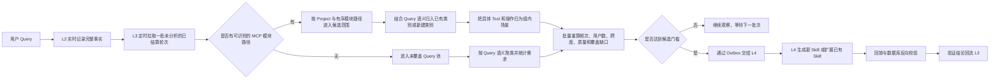
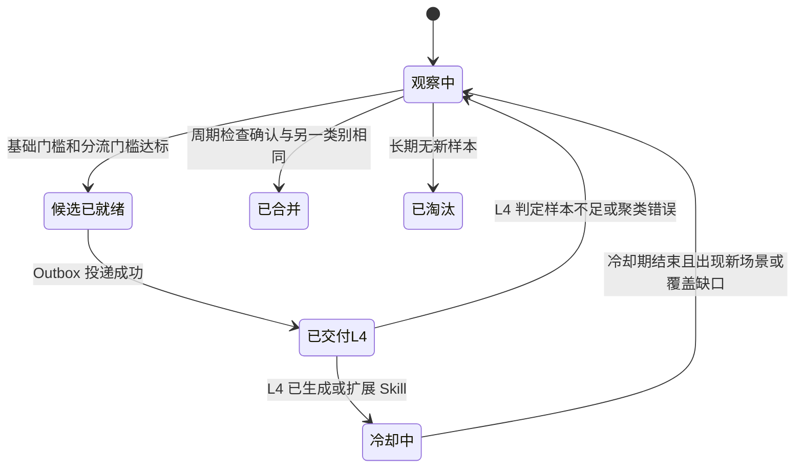

# MCPSTAT-1-L3 · Query 聚类分析层需求与实现方案

| 项目 | 内容 |
|---|---|
| 所属需求 | MCPSTAT-1 |
| 飞书同步基线 | revision 9（2026-08-14 读取） |
| 本层职责 | 对完整 Query 记录做宽口径聚类与统计，识别可生成或需扩展 Skill 的稳定需求 |
| 上游 | L2 采集层：提供 Query、实际 MCP 调用事实、执行结果和行为信号 |
| 下游 | L4 闭环层：生成、扩展、验证和发布 Skill |
| 核心边界 | L2 不判断 Query 属于哪个 Skill；L3 不生成 Skill，也不调用业务 MCP |
| 处理方式 | L2 实时记录，L3 定时批量聚类与统计，不进入用户实时调用链路 |
| 当前状态 | 核心分类原则已确认；稳定 Module 标识、语义模型和阈值仍需在真实数据实验后冻结 |

## 1. 结论

L3 的核心工作可以概括为一句话：**根据用户 Query 的语义和实际经过的 MCP 模块路径，把同一类需求聚合起来，统计出现频次与质量，再把达标的候选需求交给 L4。**

例如下面三条记录应归为同一类：

- 查询用户信息 → 查询订单
- 查询用户信息 → 修改订单
- 查询用户信息 → 删除订单

它们的共同业务路径都是“用户模块 → 订单模块”。查询、修改、删除只是这一类需求下的不同操作场景，不应成为拆分 Query 类别的硬边界。最终生成的 Skill 也应覆盖这一整类场景，而不是只覆盖其中一条精确工具链。

如果调用进入了其他模块，形成不同的业务路径，则进入另一个候选范围。例如“用户模块 → 资产模块”不能与“用户模块 → 订单模块”直接归为一类。

## 2. 背景与当前前提

### 2.1 已确认的产品事实

MCP 本身已经按照 `Project → Module → Tool` 组织，模块划分就是可复用的业务能力边界。因此 L3 不再建设一套额外的“人工能力集合”，也不维护一份与 MCP 重复的硬编码映射。

L3 直接复用 MCP 注册信息：

- Project 表示业务项目或产品域。
- Module 表示稳定的业务对象或业务模块，例如用户、订单、资产。
- Tool 表示模块下的具体操作，例如查询、修改、删除。
- Skill 是 L4 最终生成或扩展的复合能力，不是 L2 输入时已经确定的分类标签。

### 2.2 当前代码事实

当前代码已经具备 L1 接入能力和 L2 完整轮次结算能力。L2 以 `mcp_analysis_outbox` 交付 `turn_id + settlement_revision`，L3 消费时关联结算轮次和调用明细，补齐 Query、调用者摘要、调用路径、参数键、结果及行为信号，不从单条调用猜测一轮边界。

L2→L3 接线必须满足两个输入前提：

1. L2 能以稳定的 `turn_id + settlement_version` 交付整轮记录，而不是让 L3 从零散调用猜测一轮边界。
2. L2 必须记录零调用、未命中 MCP 的完整 Query，否则 L3 无法发现系统尚未覆盖的需求。

这两个前提不改变 L2 的职责：L2 只记录事实，不判断目标 Skill。

当前结构化输入和批处理链路已实现，但仍有两个与本方案直接相关的实现缺口：注册模型尚未提供稳定的独立 Module 实体；已有字符特征相似度在 50 条真实 MCP Query 批测中将数据拆成 50 个单例类别，不符合本方案的语义聚类要求。

## 3. 分层职责

| 层级 | 负责什么 | 不负责什么 |
|---|---|---|
| L1 | 身份、项目接入、调用归属 | Query 聚类和 Skill 判断 |
| L2 | 记录完整 Query、实际模块与工具调用、参数、顺序、结果、行为信号 | 判断 Query 属于哪个 Skill |
| L3 | Query 聚类、频次统计、证据质量评估、未覆盖需求和 Skill 覆盖缺口识别 | 生成、执行、发布 Skill；主动查询业务数据库 |
| L4 | 根据候选聚类生成或扩展 Skill，执行回放和数据库反向校验，决定发布 | 重新定义 L3 的聚类边界 |

L2 可以记录“本轮实际尝试执行了哪个 Skill”这一运行事实，但该字段只能作为 L3 判断覆盖是否正确的证据，不能作为聚类真值。

## 4. 核心对象与定义

### 4.1 完整 Query 记录

一条 L3 输入代表一轮已经结算的用户请求，至少包括：

- `event_id`：该结算版本的唯一事件 ID。
- `turn_id`：一轮用户请求的稳定 ID。
- `settlement_version`：同一轮补充或更正后的版本号。
- `query_text`：用户原始问题。
- `actor_hash`：不可逆的用户标识摘要。
- `occurred_at`：发生时间。
- `collection_trust`：采集可信等级。
- `calls[]`：实际发生的 Project、Module、Tool、参数键、顺序、结果和行为信号。
- `attempted_skill_id/version`：可选，仅表示运行时实际尝试过的 Skill。
- `settlement_status`：成功、失败、部分成功、未命中 MCP 或零调用结束。

### 4.2 业务模块路径

L3 从实际调用中提取有序的模块路径，并压缩连续重复模块：

```text
用户.查询 → 用户.查询详情 → 订单.查询 → 订单.删除
                        ↓
业务模块路径：用户 → 订单
```

模块路径保留先后顺序，但不把具体 Tool 和查询、修改、删除动作写入聚类硬键。

### 4.3 Query 类别

一个 Query 类别代表“相同业务路径下、语义上在完成同一类事情的一组请求”。它包含：

- 一个稳定的模块路径。
- 一个代表性 Query 和语义中心。
- 多个操作场景，例如查订单、改订单、删订单。
- 每个场景对应的真实调用样本和质量统计。
- 与已有 Skill 的覆盖关系。

## 5. 完整业务链路



流程中的关键点只有四个：

1. L2 实时交事实，不交“所属 Skill”的判断。
2. L3 由定时任务批量读取新增记录，不针对单个用户 Query 做实时聚类。
3. L3 先用模块路径限定业务边界，再用 Query 语义完成宽口径归类；具体操作是组内场景。
4. L4 才负责把达标类别变成可运行、可验证的 Skill。

## 6. Query 聚类方法

### 6.1 第一步：规范化输入

L3 对 Query 做无损规范化，例如统一空白、大小写和明显的格式差异，但保留业务对象、条件、动作和否定词。参数值不进入 Query 类别硬键，避免不同客户 ID、订单 ID 把同类需求拆散。

每条调用事实必须通过调用发生时的 MCP 注册快照解析为稳定的 `project_id/module_id/tool_id`。Project 是业务项目或产品域，Module 是用户、订单、资产等业务能力边界，Tool 是具体查询、修改或删除动作。不得将 Project 直接当作 Module，也不得根据 Tool 名猜测 Module。当前注册模型缺少独立 Module 实体，这是正式聚类前必须补齐的实现前提，而不是用 Project 代替的理由。

### 6.2 第二步：构造候选范围

正常记录的候选范围由以下信息决定：

```text
project_scope + ordered_module_path
```

例如：

| Query | 模块路径 | 候选范围 |
|---|---|---|
| 查用户后查订单 | 用户 → 订单 | A |
| 查用户后删订单 | 用户 → 订单 | A |
| 查用户后改订单 | 用户 → 订单 | A |
| 查用户后查资产 | 用户 → 资产 | B |
| 只查订单 | 订单 | C |

这里的“候选范围”只是减少语义比较范围，不等于最终类别。相同模块路径内仍需比较 Query 语义，防止把同一路径下完全不同的业务目标误并。

### 6.3 第三步：语义归类

新记录只与同一候选范围内的 Query 类别比较：

1. 先用文本指纹识别完全相同或仅参数不同的 Query。
2. 再用本地语义模型计算与各类别代表 Query 的相似度。
3. 超过加入阈值时归入得分最高的类别；否则新建类别。
4. 周期性执行合并与拆分检查，修正增量聚类的先后顺序误差。

不能仅凭“查询、修改、删除”动作不同就拆分类别。这些动作被提取成 `scene_type`，用于描述 Skill 应覆盖的子场景和风险等级。

### 6.4 第四步：场景归纳

组内按照实际 Tool、关键参数结构和业务动作归纳场景，例如：

- `user.lookup → order.query`
- `user.lookup → order.update`
- `user.lookup → order.delete`

场景的作用是告诉 L4“这个 Skill 需要覆盖哪些能力”，而不是重新把 Query 类别拆开。高风险动作可以采用更严格的 L4 验证和发布策略，但仍可属于同一 Skill。

## 7. 频次门槛与质量评估

L3 评估的是“这个 Query 类别是否值得交给 L4”，不是直接判断最终 Skill 已经合格。

### 7.1 候选门槛

推荐初始配置如下，所有数值均可配置，但只能用于影子运行和评估，需在真实数据压测后冻结：

| 指标 | 推荐初值 | 目的 |
|---|---:|---|
| 有效 Query 数 | ≥ 20 | 排除偶发需求 |
| 独立用户数 | ≥ 5 | 排除单人重复重试 |
| 时间跨度 | ≥ 3 天 | 排除一次性热点 |
| 输入完整率 | ≥ 95% | 保证模块路径和结果可解释 |
| 类内语义内聚度 | ≥ 0.82 | 防止不同目标误并 |

达到以上基础门槛后，再按需求类型分流：

- **稳定成功型**：执行成功率达到 90%，可作为生成新 Skill 或补充 Skill 场景的正向样本。
- **覆盖缺口型**：同一类别中已有 Skill 的不覆盖、误匹配或失败样本达到 5 条，或占比达到 20%，即使总体成功率低也应交给 L4，因为失败本身就是扩展需求的证据。
- **未覆盖型**：没有 MCP 调用的同类 Query 达到基础频次门槛后，作为能力建设需求交给 L4，但在映射到真实 MCP 模块和 Tool 前不能生成可执行 Skill。

### 7.2 质量信号

L3 使用的质量信号全部来自 L2 已记录事实：

- 执行是否成功、超时或参数校验失败。
- 是否立刻更换参数重试。
- 是否反复调用同一 Tool。
- 是否中途切换到另一条路径。
- 是否有明确产出或零结果结束。
- 同一场景的 Tool 顺序与参数结构是否稳定。
- 实际尝试的 Skill 是否覆盖了最终需要的场景。

每个分数必须保留构成项和样本 ID，禁止只保存一个无法解释的总分。

### 7.3 Skill 质量由 L4 最终验证

L3 只证明“需求稳定存在”和“候选调用证据足够”。Skill 是否正确，需要 L4 完成：

1. 用聚类中的代表 Query、边界样本和失败样本进行回放。
2. 检查 Tool 选择、顺序、参数来源和异常分支。
3. 将调用结果与权威数据库按业务主键、关键字段和状态进行反向校验。
4. 查询类场景核对返回值；修改或删除类场景只能在隔离测试数据上验证操作后的数据库状态，并验证幂等、权限和回滚策略。
5. 验证结论回流 L3，用于修正类别质量和后续阈值。

因此，“数据库反向校验”属于 L4 的主动验证动作，L3 只提供证据并消费验证结论。

## 8. 两类特殊情况

### 8.1 Query 未命中 MCP

如果用户 Query 没有调用任何 MCP，L3 的处理方式是：

1. L2 仍然生成一条 `zero_call/unmatched` 的完整结算记录。
2. L3 将其放入未覆盖 Query 池，按语义聚类并统计频次。
3. 达到门槛后交给 L4 或运营侧做能力映射。
4. 在确认可用的 Project、Module 和 Tool 前，只能形成需求候选，不能生成可执行 Skill。

如果 L2 不记录这类 Query，L3 没有任何数据可以发现它，这是明确的系统边界。

### 8.2 已有 Skill 覆盖过窄或误匹配

假设已有 Skill 只定义了“查用户 → 查订单”，用户实际需要“查用户 → 删订单”，运行时却误匹配了该 Skill：

1. L2 记录实际 Query、调用过程、结果及本轮尝试的 Skill ID，仍不判断它是否匹配正确。
2. L3 按真实 Query 语义和“用户 → 订单”模块路径归类，不以 Skill ID 作为分类依据。
3. “删除订单”被识别为该 Query 类别下的新场景。
4. 如果现有 Skill 的声明能力未覆盖该场景，或执行结果持续失败，记录为 `skill_coverage_gap` 或 `skill_mismatch`。
5. 达到缺口门槛后交给 L4。L4 决定扩展已有 Skill 的新版本，还是创建新的 Skill。

误匹配记录不能计入原 Skill 的成功证据，而应计入覆盖缺口或失败证据。

## 9. 状态机



状态只描述 Query 类别的分析生命周期，不代替 Skill 自身的草稿、验证、发布和废弃状态机。

## 10. 数据模型

### 10.1 核心表

| 表 | 用途 |
|---|---|
| `mcp_analysis_input` | 幂等保存 L2 完整结算记录的分析索引 |
| `mcp_query_cluster` | Query 类别主表及累计指标 |
| `mcp_query_cluster_member` | 输入记录与类别的归属和相似度 |
| `mcp_query_cluster_scene` | 类别下具体操作场景及稳定性指标 |
| `mcp_skill_coverage_gap` | 已有 Skill 的覆盖缺口或误匹配证据 |
| `mcp_cluster_score_history` | 可解释评分和状态变化历史 |
| `mcp_l4_candidate_outbox` | 向 L4 可靠交付候选事件 |
| `mcp_l4_validation_feedback` | L4 回流的回放和数据库校验结论 |

### 10.2 建表草案

以下 DDL 是 L3 方案草案。正式实现前需先更新并冻结 Spec，再合并到 `src/db/schema.sql`。

```sql
CREATE TABLE mcp_analysis_input (
    id BIGINT UNSIGNED NOT NULL AUTO_INCREMENT,
    event_id VARCHAR(64) NOT NULL,
    turn_id VARCHAR(64) NOT NULL,
    settlement_version INT UNSIGNED NOT NULL,
    actor_hash CHAR(64) NOT NULL,
    query_text TEXT NOT NULL,
    query_fingerprint CHAR(64) NOT NULL,
    project_scope VARCHAR(191) NULL,
    module_path_hash CHAR(64) NULL,
    module_path JSON NULL,
    calls JSON NOT NULL,
    behavior_signals JSON NULL,
    settlement_status ENUM('success','partial','failed','unmatched','zero_call') NOT NULL,
    collection_trust ENUM('trusted','suspect','missing') NOT NULL,
    attempted_skill_id VARCHAR(191) NULL,
    attempted_skill_version VARCHAR(64) NULL,
    occurred_at DATETIME(3) NOT NULL,
    analyzed_at DATETIME(3) NULL,
    created_at DATETIME(3) NOT NULL DEFAULT CURRENT_TIMESTAMP(3),
    PRIMARY KEY (id),
    UNIQUE KEY uk_analysis_input_event (event_id),
    UNIQUE KEY uk_analysis_input_turn_version (turn_id, settlement_version),
    KEY idx_analysis_input_path (project_scope, module_path_hash, occurred_at),
    KEY idx_analysis_input_status (settlement_status, analyzed_at)
) ENGINE=InnoDB DEFAULT CHARSET=utf8mb4 COLLATE=utf8mb4_0900_ai_ci;

CREATE TABLE mcp_query_cluster (
    id BIGINT UNSIGNED NOT NULL AUTO_INCREMENT,
    cluster_key CHAR(64) NOT NULL,
    cluster_type ENUM('normal','uncovered') NOT NULL,
    project_scope VARCHAR(191) NULL,
    module_path_hash CHAR(64) NULL,
    module_path JSON NULL,
    representative_event_id VARCHAR(64) NOT NULL,
    status ENUM('observing','candidate_ready','handed_off','cooling','merged','retired') NOT NULL,
    merged_into_cluster_id BIGINT UNSIGNED NULL,
    sample_count BIGINT UNSIGNED NOT NULL DEFAULT 0,
    distinct_actor_count BIGINT UNSIGNED NOT NULL DEFAULT 0,
    success_count BIGINT UNSIGNED NOT NULL DEFAULT 0,
    coverage_gap_count BIGINT UNSIGNED NOT NULL DEFAULT 0,
    attempted_skill_count BIGINT UNSIGNED NOT NULL DEFAULT 0,
    semantic_cohesion DECIMAL(6,5) NULL,
    input_completeness DECIMAL(6,5) NULL,
    first_seen_at DATETIME(3) NOT NULL,
    last_seen_at DATETIME(3) NOT NULL,
    cooldown_until DATETIME(3) NULL,
    version BIGINT UNSIGNED NOT NULL DEFAULT 1,
    created_at DATETIME(3) NOT NULL DEFAULT CURRENT_TIMESTAMP(3),
    updated_at DATETIME(3) NOT NULL DEFAULT CURRENT_TIMESTAMP(3) ON UPDATE CURRENT_TIMESTAMP(3),
    PRIMARY KEY (id),
    UNIQUE KEY uk_query_cluster_key (cluster_key),
    KEY idx_query_cluster_candidate (status, last_seen_at),
    CONSTRAINT fk_query_cluster_merged_into
        FOREIGN KEY (merged_into_cluster_id) REFERENCES mcp_query_cluster(id)
) ENGINE=InnoDB DEFAULT CHARSET=utf8mb4 COLLATE=utf8mb4_0900_ai_ci;

CREATE TABLE mcp_query_cluster_member (
    id BIGINT UNSIGNED NOT NULL AUTO_INCREMENT,
    cluster_id BIGINT UNSIGNED NOT NULL,
    analysis_input_id BIGINT UNSIGNED NOT NULL,
    semantic_similarity DECIMAL(6,5) NOT NULL,
    scene_type VARCHAR(191) NULL,
    threshold_eligible TINYINT(1) NOT NULL DEFAULT 1,
    quality_success TINYINT(1) NOT NULL DEFAULT 0,
    exclusion_reason VARCHAR(64) NULL,
    created_at DATETIME(3) NOT NULL DEFAULT CURRENT_TIMESTAMP(3),
    PRIMARY KEY (id),
    UNIQUE KEY uk_cluster_member_input (analysis_input_id),
    KEY idx_cluster_member_cluster (cluster_id, created_at),
    CONSTRAINT fk_cluster_member_cluster
        FOREIGN KEY (cluster_id) REFERENCES mcp_query_cluster(id),
    CONSTRAINT fk_cluster_member_input
        FOREIGN KEY (analysis_input_id) REFERENCES mcp_analysis_input(id)
) ENGINE=InnoDB DEFAULT CHARSET=utf8mb4 COLLATE=utf8mb4_0900_ai_ci;

CREATE TABLE mcp_query_cluster_scene (
    id BIGINT UNSIGNED NOT NULL AUTO_INCREMENT,
    cluster_id BIGINT UNSIGNED NOT NULL,
    scene_key CHAR(64) NOT NULL,
    scene_type VARCHAR(191) NOT NULL,
    tool_path JSON NOT NULL,
    risk_level ENUM('low','medium','high') NOT NULL,
    sample_count BIGINT UNSIGNED NOT NULL DEFAULT 0,
    success_count BIGINT UNSIGNED NOT NULL DEFAULT 0,
    flow_stability DECIMAL(6,5) NULL,
    first_seen_at DATETIME(3) NOT NULL,
    last_seen_at DATETIME(3) NOT NULL,
    created_at DATETIME(3) NOT NULL DEFAULT CURRENT_TIMESTAMP(3),
    updated_at DATETIME(3) NOT NULL DEFAULT CURRENT_TIMESTAMP(3) ON UPDATE CURRENT_TIMESTAMP(3),
    PRIMARY KEY (id),
    UNIQUE KEY uk_cluster_scene (cluster_id, scene_key),
    CONSTRAINT fk_cluster_scene_cluster
        FOREIGN KEY (cluster_id) REFERENCES mcp_query_cluster(id)
) ENGINE=InnoDB DEFAULT CHARSET=utf8mb4 COLLATE=utf8mb4_0900_ai_ci;

CREATE TABLE mcp_skill_coverage_gap (
    id BIGINT UNSIGNED NOT NULL AUTO_INCREMENT,
    cluster_id BIGINT UNSIGNED NOT NULL,
    analysis_input_id BIGINT UNSIGNED NOT NULL,
    attempted_skill_id VARCHAR(191) NOT NULL,
    attempted_skill_version VARCHAR(64) NULL,
    gap_type ENUM('not_covered','partial_coverage','mismatch','execution_failure') NOT NULL,
    evidence JSON NOT NULL,
    created_at DATETIME(3) NOT NULL DEFAULT CURRENT_TIMESTAMP(3),
    PRIMARY KEY (id),
    UNIQUE KEY uk_skill_gap_input_skill (analysis_input_id, attempted_skill_id),
    KEY idx_skill_gap_cluster (cluster_id, created_at),
    CONSTRAINT fk_skill_gap_cluster
        FOREIGN KEY (cluster_id) REFERENCES mcp_query_cluster(id),
    CONSTRAINT fk_skill_gap_input
        FOREIGN KEY (analysis_input_id) REFERENCES mcp_analysis_input(id)
) ENGINE=InnoDB DEFAULT CHARSET=utf8mb4 COLLATE=utf8mb4_0900_ai_ci;

CREATE TABLE mcp_cluster_score_history (
    id BIGINT UNSIGNED NOT NULL AUTO_INCREMENT,
    cluster_id BIGINT UNSIGNED NOT NULL,
    cluster_version BIGINT UNSIGNED NOT NULL,
    score_type VARCHAR(64) NOT NULL,
    score_value DECIMAL(8,5) NULL,
    reason JSON NOT NULL,
    created_at DATETIME(3) NOT NULL DEFAULT CURRENT_TIMESTAMP(3),
    PRIMARY KEY (id),
    KEY idx_cluster_score_history (cluster_id, created_at),
    CONSTRAINT fk_cluster_score_cluster
        FOREIGN KEY (cluster_id) REFERENCES mcp_query_cluster(id)
) ENGINE=InnoDB DEFAULT CHARSET=utf8mb4 COLLATE=utf8mb4_0900_ai_ci;

CREATE TABLE mcp_l4_candidate_outbox (
    id BIGINT UNSIGNED NOT NULL AUTO_INCREMENT,
    event_id VARCHAR(64) NOT NULL,
    cluster_id BIGINT UNSIGNED NOT NULL,
    cluster_version BIGINT UNSIGNED NOT NULL,
    candidate_type ENUM('new_skill','expand_skill','uncovered_demand') NOT NULL,
    payload JSON NOT NULL,
    status ENUM('pending','delivering','delivered','dead') NOT NULL DEFAULT 'pending',
    attempt_count INT UNSIGNED NOT NULL DEFAULT 0,
    next_attempt_at DATETIME(3) NOT NULL DEFAULT CURRENT_TIMESTAMP(3),
    delivered_at DATETIME(3) NULL,
    last_error_code VARCHAR(64) NULL,
    created_at DATETIME(3) NOT NULL DEFAULT CURRENT_TIMESTAMP(3),
    updated_at DATETIME(3) NOT NULL DEFAULT CURRENT_TIMESTAMP(3) ON UPDATE CURRENT_TIMESTAMP(3),
    PRIMARY KEY (id),
    UNIQUE KEY uk_l4_candidate_event (event_id),
    UNIQUE KEY uk_l4_candidate_cluster_version (cluster_id, cluster_version, candidate_type),
    KEY idx_l4_candidate_delivery (status, next_attempt_at),
    CONSTRAINT fk_l4_candidate_cluster
        FOREIGN KEY (cluster_id) REFERENCES mcp_query_cluster(id)
) ENGINE=InnoDB DEFAULT CHARSET=utf8mb4 COLLATE=utf8mb4_0900_ai_ci;

CREATE TABLE mcp_l4_validation_feedback (
    id BIGINT UNSIGNED NOT NULL AUTO_INCREMENT,
    feedback_id VARCHAR(64) NOT NULL,
    cluster_id BIGINT UNSIGNED NOT NULL,
    cluster_version BIGINT UNSIGNED NOT NULL,
    skill_id VARCHAR(191) NULL,
    skill_version VARCHAR(64) NULL,
    verdict ENUM('passed','failed','insufficient','cluster_error') NOT NULL,
    replay_summary JSON NULL,
    database_check_summary JSON NULL,
    created_at DATETIME(3) NOT NULL DEFAULT CURRENT_TIMESTAMP(3),
    PRIMARY KEY (id),
    UNIQUE KEY uk_l4_feedback_id (feedback_id),
    KEY idx_l4_feedback_cluster (cluster_id, created_at),
    CONSTRAINT fk_l4_feedback_cluster
        FOREIGN KEY (cluster_id) REFERENCES mcp_query_cluster(id)
) ENGINE=InnoDB DEFAULT CHARSET=utf8mb4 COLLATE=utf8mb4_0900_ai_ci;
```

## 11. L3 与 L4 的交付契约

L3 发给 L4 的候选至少包含：

- `cluster_id`、版本和候选类型。
- 代表 Query、语义边界和反例。
- Project 与有序模块路径。
- 组内场景列表、场景频次、成功率和风险等级。
- 每个场景的脱敏真实调用样本。
- 频次、独立用户数、时间跨度、内聚度和输入完整率。
- 已有 Skill ID、版本及覆盖缺口证据。
- 未覆盖 Query 的代表样本和需求规模。
- 可回查的证据 ID，不直接复制敏感参数或业务数据。

候选投递使用 Transactional Outbox。L3 状态变更和 Outbox 写入必须在同一事务内完成，L4 按 `event_id` 幂等消费。

## 12. 技术实现

### 12.1 组件

- `AnalysisInputConsumer`：幂等接收 L2 完整结算事件。
- `AnalysisOutboxWorker`：租约领取 L2 分析 Outbox，关联轮次和调用明细后转换为 L3 输入，成功后确认投递，失败则退避或死信。
- `AnalysisBatchScheduler`：按固定周期触发批处理；同一时刻只允许一个实例取得任务锁。
- `ModulePathResolver`：校验 MCP 注册快照并生成有序模块路径。
- `QueryClusterer`：候选范围检索、语义归类、新建、合并和拆分。
- `SceneExtractor`：把具体 Tool 调用归纳为组内场景。
- `CoverageGapDetector`：识别已有 Skill 的不覆盖、部分覆盖和误匹配。
- `ClusterMetricService`：统计频次、用户数、跨度、成功率和质量分。
- `CandidateGate`：判断新 Skill、扩展 Skill或未覆盖需求是否达标。
- `L4CandidateOutboxWorker`：可靠投递候选。
- `ValidationFeedbackConsumer`：接收 L4 回放和数据库校验结论。
- `ClusterRebuildJob`：在模型、阈值或模块映射变化后可重算。

### 12.2 一致性与并发

- `event_id` 和 `turn_id + settlement_version` 双重幂等。
- L2 Outbox 消费使用租约和至少一次投递；输入写入成功但确认前崩溃时，重放由 L3 输入幂等键吸收。
- 同一输入只能属于一个当前有效类别。
- 类别成员写入、指标更新、状态变化和 Outbox 写入使用单事务。
- 单条输入使用独立数据库事务和连接；一条毒性输入回滚后不得污染同批后续输入。
- 类别更新采用版本号乐观锁；并发冲突重新读取后计算。
- 模型版本、阈值版本和模块快照版本必须随评分历史保存，保证结果可重放。

### 12.3 性能基线

初始容量按日均 10 万轮、峰值 20 QPS、180 天在线证据设计。L2 只负责持续写入，L3 默认每 5 分钟拉取最多 1000 条未分析记录；正常记录先按模块路径缩小语义检索范围，避免全库两两比较，未覆盖 Query 使用独立语义检索范围。单批失败不标记已分析，由下一批重试。

目标：

- L2 投递不等待 L3 分析结果。
- 单批 1000 条在下一调度周期前处理完成。
- 积压恢复后可持续以入口峰值两倍速度追平。
- 周期重算与在线增量任务隔离，不能长期锁住成员表。

## 13. 安全、可观测与运维

- Query、参数和 Tool 结果按最小必要原则保存；凭据、Token、密码和完整敏感业务数据不得写入分析表或 Outbox。
- `actor_hash` 使用不可逆摘要，只用于去重和独立用户统计。
- 证据只保存必要字段与原始记录引用，L4 按权限回查。
- 数据库反向校验只能由 L4 的受控验证身份执行；生产库默认只读，修改和删除场景使用隔离数据集。
- 指标至少包括：输入量、零调用率、分析延迟、待处理积压、每路径类别数、合并拆分率、候选触发数、覆盖缺口率、L4 验证通过率、Outbox 重试与死信数。
- 告警至少包括：积压持续增长、模块映射缺失、某路径类别数异常膨胀、L4 连续验证失败、Outbox 死信和重建任务失败。

## 14. 文件与实施顺序

建议实现目录：

```text
src/analysis/
  input-consumer.ts
  batch-scheduler.ts
  module-path.ts
  query-clusterer.ts
  scene-extractor.ts
  coverage-gap.ts
  metrics.ts
  candidate-gate.ts
  l4-outbox.ts
  validation-feedback.ts
  rebuild.ts
src/db/
  schema.sql
  analysis-repository.ts
tests/
  analysis-*.test.ts
  mysql-analysis-*.test.ts
```

实施顺序：

1. 实现 L2 Analysis Outbox 到 L3 Input 的租约消费和幂等转换；当前网关不从单次 `CallEnvelope` 猜测整轮边界。
2. 完成语义模型与标注数据实验，冻结加入、合并和拆分阈值，不再以字符重合度作为业务语义判断。
3. 实现输入幂等、模块路径和基础数据表。
4. 实现宽口径聚类、场景归纳和周期修正。
5. 实现质量统计、覆盖缺口识别和候选门槛。
6. 实现 L4 Outbox、验证反馈和重建能力。
7. 完成真实 MySQL、并发、恢复和容量验证。

## 15. 测试与验收

### 15.1 必测场景

- “查用户 → 查订单”“查用户 → 改订单”“查用户 → 删订单”归入同一 Query 类别，并形成三个场景。
- “查用户 → 查资产”不进入“用户 → 订单”类别。
- 相同模块路径但语义目标明显不同的 Query 不被误并。
- Tool 名或参数值不同，但模块路径与需求相同的记录仍可归为一类。
- L2 未提供目标 Skill 时，L3 可以独立完成归类。
- `attempted_skill_id` 存在时只用于覆盖缺口判断，不改变聚类真值。
- 零调用 Query 能进入未覆盖池并达到需求候选门槛。
- 已有 Skill 只覆盖查询、用户请求删除时，能产生 `skill_coverage_gap`。
- 同一结算事件重复投递不重复计数；新结算版本能替换旧版本并重算。
- 一次真实 MCP 调用完成 L2 结算后，Analysis Outbox 自动转换为一条字段可追溯的 L3 Input；进程重启和重复消费不重复计数。
- 一条毒性输入回滚后，同批正常输入仍能完成分析并被标记。
- 类别达到门槛时，状态变化与 Outbox 事件原子提交且只投递一次。
- L4 验证失败或判定聚类错误后，L3 能退回观察并保留原因。
- 重建前后成员归属和统计结果可解释、可审计。

### 15.2 验收结果

满足以下条件才算 L3 完成：

1. L2 不包含目标 Skill 分类逻辑，L3 能基于 Query 与模块路径独立聚类。
2. 工具和操作差异不会错误拆散同一业务路径下的同类需求。
3. 其他模块路径不会被误并。
4. 每类 Query 的频次、质量、场景和覆盖缺口都可追溯到原始证据。
5. 零调用需求和已有 Skill 覆盖过窄均有完整处理链路。
6. L3 只产生候选，Skill 的生成、扩展和数据库反向校验均由 L4 完成。
7. MySQL 幂等、并发、Outbox、重建和恢复测试通过。

## 16. 待冻结项

核心分类原则已确认，仍需冻结以下配置和契约：

- MCP 注册信息中稳定的 `module_id` 和版本快照字段。
- Query 语义模型、类别语义中心表示、加入阈值、合并阈值和拆分规则。
- 频次、用户数、时间跨度、成功率与覆盖缺口的正式门槛。
- L4 Skill 元数据中“已声明覆盖场景”的读取契约。
- L4 数据库反向校验的隔离环境、权限和结果回流格式。
- 宿主零调用或未命中 MCP Query 的轮次结束契约。

这些待冻结项不改变核心结论：**L2 实时记录事实，L3 定时批量完成宽口径 Query 聚类与统计，L4 负责生成或扩展 Skill 并验证其正确性。**
