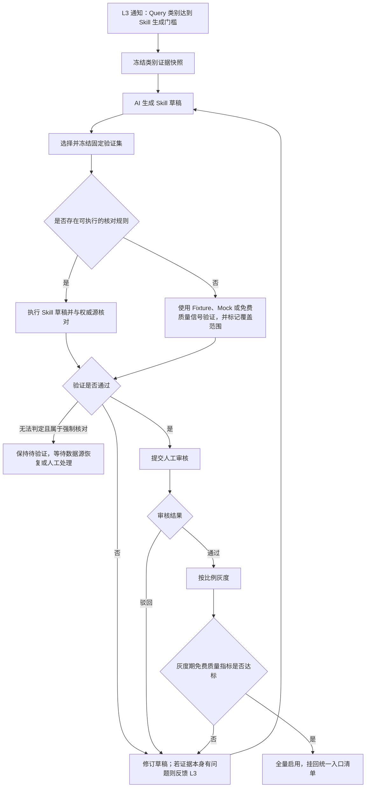
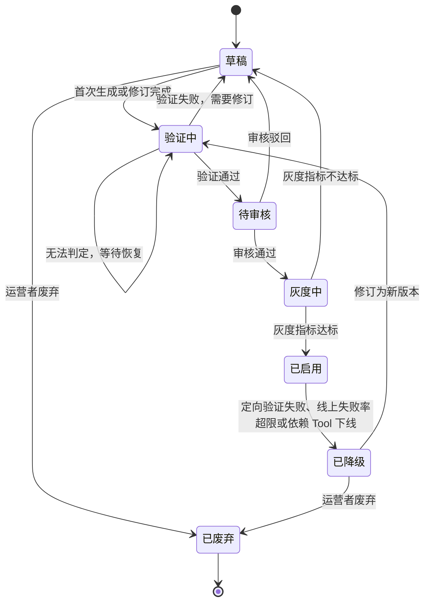

# MCPSTAT-1 · L4 闭环层

| 项目 | 内容 |
|---|---|
| 所属需求 | MCPSTAT-1 |
| 本层职责 | 在 Query 类别达到生成门槛后，由 AI 生成 Skill 草稿，验证其结果确实正确，并管理 Skill 从生成到废弃的生命周期 |
| 包含模块 | M7 Skill 验证、M8 Skill 生命周期 |
| 上游 | L3 分析层提供达标 Query 类别和生成证据；L1 接入层提供核对规则声明与原始 Tool 版本 |
| 下游 | L3 分析层接收与类别质量有关的验证反馈；L1 接入层把已启用的 Skill 挂回对外清单 |
| 硬边界 | 普通用户 Query 和普通 Tool 调用不触发权威源反查；所有验证均在用户调用链之外异步执行 |
| 当前状态 | 需求草稿；本轮已确认验证时机，技术方案尚未开始 |

## 第一部分 · 需求

### 1. 本层要解决什么

L3 已经能识别一类被反复提出、调用路径相对稳定的问题。当该类 Query 的提问频率、独立用户数和质量信号达到门槛后，系统需要把这套处理方式固化为可复用的 Skill，减少后续 Agent 重复规划多步 Tool 调用的成本。

调用没有报错、大模型没有重试，只能说明执行过程看起来顺利，不能证明最终数据一定正确。但是，权威源核对需要连接只读数据库或其他可信来源，存在网络、计算和数据源压力，没有必要在每次用户 Query 或每次 Tool 调用时执行。普通调用只经过 L1、L2、L3 的正常链路，持续采集低成本的执行结果和行为信号，不同步也不异步追加逐请求数据库反查。

权威源核对被纳入 Skill 生命周期：L3 通知某个 Query 类别达到 Skill 生成门槛后，L4 先利用 AI 根据代表 Query、调用路径和场景证据生成 Skill 草稿，再用固定验证样本执行该草稿，并将结果与权威数据源比较。系统真正验证的是生成出来的 Skill 是否选对 Tool、排对步骤、传对参数并组装出正确结果，而不是提前大规模证明历史调用本身是否正确。

Skill 内容被修改、依赖 Tool 发生变更、线上免费质量信号异常或运营者人工要求复核时，系统重新触发同一套验证。长期稳定且没有异常的 Skill 不做每日无条件数据库反查，也不对普通调用进行随机数据库抽样。

验证通过后，Skill 仍必须经过人工审核和灰度才能正式启用。首期不允许无人审核上线。启用后的 Skill 如果依赖发生变化或质量异常，先暂停或降级，再按验证结果决定恢复还是修订。

本层不决定哪一类 Query 达到生成门槛，这是 L3 的职责；本层负责生成 Skill、验证 Skill，并管理其审核、灰度、启用、暂停、降级和废弃。

### 2. 模块

#### 2.1 M7 Skill 验证

- **边界**：作为 M8 Skill 生命周期的验证能力，负责固定验证集准备、Skill 草稿或版本执行、权威源核对、结论记录和反馈。不监听普通用户 Query，不按普通调用逐条反查，不独立决定 Skill 的生成、发布或降级。
- **入口与触发**：Skill 首次生成、Skill 内容修订、依赖 Tool 变更、线上质量信号异常和运营者人工复核。
- **完成信号**：每次验证留下可追溯记录，包含触发原因、Skill 版本、固定样本、执行结果、核对结论和差异摘要；验证开关关闭前后，普通调用耗时和调用结果不发生变化。
- **对外提供**：向 M8 提供发布、恢复或降级所需的验证结论；仅当结论能够说明 Query 类别或生成证据存在问题时，才向 L3 回流相应原因。
- **依赖前提**：L3 提供可用于生成和验证的类别证据，L1 提供不可变 Tool 版本与核对规则；技术方案需要进一步明确安全的可回放样本来源。

**三层正确性的划分。**

| 层次 | 含义 | 判定手段 | 归属 |
|---|---|---|---|
| 执行正确 | 没报错、参数合法 | 调用返回状态 | L2 采集、L3 汇总 |
| 意图满足 | Agent 是否接受结果 | 重试、放弃、换工具等行为信号 | L3 折算 |
| 数据正确 | Skill 最终结果与权威源一致 | 固定样本执行与权威源核对 | L4 的 Skill 验证 |

前两层低成本且持续采集，第三层成本较高，只在 Skill 生命周期需要作出生成、发布、恢复或降级决定时执行。三者不能相互替代。

**核对规则的适用边界。** 只有结果可确定比较且已经声明核对规则的查询类 Tool 才做权威源数据比对。核对规则至少描述可信数据来源、Skill 或 Tool 参数到查询参数的映射，以及集合相等、数值容差或关键字段包含等比较方式。写操作、内容生成类 Tool 和没有声明核对规则的 Tool 不执行数据库反查，改用固定 Fixture、Mock、其他可验证来源或前两层质量信号，并在审核界面明确标记验证覆盖范围。

**执行约束。**

- 权威源核对只连接只读副本、影子库或其他受控可信来源，不允许指向生产主库。
- 验证全程异步排队，不进入普通用户 Query 的调用链，并设置独立并发上限和限流。
- 数据源不可用或核对执行失败时记为“无法判定”，不计为业务失败；首次发布所需的强制验证无法判定时，Skill 保持待验证，不得进入灰度。
- 验证能力可整体关闭；关闭后普通调用链路不变，但需要权威源核对的 Skill 新版本不得绕过门禁发布。
- Skill 验证中的业务 Tool 不自动重试；任一步失败即停止后续业务步骤，并保留失败位置和原因。

**验证触发机制。**

| 时机 | 触发条件 | 验证方式 | 结论用途 |
|---|---|---|---|
| 首次生成验证 | L3 通知 Query 类别达到门槛，AI 已生成 Skill 草稿 | 从类别证据中选择并冻结固定验证集，执行草稿后核对权威源 | 通过后允许提交人工审核；失败则修订草稿或退回类别 |
| 修订验证 | Skill 的步骤、参数映射、结果组装或依赖版本发生变化 | 为新 Skill 版本执行完整固定验证集 | 新版本通过后才能重新提交审核 |
| 变更或异常验证 | 依赖 Tool 变化，或 L2/L3 发现成功率下降、重试增加、路径漂移等异常 | 暂停受影响 Skill，针对受影响场景定向执行验证 | 通过则恢复；失败则降级并进入修订 |
| 人工复核 | 运营者或业务方反馈结果异常 | 选择指定 Skill 版本和样本定向验证 | 形成审计结论，并决定保持、暂停或修订 |

不存在“每次用户 Query 都反查数据库”和“长期稳定 Skill 每日无条件反查”两种触发方式。运行期是否需要复验，由依赖变更、低成本质量信号异常或人工判断驱动。

#### 2.2 M8 Skill 生命周期

- **边界**：负责 AI 生成 Skill 草稿、调用 M7 验证、人工审核、灰度与启用、按步执行、异常监控和失效降级。不负责决定哪一类 Query 达到生成门槛。
- **入口与触发**：L3 类别达标事件；运营者审核或修订；外部 Agent 调用已启用 Skill；L2/L3 质量异常；L1 通知依赖 Tool 变更。
- **完成信号**：AI 能根据类别证据生成草稿；草稿通过固定验证、人工审核和灰度后出现在统一入口；依赖变化或质量异常时能够暂停、验证、恢复或降级。
- **对外提供**：Skill 形式的高阶 Tool，通过 L1 的平台自有 Tool 登记能力挂回对外清单。
- **依赖前提**：L3 类别达到生成门槛；L1 支持挂载平台自有 Tool；M7 对需要权威源核对的场景给出明确结论。

**Skill 的形态。** Skill 不是一段提示词，而是统一入口上的平台自有 Tool。一个 Skill 至少包含适用场景描述、入参定义、固定调用步骤、每一步的参数来源、结果组装规则、依赖 Tool 版本和验证覆盖声明。

**AI 生成边界。** AI 根据 L3 提供的代表 Query、场景、调用顺序和证据生成草稿，但生成结果不能直接上线。固定验证证明草稿能够正确执行，人工审核确认业务边界和风险，灰度验证真实运行表现；三者都通过后才能全量启用。

**执行语义。** Skill 被调用时按步骤依次执行原有 Tool，中途任一步失败即中止，返回失败位置，不拼接不完整结果，也不自动重试业务 Tool。失败后 Agent 可以退回逐步调用。整个 Skill 运行及其内部步骤继续进入 L2 采集和 L3 分析。

### 3. 业务流程

#### 3.1 从达标 Query 类别到已启用 Skill

固定验证集从 L3 的类别证据中选择，在 Skill 首次生成时冻结。它用于验证 AI 生成的步骤、参数传递和结果组装，而不是在 Skill 生成前对历史调用做独立准入抽查。没有权威源核对规则的场景可以进入人工审核，但必须展示“未经权威源数据核对”的标记和实际验证覆盖范围。灰度期主要观察真实调用的成功率、重试、回退和路径稳定性，不对每次灰度调用反查数据库。

#### 3.2 运行期复验与失效处理

1. **持续观察免费信号。** L2/L3 持续汇总 Skill 的成功率、失败位置、重试、回退和路径变化，不增加数据库反查。
2. **依赖变更或质量异常。** L1 通知依赖 Tool 变化，或 L2/L3 检测到异常时，M8 先暂停受影响 Skill，M7 再执行定向验证。
3. **恢复或降级。** 原 Skill 内容无需修改且定向验证通过时可以清除暂停标记；验证失败时转为已降级，修订后作为新版本重新走完整验证、审核和灰度。
4. **人工复核。** 运营者或业务方可以针对指定 Skill 版本和样本发起验证，结论进入审计记录。

#### 3.3 异常分支

| 异常分支 | 触发条件 | 系统行为 | 调用方或使用者感知 | 状态或数据结果 |
|---|---|---|---|---|
| 权威数据源不可用 | 连接失败或超时 | 本次验证记为无法判定，不计为业务失败 | 普通用户无感知 | 首次强制验证保持待验证；运行期复验保持暂停并告警 |
| 核对规则指向生产主库 | 登记时填写了主库地址 | 登记阶段拒绝 | 项目负责人看到拒绝原因 | 核对规则不成立 |
| 验证队列积压 | 触发量超过并发上限 | 首次生成、依赖变更和人工紧急复核优先排队 | 普通用户无感知 | 积压量计入指标并告警 |
| Skill 无权威源核对规则 | 涉及的 Tool 均未声明规则 | 使用其他验证方式，标记未经权威源核对及覆盖范围 | 运营者审核时可见 | 可以继续审核，但不能宣称通过数据库反查 |
| 首次生成验证失败 | Skill 草稿结果与权威源不一致 | 保留差异样本并修订草稿；若来源证据错误则反馈 L3 | 运营者看到失败位置和差异 | Skill 不进入人工审核 |
| 首次生成验证无法判定 | 数据源不可用或样本不可执行 | 强制核对场景保持待验证，不按失败退回类别 | 运营者看到阻塞原因 | 等待数据源恢复或人工处理 |
| Skill 执行中途失败 | 某一步报错 | 中止后续步骤，返回失败位置，不拼凑结果、不自动重试 | Agent 可退回逐步调用 | 计入免费质量信号，达到阈值触发暂停和定向验证 |
| Skill 依赖 Tool 被下线 | 项目下线或停用 | 立即降级并移出清单 | Agent 不再看到该 Skill | 记录失效原因 |
| Skill 依赖 Tool 发生变更 | L1 通知新版本或定义变化 | 先暂停并移出清单，再定向验证 | Agent 暂时看不到该 Skill | 通过后恢复；失败则降级并修订 |
| 灰度样本不足 | 调用量过低 | 保持灰度，不自动启用或退回 | Skill 只对灰度范围可见 | 超过观察期限时告警 |
| 固定验证集失效 | 样本过期或依赖数据不可复现 | 补充并重新冻结验证集，记录变更原因 | 运营者可见 | 历史可比性中断一次并留痕 |

### 4. 状态机

#### 4.1 Skill

- **管的是什么**：一个 AI 生成的 Skill 版本从草稿到废弃的生命周期，决定它能否进入审核以及是否出现在对外清单中。
- **初始状态**：草稿，由 L3 类别达标后自动生成。
- **验证状态**：草稿必须先进入验证中；验证通过后才能进入待审核。
- **终态**：已废弃。
- **暂停是运行标记**：依赖变更或质量异常时，灰度中和已启用 Skill 保持主状态但置暂停标记并移出清单。原内容定向验证通过后可以恢复；验证失败则转为已降级。

草稿不能直接进入审核或启用；待审核不能绕过灰度；已降级内容修改后必须作为新版本重新验证、审核和灰度；已废弃 Skill 不恢复。灰度中和已启用状态下不直接修改内容，避免实际行为与已验证、已审核版本不一致。

待审核超过七天未处理时告警。灰度超过观察期仍没有足够样本时保持灰度并告警。强制验证长时间无法判定时保持验证中并告警，不得当作通过或业务失败。

### 5. 本层交付结果

1. 普通用户 Query 和普通 Tool 调用不会触发权威源反查，验证开关和队列状态不影响正常调用链路。
2. L3 类别达到门槛后，系统先由 AI 生成 Skill 草稿，再对生成结果执行固定样本验证。
3. 声明了核对规则的查询场景通过只读副本、影子库或其他受控可信来源验证；无法判定不污染通过率，也不能绕过强制发布门禁。
4. Skill 首次生成、内容修订、依赖变化、质量异常或人工复核时触发验证；长期稳定 Skill 不做每日无条件数据库反查。
5. Skill 通过验证后，经人工审核和灰度才能启用并进入统一入口清单。
6. Skill 中途失败即中止，不拼接部分结果，不自动重试业务 Tool。
7. 依赖 Tool 变化或免费质量信号异常时，Skill 先暂停并定向验证；通过后恢复，失败则降级并修订。
8. Skill 的运行及内部步骤继续进入 L2/L3，不另建普通调用观测链路。

### 6. 与其他层的边界

| 事项 | 归属 | 说明 |
|---|---|---|
| 哪一类 Query 达到 Skill 生成门槛 | L3 | L4 不重复做频率和候选门槛判断 |
| Skill 草稿生成与验证 | L4 | L4 在类别达标后先生成草稿，再验证生成结果 |
| 普通调用质量信号 | L2/L3 | 持续采集成功、失败、重试、回退和路径变化，不触发逐请求数据库反查 |
| 核对规则声明与原始 Tool 版本 | L1 | L4 读取 L1 登记的规则和不可变版本，不自行猜测 |
| Skill 上架和统一清单 | L1 承载 | L4 调用 L1 的平台自有 Tool 登记能力，不绕过统一入口 |
| Skill 调用采集 | L2 | Skill 外层运行和内部 Tool 步骤均需可追踪 |
| Query 类别状态 | L3 | L4 只回流与类别或生成证据有关的验证结论，不直接修改 L3 状态 |

## 第二部分 · 方案

### 完整 L4 技术落地

第一阶段落地为“生命周期核心 + 管理入口 + 可替换执行适配器”，以候选事件为唯一自动生成入口：

- `src/skill/types.ts` 定义 `Skill`、不可变 `SkillVersion`、固定验证样本、验证运行和生命周期状态。版本保存来源 `clusterId/clusterVersion`、依赖 Tool 版本快照和生成模型标识，禁止原地覆盖。
- `src/skill/repository.ts` 提供 `SkillRepository`，包含内存实现和 MySQL 实现；MySQL 表为 `mcp_skills`、`mcp_skill_versions`、`mcp_skill_validation_runs`、`mcp_skill_reviews`。状态变更使用期望版本号做乐观并发校验，验证运行以 `(skill_version_id, trigger, sample_set_hash)` 幂等。
- `src/skill/generator.ts` 提供 `SkillGenerator` 接口和安全的确定性默认实现。默认实现只根据 L3 脱敏候选载荷生成结构化草稿，不调用外部模型；接入真实 AI 时必须实现同一接口并返回可校验的步骤、输入映射和输出契约。
- `src/skill/validation.ts` 提供固定样本执行器与 `AuthorityChecker` 接口。验证只由 `generate`、`revision`、依赖 Tool 变更/运行异常、人工复核触发；普通 L1 Query/Tool 调用不会进入该执行器。没有配置权威库适配器时，结果为 `insufficient`，不能进入灰度或启用。
- `src/skill/service.ts` 编排候选接收、草稿生成、验证、提交审核、审核决定、灰度、启用、暂停、降级和废弃，并拒绝非法状态迁移。`receiveCandidate` 对 `(clusterId, clusterVersion, candidateType)` 做幂等，保证同一 L3 类别不会重复生成。
- `src/admin/http.ts` 增加 `/admin/skills` 管理 API：查询、手动生成/验证、提交审核、审核决定和生命周期操作；沿用现有 `x-admin-api-key` 与平台角色，生成/验证由 owner/operator 发起，审核由 reviewer 发起。
- L1 `CatalogService`/`GatewayRouter` 通过 `SkillRuntime` 挂载状态为 `canary` 或 `active` 且绑定不可变 Tool 版本的 Skill；草稿、验证中、待审核、暂停、降级和废弃状态不会进入清单。Skill 内部步骤复用原有 Tool 调用和 L2 采集，不改变普通 Tool 调用路径。

固定验证样本来源、权威库核对规则、验证幂等键、AI 生成的 Skill 结构、平台自有 Tool 的执行方式、灰度路由规则、依赖 Tool 版本绑定、候选事件消费与数据模型/API/文件/测试范围均在上述接口中显式留口；在这些外部适配边界接通前，不得把 L4 代码写成默认线上生效的“生成即启用”流程。

### 完整闭环实现补充

当前实现已经补齐以下运行闭环：L3 候选 outbox 使用消费者租约、重试和死信状态交给 `SkillCandidateWorker`；候选场景携带 L1 的 `serviceVersionId/toolVersionId` 不可变快照，按类别版本和候选类型幂等；Skill 首次生成、修订、依赖变更和人工复核统一进入 `mcp_skill_validation_jobs`，由 `SkillValidationWorker` 异步执行；验证结论写入 `mcp_l4_validation_feedback`。

已启用的 Skill 通过 `SkillRuntime` 作为 `skill__<skillKey>` 暴露到 MCP `tools/list`，调用时按固定步骤解析输入映射、绑定不可变 Tool 版本并顺序执行；任一步失败即停止且不重试。灰度状态按 `credentialId + skillId` 的稳定哈希和 `exposurePercent` 分流，未命中灰度的调用不执行。每个内部步骤写入 L2 的 `skill_id`、`skill_version_id`、`skill_run_id` 和 `skill_step_id`，继续沿用原有 L2/L3 结算链路。

Skill 依赖 Tool 版本变化时，可通过依赖事件入口将受影响 Skill 暂停并排队定向验证；验证通过仍需重新审核和灰度，失败则保持降级。Skill 激活前强制检查步骤和不可变 Tool 版本快照，避免空编排或漂移依赖进入清单。
